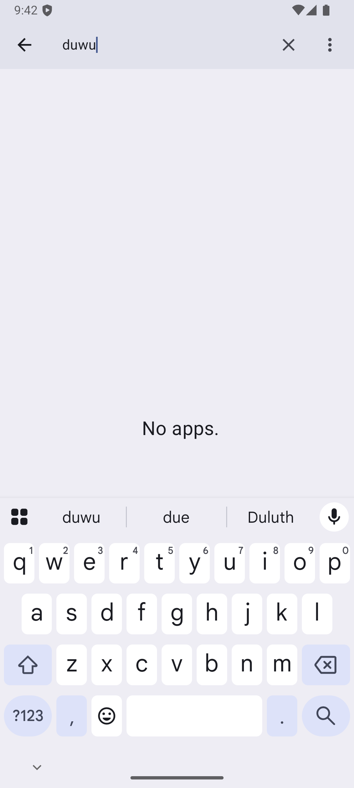

# checkin_tab_v007_finish_last_browse_products  ❌

- **Brand**: `duwu`
- **Class**: `DuwuCheckinTabV007FinishLastBrowseProductsTask`
- **Pass@3**: **0/3**  (score = 0.00)
- **Elapsed**: 401s (~6.7 min)
- **Model**: `doubao-seed-2-0-lite-260428`
- **Raw log**: [./raw_logs/DuwuCheckinTabV007FinishLastBrowseProductsTask.log](./raw_logs/DuwuCheckinTabV007FinishLastBrowseProductsTask.log)
- **Generated**: 2026-05-24T11:19:06+08:00

## Task Goal

> 【当前账户档案】账号：demo@rlbox.ai；昵称：福瑜是我。请基于以上档案使用DU物应用完成以下任务：已完成 3 个打卡任务，只差「逛商品任务」未做——完成它算今日打卡成功

## Attempts

| # | Outcome | Steps | Terminated | Reason | Start → End |
|---|---------|-------|------------|--------|-------------|
| 1 | ❌ failed | 7 | answer | – | 2026-05-24 11:12:25 → 2026-05-24 11:13:33 |
| 2 | ❌ failed | 27 | answer | – | 2026-05-24 11:14:04 → 2026-05-24 11:17:45 |
| 3 | ❌ failed | 5 | answer | – | 2026-05-24 11:18:17 → 2026-05-24 11:19:06 |

## Failure Details

### Episode 1 — ❌ failed

- steps_used: `7`
- terminated_reason: `answer`
- death shot: 
  - state: [`./death_shots/DuwuCheckinTabV007FinishLastBrowseProductsTask/episode_001/step_007.json`](./death_shots/DuwuCheckinTabV007FinishLastBrowseProductsTask/episode_001/step_007.json)
  - digest: [`episode_digest.md`](./death_shots/DuwuCheckinTabV007FinishLastBrowseProductsTask/episode_001/episode_digest.md)

### Episode 2 — ❌ failed

- steps_used: `27`
- terminated_reason: `answer`
- death shot: 
  - state: [`./death_shots/DuwuCheckinTabV007FinishLastBrowseProductsTask/episode_002/step_027.json`](./death_shots/DuwuCheckinTabV007FinishLastBrowseProductsTask/episode_002/step_027.json)
  - digest: [`episode_digest.md`](./death_shots/DuwuCheckinTabV007FinishLastBrowseProductsTask/episode_002/episode_digest.md)

### Episode 3 — ❌ failed

- steps_used: `5`
- terminated_reason: `answer`
- death shot: 
  - state: [`./death_shots/DuwuCheckinTabV007FinishLastBrowseProductsTask/episode_003/step_005.json`](./death_shots/DuwuCheckinTabV007FinishLastBrowseProductsTask/episode_003/step_005.json)
  - digest: [`episode_digest.md`](./death_shots/DuwuCheckinTabV007FinishLastBrowseProductsTask/episode_003/episode_digest.md)

---

> 本摘要由 `sengclaw/scripts/pipeline/log_summarizer.py` 自动生成。 原始完整 log 见上方 Raw log 链接（含每 step 的 messages / tool_call / screenshot 引用）。
