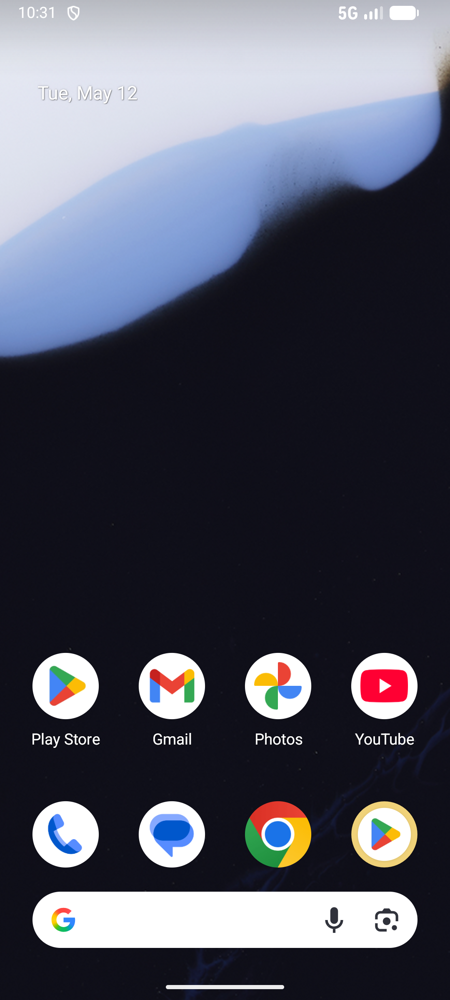

# comment_v001_post_top_level_comment  ⚠️

- **Brand**: `duwu`
- **Class**: `DuwuCommentV001PostTopLevelCommentTask`
- **Pass@3**: **1/3**  (score = 1.00)
- **Elapsed**: 300s (~5.0 min)
- **Model**: `doubao-seed-2-0-lite-260428`
- **Raw log**: [./raw_logs/DuwuCommentV001PostTopLevelCommentTask.log](./raw_logs/DuwuCommentV001PostTopLevelCommentTask.log)
- **Generated**: 2026-05-25T02:56:37+08:00

## Task Goal

> 【当前账户档案】账号：demo@rlbox.ai；昵称：福瑜是我。请基于以上档案使用DU物（com.duwu）应用完成以下任务：在「入手 AirPods Max 一个月使用感受」帖子下发一条评论：「刚入手，确实香」

## Attempts

| # | Outcome | Steps | Terminated | Reason | Start → End |
|---|---------|-------|------------|--------|-------------|
| 1 | ✅ passed | 16 | answer | – | 2026-05-25 02:51:37 → 2026-05-25 02:53:37 |
| 2 | ❌ failed | 4 | answer | – | 2026-05-25 02:54:08 → 2026-05-25 02:54:39 |
| 3 | ❌ failed | 10 | answer | – | 2026-05-25 02:55:10 → 2026-05-25 02:56:37 |

## Failure Details

### Episode 2 — ❌ failed

- steps_used: `4`
- terminated_reason: `answer`
- death shot: 
  - state: [`./death_shots/DuwuCommentV001PostTopLevelCommentTask/episode_002/step_004.json`](./death_shots/DuwuCommentV001PostTopLevelCommentTask/episode_002/step_004.json)
  - digest: [`episode_digest.md`](./death_shots/DuwuCommentV001PostTopLevelCommentTask/episode_002/episode_digest.md)

### Episode 3 — ❌ failed

- steps_used: `10`
- terminated_reason: `answer`
- death shot: 
  - state: [`./death_shots/DuwuCommentV001PostTopLevelCommentTask/episode_003/step_010.json`](./death_shots/DuwuCommentV001PostTopLevelCommentTask/episode_003/step_010.json)
  - digest: [`episode_digest.md`](./death_shots/DuwuCommentV001PostTopLevelCommentTask/episode_003/episode_digest.md)

---

> 本摘要由 `sengclaw/scripts/pipeline/log_summarizer.py` 自动生成。 原始完整 log 见上方 Raw log 链接（含每 step 的 messages / tool_call / screenshot 引用）。
