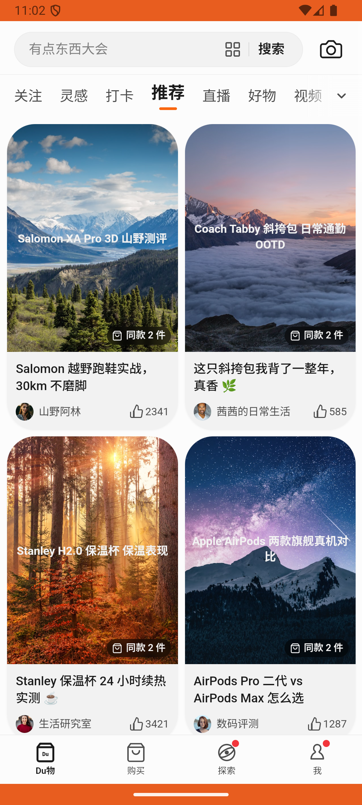

# checkin_tab_v003_switch_tier  ❌

- **Brand**: `duwu`
- **Class**: `DuwuCheckinTabV003SwitchTierTask`
- **Pass@3**: **0/3**  (score = 0.00)
- **Elapsed**: 322s (~5.4 min)
- **Model**: `doubao-seed-2-0-lite-260428`
- **Raw log**: [./raw_logs/DuwuCheckinTabV003SwitchTierTask.log](./raw_logs/DuwuCheckinTabV003SwitchTierTask.log)
- **Generated**: 2026-05-25T23:03:52+08:00

## Task Goal

> 【当前账户档案】账号：demo@rlbox.ai；昵称：福瑜是我。请基于以上档案打开 com.duwu 并完成以下任务：我不想打 60 天了，帮我换成「15 天 · 每日惊喜档」吧

## Attempts

| # | Outcome | Steps | Terminated | Reason | Start → End |
|---|---------|-------|------------|--------|-------------|
| 1 | 💥 error | 0 | exception | exception: 500 Internal Server Error for url: http://localhost:6800/screenshot?return_b64=True \\| detail: Screenshot capture failed. Che... | 2026-05-25 22:58:30 → 2026-05-25 23:02:51 |
| 2 | 💥 error | 0 | exception | exception: 500 Internal Server Error for url: http://localhost:6800/task/init \\| detail: init_task('DuwuCheckinTabV003SwitchTierTask') f... | 2026-05-25 23:02:51 → 2026-05-25 23:03:51 |
| 3 | 💥 error | 0 | exception | exception: 500 Internal Server Error for url: http://localhost:6800/task/init \\| detail: init_task('DuwuCheckinTabV003SwitchTierTask') f... | 2026-05-25 23:03:51 → 2026-05-25 23:03:52 |

## Failure Details

### Episode 1 — 💥 error

- steps_used: `0`
- terminated_reason: `exception`
- reason:

  ```
  exception: 500 Internal Server Error for url: http://localhost:6800/screenshot?return_b64=True | detail: Screenshot capture failed. Check device connection.
  ```
- death shot: 
  - state: [`./death_shots/DuwuCheckinTabV003SwitchTierTask/episode_001/step_006.json`](./death_shots/DuwuCheckinTabV003SwitchTierTask/episode_001/step_006.json)
  - digest: [`episode_digest.md`](./death_shots/DuwuCheckinTabV003SwitchTierTask/episode_001/episode_digest.md)

### Episode 2 — 💥 error

- steps_used: `0`
- terminated_reason: `exception`
- reason:

  ```
  exception: 500 Internal Server Error for url: http://localhost:6800/task/init | detail: init_task('DuwuCheckinTabV003SwitchTierTask') failed: [Errno 32] Broken pipe
  ```

### Episode 3 — 💥 error

- steps_used: `0`
- terminated_reason: `exception`
- reason:

  ```
  exception: 500 Internal Server Error for url: http://localhost:6800/task/init | detail: init_task('DuwuCheckinTabV003SwitchTierTask') failed: Task 'DuwuCheckinTabV003SwitchTierTask' failed during initialize_task()
  ```

---

> 本摘要由 `sengclaw/scripts/pipeline/log_summarizer.py` 自动生成。 原始完整 log 见上方 Raw log 链接（含每 step 的 messages / tool_call / screenshot 引用）。
