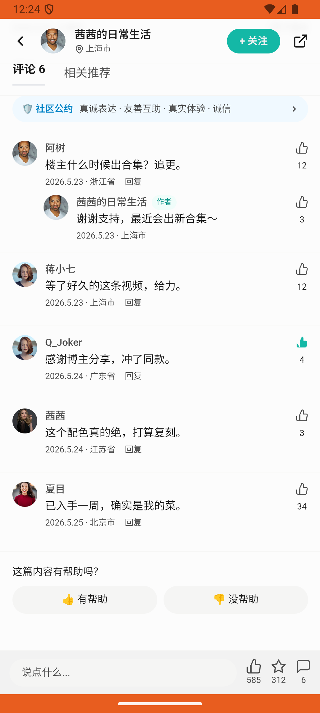

# comment_v002_like_others_comment  ⚠️

- **Brand**: `duwu`
- **Class**: `DuwuCommentV002LikeOthersCommentTask`
- **Pass@3**: **1/3**  (score = 1.00)
- **Elapsed**: 67s (~1.1 min)
- **Model**: `doubao-seed-2-0-lite-260428`
- **Raw log**: [./raw_logs/DuwuCommentV002LikeOthersCommentTask.log](./raw_logs/DuwuCommentV002LikeOthersCommentTask.log)
- **Generated**: 2026-05-26T00:25:20+08:00

## Task Goal

> 【当前账户档案】账号：demo@rlbox.ai；昵称：福瑜是我。请基于以上档案打开 com.duwu 并完成以下任务：「这只斜挎包我背了一整年」那篇帖子下面，Q_Joker 说「感谢博主分享，冲了同款」，帮我给他点个赞

## Attempts

| # | Outcome | Steps | Terminated | Reason | Start → End |
|---|---------|-------|------------|--------|-------------|
| 1 | ✅ passed | 5 | answer | – | 2026-05-26 00:24:13 → 2026-05-26 00:24:47 |
| 2 | ❌ failed | 1 | answer | – | 2026-05-26 00:24:47 → 2026-05-26 00:25:00 |
| 3 | ❌ failed | 2 | answer | – | 2026-05-26 00:25:00 → 2026-05-26 00:25:20 |

## Failure Details

### Episode 2 — ❌ failed

- steps_used: `1`
- terminated_reason: `answer`
- death shot: 
  - state: [`./death_shots/DuwuCommentV002LikeOthersCommentTask/episode_002/step_001.json`](./death_shots/DuwuCommentV002LikeOthersCommentTask/episode_002/step_001.json)
  - digest: [`episode_digest.md`](./death_shots/DuwuCommentV002LikeOthersCommentTask/episode_002/episode_digest.md)

### Episode 3 — ❌ failed

- steps_used: `2`
- terminated_reason: `answer`
- death shot: 
  - state: [`./death_shots/DuwuCommentV002LikeOthersCommentTask/episode_003/step_002.json`](./death_shots/DuwuCommentV002LikeOthersCommentTask/episode_003/step_002.json)
  - digest: [`episode_digest.md`](./death_shots/DuwuCommentV002LikeOthersCommentTask/episode_003/episode_digest.md)

---

> 本摘要由 `sengclaw/scripts/pipeline/log_summarizer.py` 自动生成。 原始完整 log 见上方 Raw log 链接（含每 step 的 messages / tool_call / screenshot 引用）。
