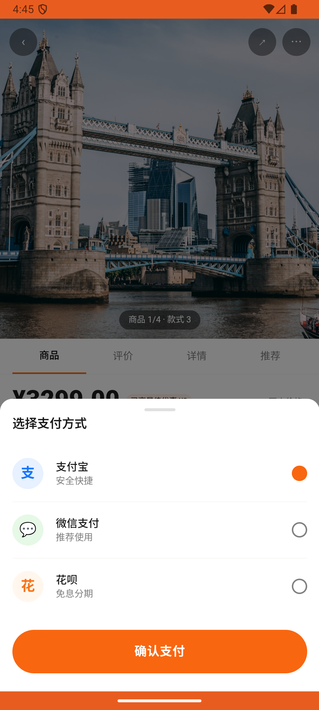

# order_v004_view_order_detail  ⚠️

- **Brand**: `duwu`
- **Class**: `DuwuOrderV004ViewOrderDetailTask`
- **Pass@3**: **2/3**  (score = 1.00)
- **Elapsed**: 454s (~7.6 min)
- **Model**: `doubao-seed-2-0-lite-260428`
- **Raw log**: [./raw_logs/DuwuOrderV004ViewOrderDetailTask.log](./raw_logs/DuwuOrderV004ViewOrderDetailTask.log)
- **Generated**: 2026-05-30T06:31:33+08:00

## Task Goal

> 【当前账户档案】账号：demo@rlbox.ai；昵称：福瑜是我；支付密码：无需密码，如需支付直接确认即可。请基于以上档案打开 com.duwu 并完成以下任务：刷动态的时候看到有人推荐 Coach Tabby 斜挎包，棕色那款挺好看的，帮我下单

## Attempts

| # | Outcome | Steps | Terminated | Reason | Start → End |
|---|---------|-------|------------|--------|-------------|
| 1 | ✅ passed | 15 | answer | – | 2026-05-30 04:37:30 → 2026-05-30 04:39:41 |
| 2 | ✅ passed | 16 | answer | – | 2026-05-30 04:39:41 → 2026-05-30 04:44:06 |
| 3 | ❌ failed | 7 | answer | 存在包含 Coach Tabby 26 斜挎包的订单: 未找到包含 Coach Tabby 26 斜挎包的订单 | 2026-05-30 04:44:06 → 2026-05-30 04:45:04 |

## Failure Details

### Episode 3 — ❌ failed

- steps_used: `7`
- terminated_reason: `answer`
- reason:

  ```
  存在包含 Coach Tabby 26 斜挎包的订单: 未找到包含 Coach Tabby 26 斜挎包的订单
  ```
- death shot: 
  - state: [`./death_shots/DuwuOrderV004ViewOrderDetailTask/episode_003/step_007.json`](./death_shots/DuwuOrderV004ViewOrderDetailTask/episode_003/step_007.json)
  - digest: [`episode_digest.md`](./death_shots/DuwuOrderV004ViewOrderDetailTask/episode_003/episode_digest.md)

---

> 本摘要由 `sengclaw/scripts/pipeline/log_summarizer.py` 自动生成。 原始完整 log 见上方 Raw log 链接（含每 step 的 messages / tool_call / screenshot 引用）。
