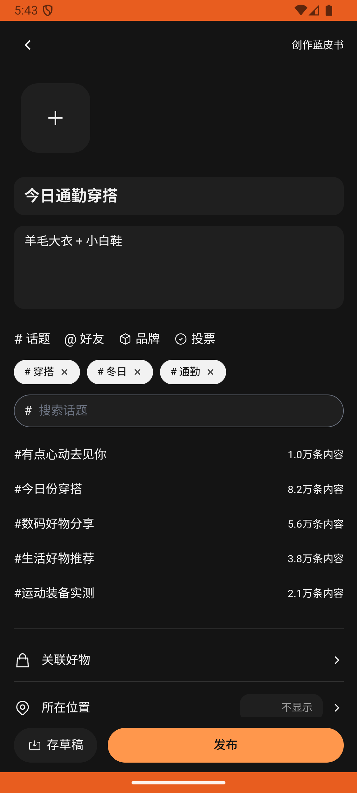

# post_v002_create_post_with_topics  ❌

- **Brand**: `duwu`
- **Class**: `DuwuPostV002CreatePostWithTopicsTask`
- **Pass@3**: **0/3**  (score = 0.00)
- **Elapsed**: 588s (~9.8 min)
- **Model**: `doubao-seed-2-0-lite-260428`
- **Raw log**: [./raw_logs/DuwuPostV002CreatePostWithTopicsTask.log](./raw_logs/DuwuPostV002CreatePostWithTopicsTask.log)
- **Generated**: 2026-05-30T06:31:33+08:00

## Task Goal

> 【当前账户档案】账号：demo@rlbox.ai；昵称：福瑜是我；支付密码：无需密码，如需支付直接确认即可。请基于以上档案打开 com.duwu 并完成以下任务：发条穿搭帖，标题「今日通勤穿搭」，正文写「羊毛大衣 + 小白鞋」，加上穿搭、冬日、通勤的话题标签

## Attempts

| # | Outcome | Steps | Terminated | Reason | Start → End |
|---|---------|-------|------------|--------|-------------|
| 1 | ❌ failed | 26 | answer | 本人发布了至少 1 条 UGC 帖子: 预期至少 1 条，实际 0 | 2026-05-30 05:36:37 → 2026-05-30 05:39:55 |
| 2 | ❌ failed | 27 | answer | 本人发布了至少 1 条 UGC 帖子: 预期至少 1 条，实际 0 | 2026-05-30 05:39:55 → 2026-05-30 05:43:21 |
| 3 | ❌ failed | 25 | answer | 本人发布了至少 1 条 UGC 帖子: 预期至少 1 条，实际 0 | 2026-05-30 05:43:21 → 2026-05-30 05:46:25 |

## Failure Details

### Episode 1 — ❌ failed

- steps_used: `26`
- terminated_reason: `answer`
- reason:

  ```
  本人发布了至少 1 条 UGC 帖子: 预期至少 1 条，实际 0
  ```
- death shot: 
  - state: [`./death_shots/DuwuPostV002CreatePostWithTopicsTask/episode_001/step_026.json`](./death_shots/DuwuPostV002CreatePostWithTopicsTask/episode_001/step_026.json)
  - digest: [`episode_digest.md`](./death_shots/DuwuPostV002CreatePostWithTopicsTask/episode_001/episode_digest.md)

### Episode 2 — ❌ failed

- steps_used: `27`
- terminated_reason: `answer`
- reason:

  ```
  本人发布了至少 1 条 UGC 帖子: 预期至少 1 条，实际 0
  ```
- death shot: 
  - state: [`./death_shots/DuwuPostV002CreatePostWithTopicsTask/episode_002/step_027.json`](./death_shots/DuwuPostV002CreatePostWithTopicsTask/episode_002/step_027.json)
  - digest: [`episode_digest.md`](./death_shots/DuwuPostV002CreatePostWithTopicsTask/episode_002/episode_digest.md)

### Episode 3 — ❌ failed

- steps_used: `25`
- terminated_reason: `answer`
- reason:

  ```
  本人发布了至少 1 条 UGC 帖子: 预期至少 1 条，实际 0
  ```
- death shot: 
  - state: [`./death_shots/DuwuPostV002CreatePostWithTopicsTask/episode_003/step_025.json`](./death_shots/DuwuPostV002CreatePostWithTopicsTask/episode_003/step_025.json)
  - digest: [`episode_digest.md`](./death_shots/DuwuPostV002CreatePostWithTopicsTask/episode_003/episode_digest.md)

---

> 本摘要由 `sengclaw/scripts/pipeline/log_summarizer.py` 自动生成。 原始完整 log 见上方 Raw log 链接（含每 step 的 messages / tool_call / screenshot 引用）。
