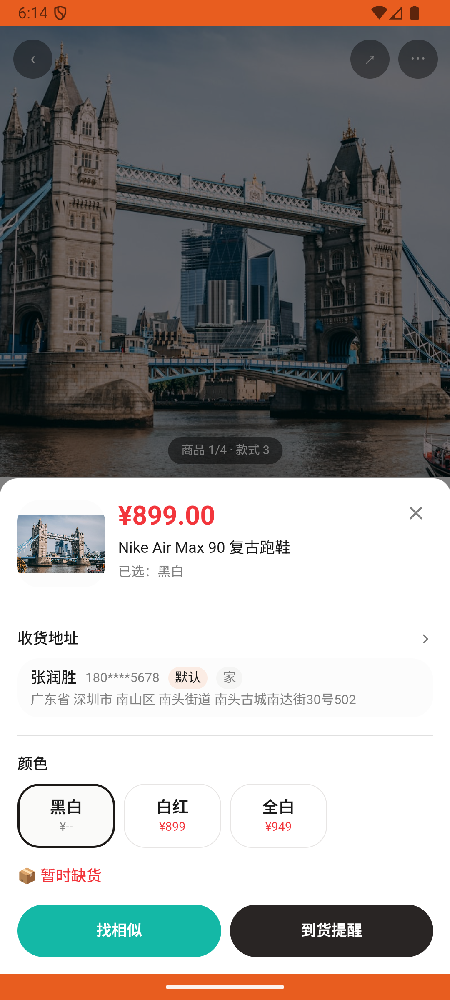

# sku_v002_subscribe_restock  ❌

- **Brand**: `duwu`
- **Class**: `DuwuSkuV002SubscribeRestockTask`
- **Pass@3**: **0/3**  (score = 0.00)
- **Elapsed**: 250s (~4.2 min)
- **Model**: `doubao-seed-2-0-lite-260428`
- **Raw log**: [./raw_logs/DuwuSkuV002SubscribeRestockTask.log](./raw_logs/DuwuSkuV002SubscribeRestockTask.log)
- **Generated**: 2026-05-30T06:31:33+08:00

## Task Goal

> 【当前账户档案】账号：demo@rlbox.ai；昵称：福瑜是我；支付密码：无需密码，如需支付直接确认即可。请基于以上档案打开 com.duwu 并完成以下任务：我想要一双 Nike Air Max 90 黑白配色的，帮我看看有没有货

## Attempts

| # | Outcome | Steps | Terminated | Reason | Start → End |
|---|---------|-------|------------|--------|-------------|
| 1 | ❌ failed | 11 | answer | 已订阅黑白配色到货提醒: 未找到 Nike Air Max 90 黑白配色的到货订阅; 订阅记录的 SKU 正确: undefined method `sku_id' for nil | 2026-05-30 06:10:06 → 2026-05-30 06:11:30 |
| 2 | ❌ failed | 11 | answer | 已订阅黑白配色到货提醒: 未找到 Nike Air Max 90 黑白配色的到货订阅; 订阅记录的 SKU 正确: undefined method `sku_id' for nil | 2026-05-30 06:11:30 → 2026-05-30 06:12:58 |
| 3 | ❌ failed | 11 | answer | 已订阅黑白配色到货提醒: 未找到 Nike Air Max 90 黑白配色的到货订阅; 订阅记录的 SKU 正确: undefined method `sku_id' for nil | 2026-05-30 06:12:58 → 2026-05-30 06:14:16 |

## Failure Details

### Episode 1 — ❌ failed

- steps_used: `11`
- terminated_reason: `answer`
- reason:

  ```
  已订阅黑白配色到货提醒: 未找到 Nike Air Max 90 黑白配色的到货订阅; 订阅记录的 SKU 正确: undefined method `sku_id' for nil
  ```
- death shot: 
  - state: [`./death_shots/DuwuSkuV002SubscribeRestockTask/episode_001/step_011.json`](./death_shots/DuwuSkuV002SubscribeRestockTask/episode_001/step_011.json)
  - digest: [`episode_digest.md`](./death_shots/DuwuSkuV002SubscribeRestockTask/episode_001/episode_digest.md)

### Episode 2 — ❌ failed

- steps_used: `11`
- terminated_reason: `answer`
- reason:

  ```
  已订阅黑白配色到货提醒: 未找到 Nike Air Max 90 黑白配色的到货订阅; 订阅记录的 SKU 正确: undefined method `sku_id' for nil
  ```
- death shot: 
  - state: [`./death_shots/DuwuSkuV002SubscribeRestockTask/episode_002/step_011.json`](./death_shots/DuwuSkuV002SubscribeRestockTask/episode_002/step_011.json)
  - digest: [`episode_digest.md`](./death_shots/DuwuSkuV002SubscribeRestockTask/episode_002/episode_digest.md)

### Episode 3 — ❌ failed

- steps_used: `11`
- terminated_reason: `answer`
- reason:

  ```
  已订阅黑白配色到货提醒: 未找到 Nike Air Max 90 黑白配色的到货订阅; 订阅记录的 SKU 正确: undefined method `sku_id' for nil
  ```
- death shot: 
  - state: [`./death_shots/DuwuSkuV002SubscribeRestockTask/episode_003/step_011.json`](./death_shots/DuwuSkuV002SubscribeRestockTask/episode_003/step_011.json)
  - digest: [`episode_digest.md`](./death_shots/DuwuSkuV002SubscribeRestockTask/episode_003/episode_digest.md)

---

> 本摘要由 `sengclaw/scripts/pipeline/log_summarizer.py` 自动生成。 原始完整 log 见上方 Raw log 链接（含每 step 的 messages / tool_call / screenshot 引用）。
