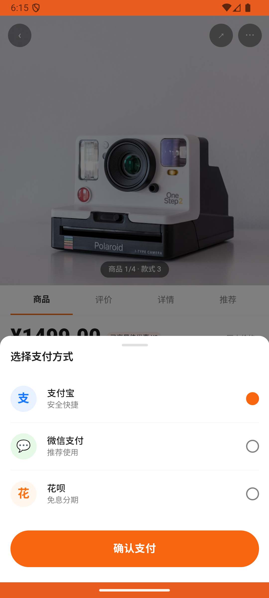

# sku_v003_view_restock_wishlist  ⚠️

- **Brand**: `duwu`
- **Class**: `DuwuSkuV003ViewRestockWishlistTask`
- **Pass@3**: **2/3**  (score = 1.00)
- **Elapsed**: 322s (~5.4 min)
- **Model**: `doubao-seed-2-0-lite-260428`
- **Raw log**: [./raw_logs/DuwuSkuV003ViewRestockWishlistTask.log](./raw_logs/DuwuSkuV003ViewRestockWishlistTask.log)
- **Generated**: 2026-05-30T06:31:33+08:00

## Task Goal

> 【当前账户档案】账号：demo@rlbox.ai；昵称：福瑜是我；支付密码：无需密码，如需支付直接确认即可。请基于以上档案打开 com.duwu 并完成以下任务：之前订阅了 New Balance 990v6 42码的到货提醒，现在到货了，帮我从「我想要的」列表里点进去买了

## Attempts

| # | Outcome | Steps | Terminated | Reason | Start → End |
|---|---------|-------|------------|--------|-------------|
| 1 | ❌ failed | 8 | answer | 存在包含 New Balance 990v6 的订单: 未找到包含 New Balance 990v6 跑步鞋的订单 | 2026-05-30 06:15:03 → 2026-05-30 06:15:58 |
| 2 | ✅ passed | 18 | answer | – | 2026-05-30 06:15:58 → 2026-05-30 06:18:21 |
| 3 | ✅ passed | 17 | answer | – | 2026-05-30 06:18:21 → 2026-05-30 06:20:24 |

## Failure Details

### Episode 1 — ❌ failed

- steps_used: `8`
- terminated_reason: `answer`
- reason:

  ```
  存在包含 New Balance 990v6 的订单: 未找到包含 New Balance 990v6 跑步鞋的订单
  ```
- death shot: 
  - state: [`./death_shots/DuwuSkuV003ViewRestockWishlistTask/episode_001/step_008.json`](./death_shots/DuwuSkuV003ViewRestockWishlistTask/episode_001/step_008.json)
  - digest: [`episode_digest.md`](./death_shots/DuwuSkuV003ViewRestockWishlistTask/episode_001/episode_digest.md)

---

> 本摘要由 `sengclaw/scripts/pipeline/log_summarizer.py` 自动生成。 原始完整 log 见上方 Raw log 链接（含每 step 的 messages / tool_call / screenshot 引用）。
