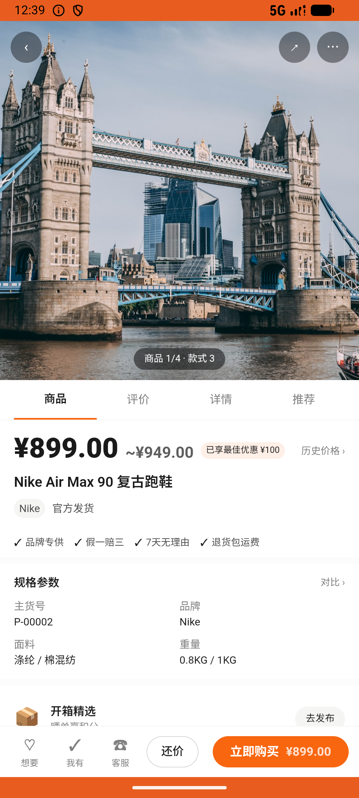

# brand_v002_unfollow_brand  ⚠️

- **Brand**: `duwu`
- **Class**: `DuwuBrandV002UnfollowBrandTask`
- **Pass@3**: **2/3**  (score = 1.00)
- **Elapsed**: 806s (~13.4 min)
- **Model**: `doubao-seed-2-0-lite-260428`
- **Raw log**: [./raw_logs/DuwuBrandV002UnfollowBrandTask.log](./raw_logs/DuwuBrandV002UnfollowBrandTask.log)
- **Generated**: 2026-06-04T15:25:57+08:00

## Task Goal

> 【当前账户档案】账号：demo@rlbox.ai；昵称：福瑜是我；支付密码：无需密码，如需支付直接确认即可。请基于以上档案打开 com.duwu 并完成以下任务：Nike 的推送太多了，取关一下这个品牌

## Attempts

| # | Outcome | Steps | Terminated | Reason | Start → End |
|---|---------|-------|------------|--------|-------------|
| 1 | ❌ failed | 33 | answer | 已取消关注 Nike: 仍残留 1 条对 Nike 的品牌关注记录 | 2026-06-04 12:31:03 → 2026-06-04 12:39:57 |
| 2 | ✅ passed | 12 | answer | – | 2026-06-04 12:39:58 → 2026-06-04 12:43:04 |
| 3 | ✅ passed | 7 | answer | – | 2026-06-04 12:43:04 → 2026-06-04 12:44:29 |

## Failure Details

### Episode 1 — ❌ failed

- steps_used: `33`
- terminated_reason: `answer`
- reason:

  ```
  已取消关注 Nike: 仍残留 1 条对 Nike 的品牌关注记录
  ```
- death shot: 
  - state: [`./death_shots/DuwuBrandV002UnfollowBrandTask/episode_001/step_033.json`](./death_shots/DuwuBrandV002UnfollowBrandTask/episode_001/step_033.json)
  - digest: [`episode_digest.md`](./death_shots/DuwuBrandV002UnfollowBrandTask/episode_001/episode_digest.md)

---

> 本摘要由 `sengclaw/scripts/pipeline/log_summarizer.py` 自动生成。 原始完整 log 见上方 Raw log 链接（含每 step 的 messages / tool_call / screenshot 引用）。
