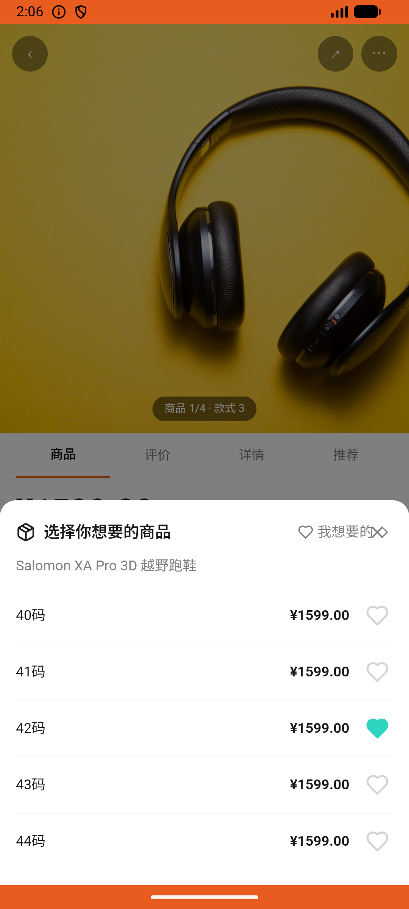

# search_v001_search_then_wish  ❌

- **Brand**: `duwu`
- **Class**: `DuwuSearchV001SearchThenWishTask`
- **Pass@3**: **0/3**  (score = 0.00)
- **Elapsed**: 323s (~5.4 min)
- **Model**: `doubao-seed-2-0-lite-260428`
- **Raw log**: [./raw_logs/DuwuSearchV001SearchThenWishTask.log](./raw_logs/DuwuSearchV001SearchThenWishTask.log)
- **Generated**: 2026-06-04T15:25:57+08:00

## Task Goal

> 【当前账户档案】账号：demo@rlbox.ai；昵称：福瑜是我；支付密码：无需密码，如需支付直接确认即可。请基于以上档案打开 com.duwu 并完成以下任务：最近想入一双 Salomon 的越野跑鞋，帮我找下「XA Pro 3D」那双，按我的尺码加到想要里

## Attempts

| # | Outcome | Steps | Terminated | Reason | Start → End |
|---|---------|-------|------------|--------|-------------|
| 1 | ❌ failed | 11 | answer | 已把 Salomon XA Pro 3D 加入想要清单: 未找到 Salomon XA Pro 3D 越野跑鞋的想要记录; 想要的是符合我尺码的 41码: 未找到指向 41码 SKU（id 41）的想要记录 | 2026-06-04 14:01:06 → 2026-06-04 14:02:55 |
| 2 | ❌ failed | 11 | answer | 已把 Salomon XA Pro 3D 加入想要清单: 未找到 Salomon XA Pro 3D 越野跑鞋的想要记录; 想要的是符合我尺码的 41码: 未找到指向 41码 SKU（id 41）的想要记录 | 2026-06-04 14:02:55 → 2026-06-04 14:04:39 |
| 3 | ❌ failed | 11 | answer | 已把 Salomon XA Pro 3D 加入想要清单: 未找到 Salomon XA Pro 3D 越野跑鞋的想要记录; 想要的是符合我尺码的 41码: 未找到指向 41码 SKU（id 41）的想要记录 | 2026-06-04 14:04:39 → 2026-06-04 14:06:28 |

## Failure Details

### Episode 1 — ❌ failed

- steps_used: `11`
- terminated_reason: `answer`
- reason:

  ```
  已把 Salomon XA Pro 3D 加入想要清单: 未找到 Salomon XA Pro 3D 越野跑鞋的想要记录; 想要的是符合我尺码的 41码: 未找到指向 41码 SKU（id 41）的想要记录
  ```
- death shot: 
  - state: [`./death_shots/DuwuSearchV001SearchThenWishTask/episode_001/step_011.json`](./death_shots/DuwuSearchV001SearchThenWishTask/episode_001/step_011.json)
  - digest: [`episode_digest.md`](./death_shots/DuwuSearchV001SearchThenWishTask/episode_001/episode_digest.md)

### Episode 2 — ❌ failed

- steps_used: `11`
- terminated_reason: `answer`
- reason:

  ```
  已把 Salomon XA Pro 3D 加入想要清单: 未找到 Salomon XA Pro 3D 越野跑鞋的想要记录; 想要的是符合我尺码的 41码: 未找到指向 41码 SKU（id 41）的想要记录
  ```
- death shot: 
  - state: [`./death_shots/DuwuSearchV001SearchThenWishTask/episode_002/step_011.json`](./death_shots/DuwuSearchV001SearchThenWishTask/episode_002/step_011.json)
  - digest: [`episode_digest.md`](./death_shots/DuwuSearchV001SearchThenWishTask/episode_002/episode_digest.md)

### Episode 3 — ❌ failed

- steps_used: `11`
- terminated_reason: `answer`
- reason:

  ```
  已把 Salomon XA Pro 3D 加入想要清单: 未找到 Salomon XA Pro 3D 越野跑鞋的想要记录; 想要的是符合我尺码的 41码: 未找到指向 41码 SKU（id 41）的想要记录
  ```
- death shot: 
  - state: [`./death_shots/DuwuSearchV001SearchThenWishTask/episode_003/step_011.json`](./death_shots/DuwuSearchV001SearchThenWishTask/episode_003/step_011.json)
  - digest: [`episode_digest.md`](./death_shots/DuwuSearchV001SearchThenWishTask/episode_003/episode_digest.md)

---

> 本摘要由 `sengclaw/scripts/pipeline/log_summarizer.py` 自动生成。 原始完整 log 见上方 Raw log 链接（含每 step 的 messages / tool_call / screenshot 引用）。
