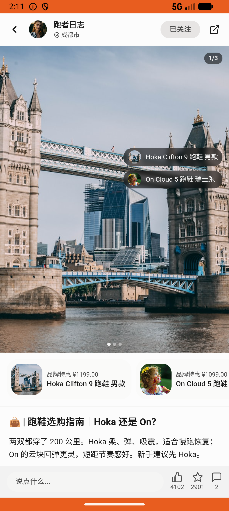

# search_v002_search_then_own  ⚠️

- **Brand**: `duwu`
- **Class**: `DuwuSearchV002SearchThenOwnTask`
- **Pass@3**: **2/3**  (score = 1.00)
- **Elapsed**: 391s (~6.5 min)
- **Model**: `doubao-seed-2-0-lite-260428`
- **Raw log**: [./raw_logs/DuwuSearchV002SearchThenOwnTask.log](./raw_logs/DuwuSearchV002SearchThenOwnTask.log)
- **Generated**: 2026-06-04T15:25:57+08:00

## Task Goal

> 【当前账户档案】账号：demo@rlbox.ai；昵称：福瑜是我；支付密码：无需密码，如需支付直接确认即可。请基于以上档案打开 com.duwu 并完成以下任务：刚看到「跑者日志」那篇跑鞋选购指南，里面推荐的 Hoka Clifton 9 我想要，顺手把这博主也关注了

## Attempts

| # | Outcome | Steps | Terminated | Reason | Start → End |
|---|---------|-------|------------|--------|-------------|
| 1 | ✅ passed | 13 | answer | – | 2026-06-04 14:07:09 → 2026-06-04 14:09:49 |
| 2 | ❌ failed | 10 | answer | 已把 Hoka Clifton 9 跑鞋加入想要清单: 未找到 Hoka Clifton 9 跑鞋的想要记录 | 2026-06-04 14:09:49 → 2026-06-04 14:11:33 |
| 3 | ✅ passed | 14 | answer | – | 2026-06-04 14:11:33 → 2026-06-04 14:13:40 |

## Failure Details

### Episode 2 — ❌ failed

- steps_used: `10`
- terminated_reason: `answer`
- reason:

  ```
  已把 Hoka Clifton 9 跑鞋加入想要清单: 未找到 Hoka Clifton 9 跑鞋的想要记录
  ```
- death shot: 
  - state: [`./death_shots/DuwuSearchV002SearchThenOwnTask/episode_002/step_010.json`](./death_shots/DuwuSearchV002SearchThenOwnTask/episode_002/step_010.json)
  - digest: [`episode_digest.md`](./death_shots/DuwuSearchV002SearchThenOwnTask/episode_002/episode_digest.md)

---

> 本摘要由 `sengclaw/scripts/pipeline/log_summarizer.py` 自动生成。 原始完整 log 见上方 Raw log 链接（含每 step 的 messages / tool_call / screenshot 引用）。
