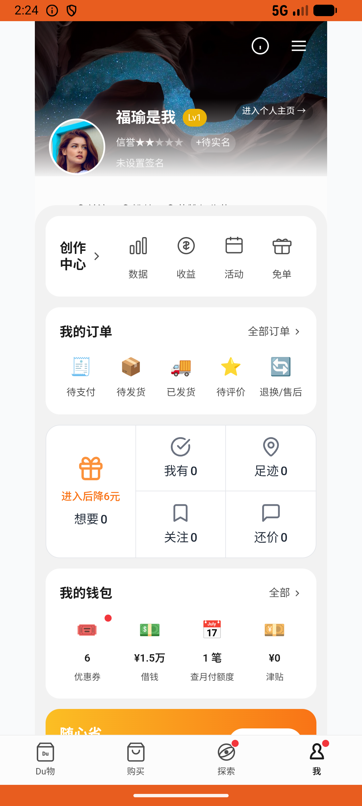

# wallet_v001_check_in  ⚠️

- **Brand**: `duwu`
- **Class**: `DuwuWalletV001CheckInTask`
- **Pass@3**: **1/3**  (score = 1.00)
- **Elapsed**: 213s (~3.5 min)
- **Model**: `doubao-seed-2-0-lite-260428`
- **Raw log**: [./raw_logs/DuwuWalletV001CheckInTask.log](./raw_logs/DuwuWalletV001CheckInTask.log)
- **Generated**: 2026-06-04T15:25:57+08:00

## Task Goal

> 【当前账户档案】账号：demo@rlbox.ai；昵称：福瑜是我；支付密码：无需密码，如需支付直接确认即可。请基于以上档案打开 com.duwu 并完成以下任务：帮我去钱包首页签到，把今天的签到积分领了

## Attempts

| # | Outcome | Steps | Terminated | Reason | Start → End |
|---|---------|-------|------------|--------|-------------|
| 1 | ✅ passed | 6 | answer | – | 2026-06-04 14:20:56 → 2026-06-04 14:21:42 |
| 2 | ❌ failed | 9 | answer | 今日签到记录存在: 预期 1 条签到记录，实际 0 | 2026-06-04 14:21:42 → 2026-06-04 14:22:54 |
| 3 | ❌ failed | 12 | answer | 今日签到记录存在: 预期 1 条签到记录，实际 0 | 2026-06-04 14:22:54 → 2026-06-04 14:24:29 |

## Failure Details

### Episode 2 — ❌ failed

- steps_used: `9`
- terminated_reason: `answer`
- reason:

  ```
  今日签到记录存在: 预期 1 条签到记录，实际 0
  ```
- death shot: 
  - state: [`./death_shots/DuwuWalletV001CheckInTask/episode_002/step_009.json`](./death_shots/DuwuWalletV001CheckInTask/episode_002/step_009.json)
  - digest: [`episode_digest.md`](./death_shots/DuwuWalletV001CheckInTask/episode_002/episode_digest.md)

### Episode 3 — ❌ failed

- steps_used: `12`
- terminated_reason: `answer`
- reason:

  ```
  今日签到记录存在: 预期 1 条签到记录，实际 0
  ```
- death shot: 
  - state: [`./death_shots/DuwuWalletV001CheckInTask/episode_003/step_012.json`](./death_shots/DuwuWalletV001CheckInTask/episode_003/step_012.json)
  - digest: [`episode_digest.md`](./death_shots/DuwuWalletV001CheckInTask/episode_003/episode_digest.md)

---

> 本摘要由 `sengclaw/scripts/pipeline/log_summarizer.py` 自动生成。 原始完整 log 见上方 Raw log 链接（含每 step 的 messages / tool_call / screenshot 引用）。
