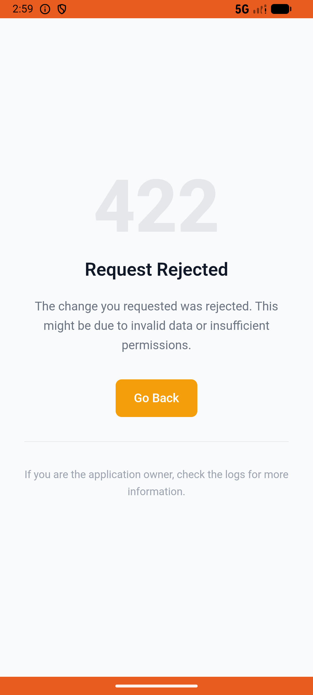

# wallet_v003_flip_card  ⚠️

- **Brand**: `duwu`
- **Class**: `DuwuWalletV003FlipCardTask`
- **Pass@3**: **2/3**  (score = 1.00)
- **Elapsed**: 1206s (~20.1 min)
- **Model**: `doubao-seed-2-0-lite-260428`
- **Raw log**: [./raw_logs/DuwuWalletV003FlipCardTask.log](./raw_logs/DuwuWalletV003FlipCardTask.log)
- **Generated**: 2026-06-04T15:25:57+08:00

## Task Goal

> 【当前账户档案】账号：demo@rlbox.ai；昵称：福瑜是我；支付密码：无需密码，如需支付直接确认即可。请基于以上档案打开 com.duwu 并完成以下任务：帮我去「免费领券」翻一次牌，抽张优惠券

## Attempts

| # | Outcome | Steps | Terminated | Reason | Start → End |
|---|---------|-------|------------|--------|-------------|
| 1 | ✅ passed | 22 | answer | – | 2026-06-04 14:39:18 → 2026-06-04 14:43:43 |
| 2 | ✅ passed | 15 | answer | – | 2026-06-04 14:43:43 → 2026-06-04 14:46:36 |
| 3 | ❌ failed | 64 | answer | 今日产生了翻牌记录: 预期 1 条翻牌记录，实际 0; 翻牌次数 >= 1: 预期 flips_today >= 1，实际 nil; 翻牌抽到了一张券: 预期翻牌后本会话有 daily_flip 券，实际 0 | 2026-06-04 14:46:36 → 2026-06-04 14:59:23 |

## Failure Details

### Episode 3 — ❌ failed

- steps_used: `64`
- terminated_reason: `answer`
- reason:

  ```
  今日产生了翻牌记录: 预期 1 条翻牌记录，实际 0; 翻牌次数 >= 1: 预期 flips_today >= 1，实际 nil; 翻牌抽到了一张券: 预期翻牌后本会话有 daily_flip 券，实际 0
  ```
- death shot: 
  - state: [`./death_shots/DuwuWalletV003FlipCardTask/episode_003/step_064.json`](./death_shots/DuwuWalletV003FlipCardTask/episode_003/step_064.json)
  - digest: [`episode_digest.md`](./death_shots/DuwuWalletV003FlipCardTask/episode_003/episode_digest.md)

---

> 本摘要由 `sengclaw/scripts/pipeline/log_summarizer.py` 自动生成。 原始完整 log 见上方 Raw log 链接（含每 step 的 messages / tool_call / screenshot 引用）。
