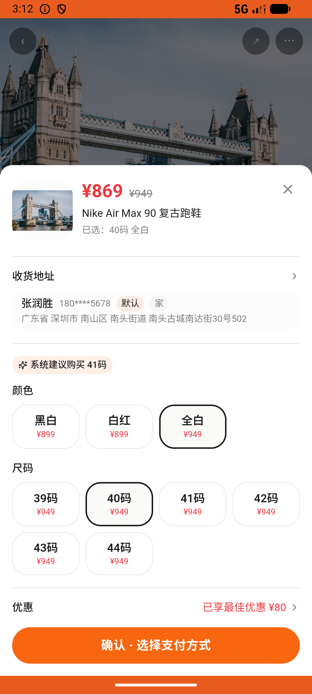

# wallet_v005_use_coupon_on_order  ⚠️

- **Brand**: `duwu`
- **Class**: `DuwuWalletV005UseCouponOnOrderTask`
- **Pass@3**: **1/3**  (score = 1.00)
- **Elapsed**: 575s (~9.6 min)
- **Model**: `doubao-seed-2-0-lite-260428`
- **Raw log**: [./raw_logs/DuwuWalletV005UseCouponOnOrderTask.log](./raw_logs/DuwuWalletV005UseCouponOnOrderTask.log)
- **Generated**: 2026-06-04T15:25:57+08:00

## Task Goal

> 【当前账户档案】账号：demo@rlbox.ai；昵称：福瑜是我；支付密码：无需密码，如需支付直接确认即可。请基于以上档案打开 com.duwu 并完成以下任务：我看上那双 Nike Air Max 90，想买全白的、40 码。我钱包里有几张券快到期了，帮我在快到期的券里挑张抵得最多的用掉

## Attempts

| # | Outcome | Steps | Terminated | Reason | Start → End |
|---|---------|-------|------------|--------|-------------|
| 1 | ❌ failed | 19 | answer | 存在购买这双鞋的订单: 预期至少 1 笔 Nike Air Max 90 复古跑鞋 的订单，实际 0 | 2026-06-04 15:03:14 → 2026-06-04 15:06:23 |
| 2 | ✅ passed | 20 | answer | – | 2026-06-04 15:06:23 → 2026-06-04 15:09:47 |
| 3 | ❌ failed | 18 | answer | 存在购买这双鞋的订单: 预期至少 1 笔 Nike Air Max 90 复古跑鞋 的订单，实际 0 | 2026-06-04 15:09:47 → 2026-06-04 15:12:49 |

## Failure Details

### Episode 1 — ❌ failed

- steps_used: `19`
- terminated_reason: `answer`
- reason:

  ```
  存在购买这双鞋的订单: 预期至少 1 笔 Nike Air Max 90 复古跑鞋 的订单，实际 0
  ```
- death shot: 
  - state: [`./death_shots/DuwuWalletV005UseCouponOnOrderTask/episode_001/step_019.json`](./death_shots/DuwuWalletV005UseCouponOnOrderTask/episode_001/step_019.json)
  - digest: [`episode_digest.md`](./death_shots/DuwuWalletV005UseCouponOnOrderTask/episode_001/episode_digest.md)

### Episode 3 — ❌ failed

- steps_used: `18`
- terminated_reason: `answer`
- reason:

  ```
  存在购买这双鞋的订单: 预期至少 1 笔 Nike Air Max 90 复古跑鞋 的订单，实际 0
  ```
- death shot: 
  - state: [`./death_shots/DuwuWalletV005UseCouponOnOrderTask/episode_003/step_018.json`](./death_shots/DuwuWalletV005UseCouponOnOrderTask/episode_003/step_018.json)
  - digest: [`episode_digest.md`](./death_shots/DuwuWalletV005UseCouponOnOrderTask/episode_003/episode_digest.md)

---

> 本摘要由 `sengclaw/scripts/pipeline/log_summarizer.py` 自动生成。 原始完整 log 见上方 Raw log 链接（含每 step 的 messages / tool_call / screenshot 引用）。
