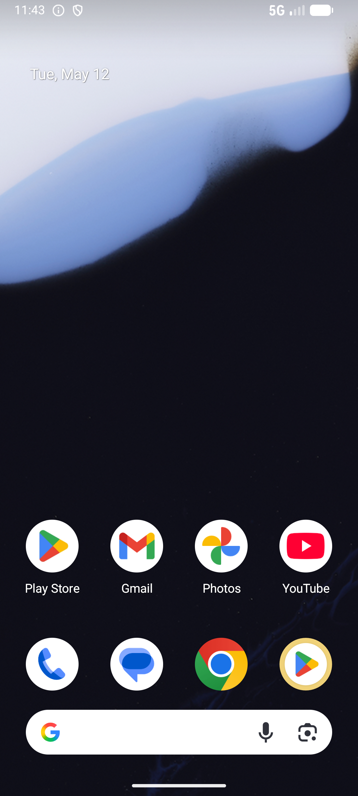

# comment_v005_like_bookmark_and_comment  ⚠️

- **Brand**: `duwu`
- **Class**: `DuwuCommentV005LikeBookmarkAndCommentTask`
- **Pass@3**: **1/3**  (score = 1.00)
- **Elapsed**: 304s (~5.1 min)
- **Model**: `doubao-seed-2-0-lite-260428`
- **Raw log**: [./raw_logs/DuwuCommentV005LikeBookmarkAndCommentTask.log](./raw_logs/DuwuCommentV005LikeBookmarkAndCommentTask.log)
- **Generated**: 2026-06-16T03:05:59+08:00

## Task Goal

> 「Rose 同款穿搭太美了，衣服鞋子都是 PUMA」这篇帖子帮我点赞、收藏，然后评论一句「Rose好美啊，我的女神，怎么这么高级」

## System Prompt

<details>
<summary>展开查看完整 System Prompt</summary>


> You are provided with a task description, a history of previous actions, and corresponding screenshots. Your goal is to perform the next action to complete the task. Please note that if performing the same action multiple times results in a static screen with no changes, you should attempt a modified or alternative action.
> 
> ---
> 
> ## Function Definition
> 
> - `clarify` — Ask the user for more information to complete the task.
> - `click` — Mouse left single click action.
> - `double_click` — Mouse left double click action.
> - `drag` — Perform a drag action from the start point to the end point. Typically used for swiping or selecting elements.
> - `long_press` — Perform a long press action at the specified coordinates.
> - `open_app` — Open the specified application.
> - `press_back` — Press the back button.
> - `press_enter` — Press the enter key.
> - `press_home` — Press the home button.
> - `take_notes` — Take notes and report the result in the specified content.
> - `type` — Type the specified content. You should manually delete any text from the input box that you want to remove.
> - `wait` — Wait for a certain period of time.

</details>

## User Query

> 请在 com.duwu 里面完成以下任务：
> 「Rose 同款穿搭太美了，衣服鞋子都是 PUMA」这篇帖子帮我点赞、收藏，然后评论一句「Rose好美啊，我的女神，怎么这么高级」

## Attempts

| # | Outcome | Steps | Terminated | Reason | Start → End |
|---|---------|-------|------------|--------|-------------|
| 1 | ✅ passed | 15 | answer | – | 2026-06-16 00:48:06 → 2026-06-16 00:50:52 |
| 2 | ❌ failed | 6 | answer | 已对目标帖子点赞: 目标帖子未点赞; 已对目标帖子收藏: 目标帖子未收藏; 在目标帖子下有 1 条本人发的顶级评论: 预期 1 条本人顶级评论，实际 0; 没有对其他帖子误操作: 预期总点赞 1，实际 0 | 2026-06-16 00:50:52 → 2026-06-16 00:52:00 |
| 3 | ❌ failed | 8 | answer | 已对目标帖子点赞: 目标帖子未点赞; 已对目标帖子收藏: 目标帖子未收藏; 在目标帖子下有 1 条本人发的顶级评论: 预期 1 条本人顶级评论，实际 0; 没有对其他帖子误操作: 预期总点赞 1，实际 0 | 2026-06-16 00:52:00 → 2026-06-16 00:53:09 |

## Failure Details

### Episode 2 — ❌ failed

- steps_used: `6`
- terminated_reason: `answer`
- reason:

  ```
  已对目标帖子点赞: 目标帖子未点赞; 已对目标帖子收藏: 目标帖子未收藏; 在目标帖子下有 1 条本人发的顶级评论: 预期 1 条本人顶级评论，实际 0; 没有对其他帖子误操作: 预期总点赞 1，实际 0
  ```
- death shot: 
  - state: [`./death_shots/DuwuCommentV005LikeBookmarkAndCommentTask/episode_002/step_006.json`](./death_shots/DuwuCommentV005LikeBookmarkAndCommentTask/episode_002/step_006.json)
  - digest: [`episode_digest.md`](./death_shots/DuwuCommentV005LikeBookmarkAndCommentTask/episode_002/episode_digest.md)

### Episode 3 — ❌ failed

- steps_used: `8`
- terminated_reason: `answer`
- reason:

  ```
  已对目标帖子点赞: 目标帖子未点赞; 已对目标帖子收藏: 目标帖子未收藏; 在目标帖子下有 1 条本人发的顶级评论: 预期 1 条本人顶级评论，实际 0; 没有对其他帖子误操作: 预期总点赞 1，实际 0
  ```
- death shot: 
  - state: [`./death_shots/DuwuCommentV005LikeBookmarkAndCommentTask/episode_003/step_008.json`](./death_shots/DuwuCommentV005LikeBookmarkAndCommentTask/episode_003/step_008.json)
  - digest: [`episode_digest.md`](./death_shots/DuwuCommentV005LikeBookmarkAndCommentTask/episode_003/episode_digest.md)

---

> 本摘要由 `sengclaw/scripts/pipeline/log_summarizer.py` 自动生成。 原始完整 log 见上方 Raw log 链接（含每 step 的 messages / tool_call / screenshot 引用）。
