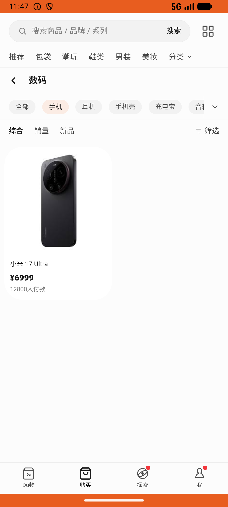

# sell_v013_view_recycle_orders  ⚠️

- **Brand**: `duwu`
- **Class**: `DuwuSellV013ViewRecycleOrdersTask`
- **Pass@3**: **1/3**  (score = 1.00)
- **Elapsed**: 1219s (~20.3 min)
- **Model**: `doubao-seed-2-0-lite-260428`
- **Raw log**: [./raw_logs/DuwuSellV013ViewRecycleOrdersTask.log](./raw_logs/DuwuSellV013ViewRecycleOrdersTask.log)
- **Generated**: 2026-06-18T23:36:51+08:00

## Task Goal

> 去闲置买卖帮我把之前那笔 iPhone 回收单取消掉（容量选错了应该是512G），取消后重新提交

## System Prompt

<details>
<summary>展开查看完整 System Prompt</summary>


> You are provided with a task description, a history of previous actions, and corresponding screenshots. Your goal is to perform the next action to complete the task. Please note that if performing the same action multiple times results in a static screen with no changes, you should attempt a modified or alternative action.
> 
> ---
> 
> ## Function Definition
> 
> - `clarify` — Ask the user for more information to complete the task.
> - `click` — Mouse left single click action.
> - `double_click` — Mouse left double click action.
> - `drag` — Perform a drag action from the start point to the end point. Typically used for swiping or selecting elements.
> - `long_press` — Perform a long press action at the specified coordinates.
> - `open_app` — Open the specified application.
> - `press_back` — Press the back button.
> - `press_enter` — Press the enter key.
> - `press_home` — Press the home button.
> - `take_notes` — Take notes and report the result in the specified content.
> - `type` — Type the specified content. You should manually delete any text from the input box that you want to remove.
> - `wait` — Wait for a certain period of time.

</details>

## User Query

> 请在 com.duwu 里面完成以下任务：
> 去闲置买卖帮我把之前那笔 iPhone 回收单取消掉（容量选错了应该是512G），取消后重新提交

## Attempts

| # | Outcome | Steps | Terminated | Reason | Start → End |
|---|---------|-------|------------|--------|-------------|
| 1 | ✅ passed | 59 | answer | – | 2026-06-18 22:20:41 → 2026-06-18 22:29:20 |
| 2 | ❌ failed | 46 | answer | 已有回收单及新回收单共两条记录: 预期至少 2 条回收记录，实际 1; 已有回收单已被取消: 预期至少 1 条已取消，实际 0; 取消原因为「商品信息描述有误」: cancel_reason 预期 '商品信息描述有误'，实际 nil; 新回收单问卷容量为 512G: 问卷 ... | 2026-06-18 22:29:20 → 2026-06-18 22:36:20 |
| 3 | ❌ failed | 30 | answer | 已有回收单及新回收单共两条记录: 预期至少 2 条回收记录，实际 1; 已有回收单已被取消: 预期至少 1 条已取消，实际 0; 取消原因为「商品信息描述有误」: cancel_reason 预期 '商品信息描述有误'，实际 nil; 新回收单问卷容量为 512G: 问卷 ... | 2026-06-18 22:36:20 → 2026-06-18 22:41:00 |

## Failure Details

### Episode 2 — ❌ failed

- steps_used: `46`
- terminated_reason: `answer`
- reason:

  ```
  已有回收单及新回收单共两条记录: 预期至少 2 条回收记录，实际 1; 已有回收单已被取消: 预期至少 1 条已取消，实际 0; 取消原因为「商品信息描述有误」: cancel_reason 预期 '商品信息描述有误'，实际 nil; 新回收单问卷容量为 512G: 问卷 capacity 预期 '512G'，实际 "256G"
  ```
- death shot: 
  - state: [`./death_shots/DuwuSellV013ViewRecycleOrdersTask/episode_002/step_046.json`](./death_shots/DuwuSellV013ViewRecycleOrdersTask/episode_002/step_046.json)
  - digest: [`episode_digest.md`](./death_shots/DuwuSellV013ViewRecycleOrdersTask/episode_002/episode_digest.md)

### Episode 3 — ❌ failed

- steps_used: `30`
- terminated_reason: `answer`
- reason:

  ```
  已有回收单及新回收单共两条记录: 预期至少 2 条回收记录，实际 1; 已有回收单已被取消: 预期至少 1 条已取消，实际 0; 取消原因为「商品信息描述有误」: cancel_reason 预期 '商品信息描述有误'，实际 nil; 新回收单问卷容量为 512G: 问卷 capacity 预期 '512G'，实际 "256G"
  ```
- death shot: 
  - state: [`./death_shots/DuwuSellV013ViewRecycleOrdersTask/episode_003/step_030.json`](./death_shots/DuwuSellV013ViewRecycleOrdersTask/episode_003/step_030.json)
  - digest: [`episode_digest.md`](./death_shots/DuwuSellV013ViewRecycleOrdersTask/episode_003/episode_digest.md)

---

> 本摘要由 `sengclaw/scripts/pipeline/log_summarizer.py` 自动生成。 原始完整 log 见上方 Raw log 链接（含每 step 的 messages / tool_call / screenshot 引用）。
