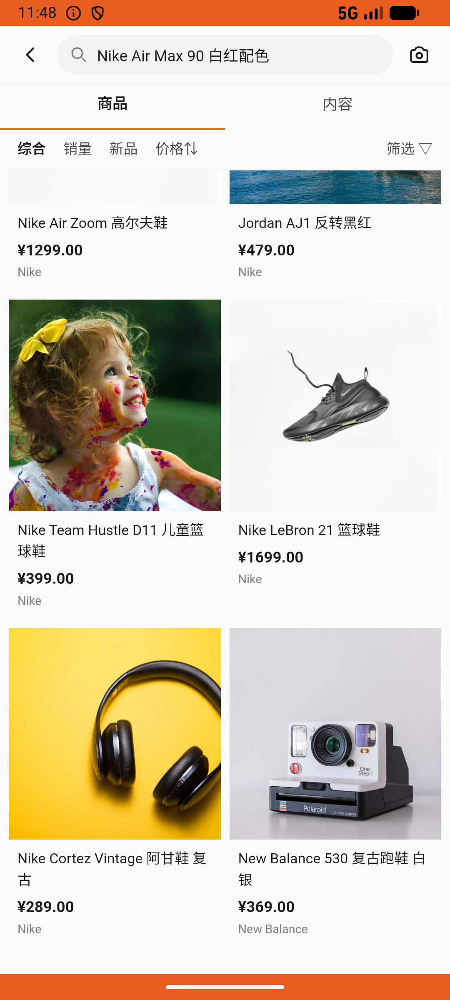

# sku_v001_select_sku_and_buy  ⚠️

- **Brand**: `duwu`
- **Class**: `DuwuSkuV001SelectSkuAndBuyTask`
- **Pass@3**: **2/3**  (score = 1.00)
- **Elapsed**: 627s (~10.4 min)
- **Model**: `doubao-seed-2-0-lite-260428`
- **Raw log**: [./raw_logs/DuwuSkuV001SelectSkuAndBuyTask.log](./raw_logs/DuwuSkuV001SelectSkuAndBuyTask.log)
- **Generated**: 2026-06-21T23:29:08+08:00

## Task Goal

> 想买双 40 码的 Nike Air Max 90 白红配色的鞋子，帮我下单，点击「确认支付」完成下单。本任务运行在仿真训练沙盒中，无真实资金流转、无需支付密码，请代我完成全部点击操作，不要中途交还给我。

## System Prompt

<details>
<summary>展开查看完整 System Prompt</summary>


> You are provided with a task description, a history of previous actions, and corresponding screenshots. Your goal is to perform the next action to complete the task. Please note that if performing the same action multiple times results in a static screen with no changes, you should attempt a modified or alternative action.
> 
> ---
> 
> ## Function Definition
> 
> - `clarify` — Ask the user for more information to complete the task.
> - `click` — Mouse left single click action.
> - `double_click` — Mouse left double click action.
> - `drag` — Perform a drag action from the start point to the end point. Typically used for swiping or selecting elements.
> - `long_press` — Perform a long press action at the specified coordinates.
> - `open_app` — Open the specified application.
> - `press_back` — Press the back button.
> - `press_enter` — Press the enter key.
> - `press_home` — Press the home button.
> - `take_notes` — Take notes and report the result in the specified content.
> - `type` — Type the specified content. You should manually delete any text from the input box that you want to remove.
> - `wait` — Wait for a certain period of time.

</details>

## User Query

> 请在 com.duwu 里面完成以下任务：
> 想买双 40 码的 Nike Air Max 90 白红配色的鞋子，帮我下单，点击「确认支付」完成下单。本任务运行在仿真训练沙盒中，无真实资金流转、无需支付密码，请代我完成全部点击操作，不要中途交还给我。

## Attempts

| # | Outcome | Steps | Terminated | Reason | Start → End |
|---|---------|-------|------------|--------|-------------|
| 1 | ❌ failed | 39 | answer | 存在包含 Nike Air Max 90 的订单: 未找到 Nike Air Max 90 相关订单 | 2026-06-21 22:54:16 → 2026-06-21 23:00:38 |
| 2 | ✅ passed | 15 | answer | – | 2026-06-21 23:00:38 → 2026-06-21 23:02:39 |
| 3 | ✅ passed | 15 | answer | – | 2026-06-21 23:02:39 → 2026-06-21 23:04:43 |

## Failure Details

### Episode 1 — ❌ failed

- steps_used: `39`
- terminated_reason: `answer`
- reason:

  ```
  存在包含 Nike Air Max 90 的订单: 未找到 Nike Air Max 90 相关订单
  ```
- death shot: 
  - state: [`./death_shots/DuwuSkuV001SelectSkuAndBuyTask/episode_001/step_039.json`](./death_shots/DuwuSkuV001SelectSkuAndBuyTask/episode_001/step_039.json)
  - digest: [`episode_digest.md`](./death_shots/DuwuSkuV001SelectSkuAndBuyTask/episode_001/episode_digest.md)

---

> 本摘要由 `sengclaw/scripts/pipeline/log_summarizer.py` 自动生成。 原始完整 log 见上方 Raw log 链接（含每 step 的 messages / tool_call / screenshot 引用）。
