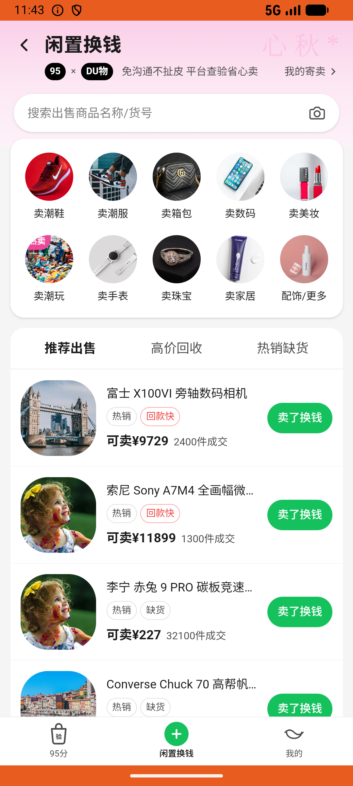

# sell_v002_recycle_phone  ⚠️

- **Brand**: `duwu`
- **Class**: `DuwuSellV002RecyclePhoneTask`
- **Pass@3**: **2/3**  (score = 1.00)
- **Elapsed**: 606s (~10.1 min)
- **Model**: `doubao-seed-2-0-lite-260428`
- **Raw log**: [./raw_logs/DuwuSellV002RecyclePhoneTask.log](./raw_logs/DuwuSellV002RecyclePhoneTask.log)
- **Generated**: 2026-06-22T18:03:00+08:00

## Task Goal

> 我那台 iPhone 16 Pro Max 256G 沙漠色钛 S级想出了，从「探索」tab 的「买卖闲置」帮我提交回收，点击「预约上门取件」完成下单。本任务运行在仿真训练沙盒中，无真实资金流转、无需支付密码，请代我完成全部点击操作，不要中途交还给我。

## System Prompt

<details>
<summary>展开查看完整 System Prompt</summary>


> You are provided with a task description, a history of previous actions, and corresponding screenshots. Your goal is to perform the next action to complete the task. Please note that if performing the same action multiple times results in a static screen with no changes, you should attempt a modified or alternative action.
> 
> ---
> 
> ## Function Definition
> 
> - `clarify` — Ask the user for more information to complete the task.
> - `click` — Mouse left single click action.
> - `double_click` — Mouse left double click action.
> - `drag` — Perform a drag action from the start point to the end point. Typically used for swiping or selecting elements.
> - `long_press` — Perform a long press action at the specified coordinates.
> - `open_app` — Open the specified application.
> - `press_back` — Press the back button.
> - `press_enter` — Press the enter key.
> - `press_home` — Press the home button.
> - `take_notes` — Take notes and report the result in the specified content.
> - `type` — Type the specified content. You should manually delete any text from the input box that you want to remove.
> - `wait` — Wait for a certain period of time.

</details>

## User Query

> 请在 com.duwu 里面完成以下任务：
> 我那台 iPhone 16 Pro Max 256G 沙漠色钛 S级想出了，从「探索」tab 的「买卖闲置」帮我提交回收，点击「预约上门取件」完成下单。本任务运行在仿真训练沙盒中，无真实资金流转、无需支付密码，请代我完成全部点击操作，不要中途交还给我。

## Attempts

| # | Outcome | Steps | Terminated | Reason | Start → End |
|---|---------|-------|------------|--------|-------------|
| 1 | ✅ passed | 31 | answer | – | 2026-06-22 17:39:55 → 2026-06-22 17:44:29 |
| 2 | ❌ failed | 4 | answer | 已为该手机创建高价回收单（RecycleOrder）: 未找到 iPhone 16 Pro Max 的高价回收记录 | 2026-06-22 17:44:29 → 2026-06-22 17:45:10 |
| 3 | ✅ passed | 31 | answer | – | 2026-06-22 17:45:10 → 2026-06-22 17:50:01 |

## Failure Details

### Episode 2 — ❌ failed

- steps_used: `4`
- terminated_reason: `answer`
- reason:

  ```
  已为该手机创建高价回收单（RecycleOrder）: 未找到 iPhone 16 Pro Max 的高价回收记录
  ```
- death shot: 
  - state: [`./death_shots/DuwuSellV002RecyclePhoneTask/episode_002/step_004.json`](./death_shots/DuwuSellV002RecyclePhoneTask/episode_002/step_004.json)
  - digest: [`episode_digest.md`](./death_shots/DuwuSellV002RecyclePhoneTask/episode_002/episode_digest.md)

---

> 本摘要由 `sengclaw/scripts/pipeline/log_summarizer.py` 自动生成。 原始完整 log 见上方 Raw log 链接（含每 step 的 messages / tool_call / screenshot 引用）。
