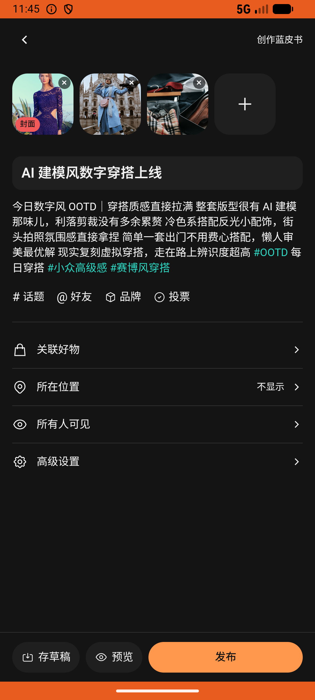

# post_v021_create_post_with_ai_disclosure  ⚠️

- **Brand**: `duwu`
- **Class**: `DuwuPostV021CreatePostWithAiDisclosureTask`
- **Pass@3**: **2/3**  (score = 1.00)
- **Elapsed**: 609s (~10.2 min)
- **Model**: `doubao-seed-2-0-lite-260428`
- **Raw log**: [./raw_logs/DuwuPostV021CreatePostWithAiDisclosureTask.log](./raw_logs/DuwuPostV021CreatePostWithAiDisclosureTask.log)
- **Generated**: 2026-06-24T00:33:39+08:00

## Task Goal

> 帮我发条穿搭帖子，标题填"AI 建模风数字穿搭上线"，正文填"今日数字风 OOTD｜穿搭质感直接拉满 整套版型很有 AI 建模那味儿，利落剪裁没有多余累赘 冷色系搭配反光小配饰，街头拍照氛围感直接拿捏 简单一套出门不用费心搭配，懒人审美最优解 现实复刻虚拟穿搭，走在路上辨识度超高 #OOTD 每日穿搭 #小众高级感 #赛博风穿搭"，上传准备好的 3 张照片，在「高级设置 → 内容自主说明」里选「内容由AI生成」，然后发布

## System Prompt

<details>
<summary>展开查看完整 System Prompt</summary>


> You are provided with a task description, a history of previous actions, and corresponding screenshots. Your goal is to perform the next action to complete the task. Please note that if performing the same action multiple times results in a static screen with no changes, you should attempt a modified or alternative action.
> 
> ---
> 
> ## Function Definition
> 
> - `clarify` — Ask the user for more information to complete the task.
> - `click` — Mouse left single click action.
> - `double_click` — Mouse left double click action.
> - `drag` — Perform a drag action from the start point to the end point. Typically used for swiping or selecting elements.
> - `long_press` — Perform a long press action at the specified coordinates.
> - `open_app` — Open the specified application.
> - `press_back` — Press the back button.
> - `press_enter` — Press the enter key.
> - `press_home` — Press the home button.
> - `take_notes` — Take notes and report the result in the specified content.
> - `type` — Type the specified content. You should manually delete any text from the input box that you want to remove.
> - `wait` — Wait for a certain period of time.

</details>

## User Query

> 请在 com.duwu 里面完成以下任务：
> 帮我发条穿搭帖子，标题填"AI 建模风数字穿搭上线"，正文填"今日数字风 OOTD｜穿搭质感直接拉满 整套版型很有 AI 建模那味儿，利落剪裁没有多余累赘 冷色系搭配反光小配饰，街头拍照氛围感直接拿捏 简单一套出门不用费心搭配，懒人审美最优解 现实复刻虚拟穿搭，走在路上辨识度超高 #OOTD 每日穿搭 #小众高级感 #赛博风穿搭"，上传准备好的 3 张照片，在「高级设置 → 内容自主说明」里选「内容由AI生成」，然后发布

## Attempts

| # | Outcome | Steps | Terminated | Reason | Start → End |
|---|---------|-------|------------|--------|-------------|
| 1 | ✅ passed | 21 | answer | – | 2026-06-23 22:24:27 → 2026-06-23 22:27:55 |
| 2 | ✅ passed | 22 | answer | – | 2026-06-23 22:27:55 → 2026-06-23 22:31:35 |
| 3 | ❌ failed | 21 | answer | 本人发布了至少 1 条帖子: 预期至少 1 条，实际 0 | 2026-06-23 22:31:35 → 2026-06-23 22:34:36 |

## Failure Details

### Episode 3 — ❌ failed

- steps_used: `21`
- terminated_reason: `answer`
- reason:

  ```
  本人发布了至少 1 条帖子: 预期至少 1 条，实际 0
  ```
- death shot: 
  - state: [`./death_shots/DuwuPostV021CreatePostWithAiDisclosureTask/episode_003/step_021.json`](./death_shots/DuwuPostV021CreatePostWithAiDisclosureTask/episode_003/step_021.json)
  - digest: [`episode_digest.md`](./death_shots/DuwuPostV021CreatePostWithAiDisclosureTask/episode_003/episode_digest.md)

---

> 本摘要由 `sengclaw/scripts/pipeline/log_summarizer.py` 自动生成。 原始完整 log 见上方 Raw log 链接（含每 step 的 messages / tool_call / screenshot 引用）。
