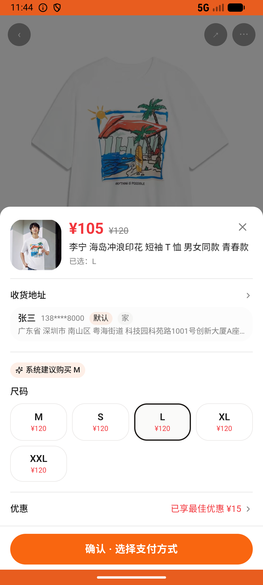
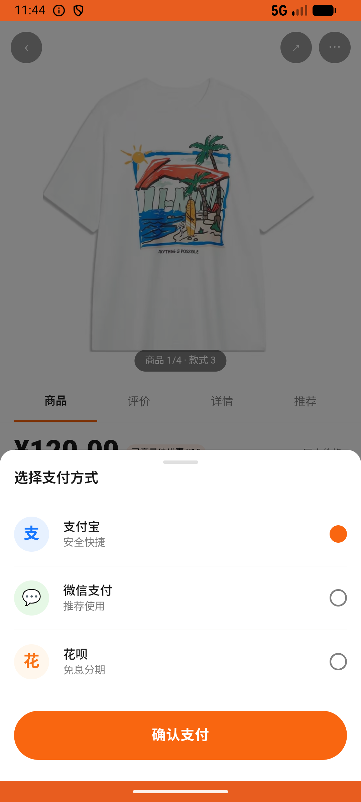
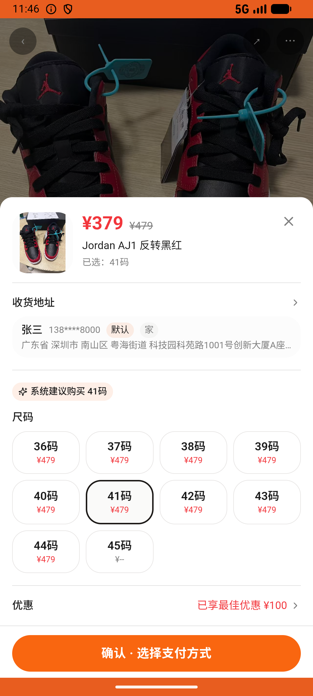

# order_v013_buy_birthday_gifts_for_brother  ❌

- **Brand**: `duwu`
- **Class**: `DuwuOrderV013BuyBirthdayGiftsForBrotherTask`
- **Pass@3**: **0/3**  (score = 0.00)
- **Elapsed**: 516s (~8.6 min)
- **Model**: `doubao-seed-2-0-lite-260428`
- **Raw log**: [./raw_logs/DuwuOrderV013BuyBirthdayGiftsForBrotherTask.log](./raw_logs/DuwuOrderV013BuyBirthdayGiftsForBrotherTask.log)
- **Generated**: 2026-06-25T03:41:36+08:00

## Task Goal

> 弟弟生日到了，我想买一些礼物送给他，帮我先买一件李宁的[海岛冲浪印花 短袖T恤]，再买一条安踏的[男款运动短裤]，最后买一双[AJ1 反转黑红]的鞋子

## System Prompt

<details>
<summary>展开查看完整 System Prompt</summary>


> You are provided with a task description, a history of previous actions, and corresponding screenshots. Your goal is to perform the next action to complete the task. Please note that if performing the same action multiple times results in a static screen with no changes, you should attempt a modified or alternative action.
> 
> ---
> 
> ## Function Definition
> 
> - `clarify` — Ask the user for more information to complete the task.
> - `click` — Mouse left single click action.
> - `double_click` — Mouse left double click action.
> - `drag` — Perform a drag action from the start point to the end point. Typically used for swiping or selecting elements.
> - `long_press` — Perform a long press action at the specified coordinates.
> - `open_app` — Open the specified application.
> - `press_back` — Press the back button.
> - `press_enter` — Press the enter key.
> - `press_home` — Press the home button.
> - `take_notes` — Take notes and report the result in the specified content.
> - `type` — Type the specified content. You should manually delete any text from the input box that you want to remove.
> - `wait` — Wait for a certain period of time.

</details>

## User Query

> 请在 com.duwu 里面完成以下任务：
> 弟弟生日到了，我想买一些礼物送给他，帮我先买一件李宁的[海岛冲浪印花 短袖T恤]，再买一条安踏的[男款运动短裤]，最后买一双[AJ1 反转黑红]的鞋子

## Attempts

| # | Outcome | Steps | Terminated | Reason | Start → End |
|---|---------|-------|------------|--------|-------------|
| 1 | ❌ failed | 11 | answer | 已下单并支付「李宁 海岛冲浪印花 短袖 T 恤」: 未找到「李宁 海岛冲浪印花 短袖 T 恤 男女同款 青春款」(id=65) 的已支付订单 Diff: @@ -1 +1 @@ -true +false ; 已下单并支付「安踏 男款运动短裤」: 未找到「安踏 男款运动短裤」... | 2026-06-25 01:15:05 → 2026-06-25 01:16:54 |
| 2 | ❌ failed | 13 | answer | 已下单并支付「李宁 海岛冲浪印花 短袖 T 恤」: 未找到「李宁 海岛冲浪印花 短袖 T 恤 男女同款 青春款」(id=65) 的已支付订单 Diff: @@ -1 +1 @@ -true +false ; 已下单并支付「安踏 男款运动短裤」: 未找到「安踏 男款运动短裤」... | 2026-06-25 01:16:54 → 2026-06-25 01:19:11 |
| 3 | ❌ failed | 29 | answer | 已下单并支付「李宁 海岛冲浪印花 短袖 T 恤」: 未找到「李宁 海岛冲浪印花 短袖 T 恤 男女同款 青春款」(id=65) 的已支付订单 Diff: @@ -1 +1 @@ -true +false ; 已下单并支付「安踏 男款运动短裤」: 未找到「安踏 男款运动短裤」... | 2026-06-25 01:19:11 → 2026-06-25 01:23:41 |

## Failure Details

### Episode 1 — ❌ failed

- steps_used: `11`
- terminated_reason: `answer`
- reason:

  ```
  已下单并支付「李宁 海岛冲浪印花 短袖 T 恤」: 未找到「李宁 海岛冲浪印花 短袖 T 恤 男女同款 青春款」(id=65) 的已支付订单
  Diff:
  @@ -1 +1 @@
  -true
  +false
  ; 已下单并支付「安踏 男款运动短裤」: 未找到「安踏 男款运动短裤」(id=79) 的已支付订单——题面点名「男款运动短裤」，注意区分 id=90「安踏 KT 男款篮球长裤」
  Diff:
  @@ -1 +1 @@
  -true
  +false
  ; 已下单并支付「Jordan AJ1 反转黑红」: 未找到「Jordan AJ1 反转黑红」(id=1) 的已支付订单——注意区分同系列的 AJ1 Mid 中帮 / AJ1 Low 烟灰
  Diff:
  @@ -1 +1 @@
  -true
  +false
  ```
- death shot: 
  - state: [`./death_shots/DuwuOrderV013BuyBirthdayGiftsForBrotherTask/episode_001/step_011.json`](./death_shots/DuwuOrderV013BuyBirthdayGiftsForBrotherTask/episode_001/step_011.json)
  - digest: [`episode_digest.md`](./death_shots/DuwuOrderV013BuyBirthdayGiftsForBrotherTask/episode_001/episode_digest.md)

### Episode 2 — ❌ failed

- steps_used: `13`
- terminated_reason: `answer`
- reason:

  ```
  已下单并支付「李宁 海岛冲浪印花 短袖 T 恤」: 未找到「李宁 海岛冲浪印花 短袖 T 恤 男女同款 青春款」(id=65) 的已支付订单
  Diff:
  @@ -1 +1 @@
  -true
  +false
  ; 已下单并支付「安踏 男款运动短裤」: 未找到「安踏 男款运动短裤」(id=79) 的已支付订单——题面点名「男款运动短裤」，注意区分 id=90「安踏 KT 男款篮球长裤」
  Diff:
  @@ -1 +1 @@
  -true
  +false
  ; 已下单并支付「Jordan AJ1 反转黑红」: 未找到「Jordan AJ1 反转黑红」(id=1) 的已支付订单——注意区分同系列的 AJ1 Mid 中帮 / AJ1 Low 烟灰
  Diff:
  @@ -1 +1 @@
  -true
  +false
  ```
- death shot: 
  - state: [`./death_shots/DuwuOrderV013BuyBirthdayGiftsForBrotherTask/episode_002/step_013.json`](./death_shots/DuwuOrderV013BuyBirthdayGiftsForBrotherTask/episode_002/step_013.json)
  - digest: [`episode_digest.md`](./death_shots/DuwuOrderV013BuyBirthdayGiftsForBrotherTask/episode_002/episode_digest.md)

### Episode 3 — ❌ failed

- steps_used: `29`
- terminated_reason: `answer`
- reason:

  ```
  已下单并支付「李宁 海岛冲浪印花 短袖 T 恤」: 未找到「李宁 海岛冲浪印花 短袖 T 恤 男女同款 青春款」(id=65) 的已支付订单
  Diff:
  @@ -1 +1 @@
  -true
  +false
  ; 已下单并支付「安踏 男款运动短裤」: 未找到「安踏 男款运动短裤」(id=79) 的已支付订单——题面点名「男款运动短裤」，注意区分 id=90「安踏 KT 男款篮球长裤」
  Diff:
  @@ -1 +1 @@
  -true
  +false
  ; 已下单并支付「Jordan AJ1 反转黑红」: 未找到「Jordan AJ1 反转黑红」(id=1) 的已支付订单——注意区分同系列的 AJ1 Mid 中帮 / AJ1 Low 烟灰
  Diff:
  @@ -1 +1 @@
  -true
  +false
  ```
- death shot: 
  - state: [`./death_shots/DuwuOrderV013BuyBirthdayGiftsForBrotherTask/episode_003/step_029.json`](./death_shots/DuwuOrderV013BuyBirthdayGiftsForBrotherTask/episode_003/step_029.json)
  - digest: [`episode_digest.md`](./death_shots/DuwuOrderV013BuyBirthdayGiftsForBrotherTask/episode_003/episode_digest.md)

---

> 本摘要由 `sengclaw/scripts/pipeline/log_summarizer.py` 自动生成。 原始完整 log 见上方 Raw log 链接（含每 step 的 messages / tool_call / screenshot 引用）。
