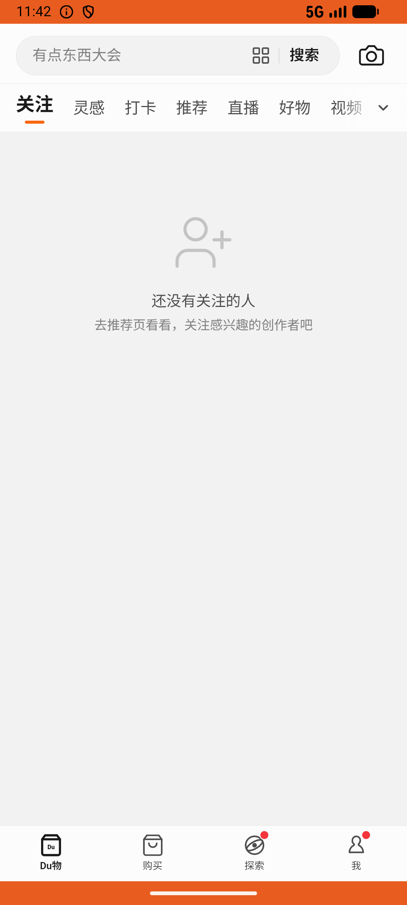
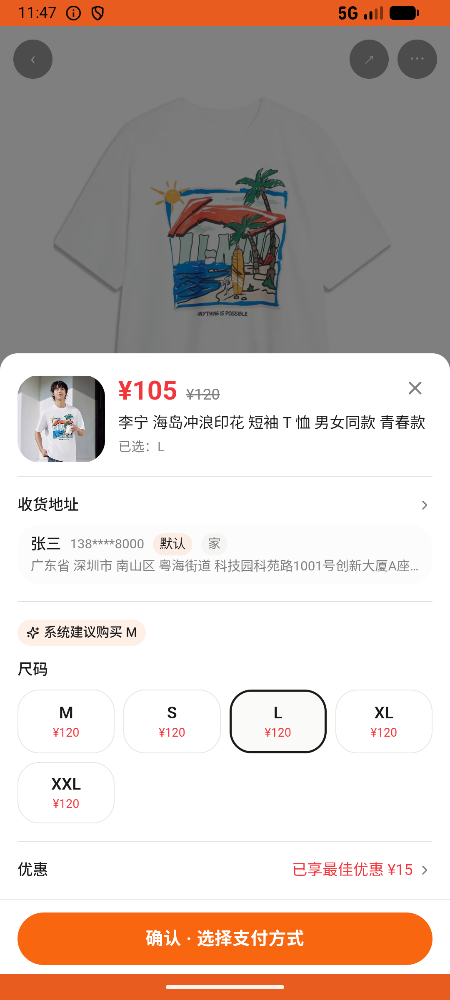

# order_v014_buy_lining_tee_from_kol_feed  ❌

- **Brand**: `duwu`
- **Class**: `DuwuOrderV014BuyLiningTeeFromKolFeedTask`
- **Pass@3**: **0/3**  (score = 0.00)
- **Elapsed**: 405s (~6.8 min)
- **Model**: `doubao-seed-2-0-lite-260428`
- **Raw log**: [./raw_logs/DuwuOrderV014BuyLiningTeeFromKolFeedTask.log](./raw_logs/DuwuOrderV014BuyLiningTeeFromKolFeedTask.log)
- **Generated**: 2026-06-25T03:41:36+08:00

## Task Goal

> 关注页刷到「忧郁祖冲之I」的帖子，从帖子里直接买李宁这件短袖，要 L 码

## System Prompt

<details>
<summary>展开查看完整 System Prompt</summary>


> You are provided with a task description, a history of previous actions, and corresponding screenshots. Your goal is to perform the next action to complete the task. Please note that if performing the same action multiple times results in a static screen with no changes, you should attempt a modified or alternative action.
> 
> ---
> 
> ## Function Definition
> 
> - `clarify` — Ask the user for more information to complete the task.
> - `click` — Mouse left single click action.
> - `double_click` — Mouse left double click action.
> - `drag` — Perform a drag action from the start point to the end point. Typically used for swiping or selecting elements.
> - `long_press` — Perform a long press action at the specified coordinates.
> - `open_app` — Open the specified application.
> - `press_back` — Press the back button.
> - `press_enter` — Press the enter key.
> - `press_home` — Press the home button.
> - `take_notes` — Take notes and report the result in the specified content.
> - `type` — Type the specified content. You should manually delete any text from the input box that you want to remove.
> - `wait` — Wait for a certain period of time.

</details>

## User Query

> 请在 com.duwu 里面完成以下任务：
> 关注页刷到「忧郁祖冲之I」的帖子，从帖子里直接买李宁这件短袖，要 L 码

## Attempts

| # | Outcome | Steps | Terminated | Reason | Start → End |
|---|---------|-------|------------|--------|-------------|
| 1 | ❌ failed | 11 | answer | 存在李宁短袖订单且已支付: 未找到「李宁 海岛冲浪印花 短袖 T 恤 男女同款 青春款」的已支付订单 | 2026-06-25 01:24:24 → 2026-06-25 01:26:03 |
| 2 | ❌ failed | 3 | answer | 已关注「忧郁祖冲之I」: 未找到对忧郁祖冲之I 的关注记录; 已浏览过「经典红白蓝，穿出随性自在范」帖子: 未找到对该帖子的浏览记录（应进入帖子详情）; 存在李宁短袖订单且已支付: 未找到「李宁 海岛冲浪印花 短袖 T 恤 男女同款 青春款」的已支付订单 | 2026-06-25 01:26:03 → 2026-06-25 01:26:34 |
| 3 | ❌ failed | 28 | answer | 存在李宁短袖订单且已支付: 未找到「李宁 海岛冲浪印花 短袖 T 恤 男女同款 青春款」的已支付订单 | 2026-06-25 01:26:34 → 2026-06-25 01:31:08 |

## Failure Details

### Episode 1 — ❌ failed

- steps_used: `11`
- terminated_reason: `answer`
- reason:

  ```
  存在李宁短袖订单且已支付: 未找到「李宁 海岛冲浪印花 短袖 T 恤 男女同款 青春款」的已支付订单
  ```
- death shot: 
  - state: [`./death_shots/DuwuOrderV014BuyLiningTeeFromKolFeedTask/episode_001/step_011.json`](./death_shots/DuwuOrderV014BuyLiningTeeFromKolFeedTask/episode_001/step_011.json)
  - digest: [`episode_digest.md`](./death_shots/DuwuOrderV014BuyLiningTeeFromKolFeedTask/episode_001/episode_digest.md)

### Episode 2 — ❌ failed

- steps_used: `3`
- terminated_reason: `answer`
- reason:

  ```
  已关注「忧郁祖冲之I」: 未找到对忧郁祖冲之I 的关注记录; 已浏览过「经典红白蓝，穿出随性自在范」帖子: 未找到对该帖子的浏览记录（应进入帖子详情）; 存在李宁短袖订单且已支付: 未找到「李宁 海岛冲浪印花 短袖 T 恤 男女同款 青春款」的已支付订单
  ```
- death shot: 
  - state: [`./death_shots/DuwuOrderV014BuyLiningTeeFromKolFeedTask/episode_002/step_003.json`](./death_shots/DuwuOrderV014BuyLiningTeeFromKolFeedTask/episode_002/step_003.json)
  - digest: [`episode_digest.md`](./death_shots/DuwuOrderV014BuyLiningTeeFromKolFeedTask/episode_002/episode_digest.md)

### Episode 3 — ❌ failed

- steps_used: `28`
- terminated_reason: `answer`
- reason:

  ```
  存在李宁短袖订单且已支付: 未找到「李宁 海岛冲浪印花 短袖 T 恤 男女同款 青春款」的已支付订单
  ```
- death shot: 
  - state: [`./death_shots/DuwuOrderV014BuyLiningTeeFromKolFeedTask/episode_003/step_028.json`](./death_shots/DuwuOrderV014BuyLiningTeeFromKolFeedTask/episode_003/step_028.json)
  - digest: [`episode_digest.md`](./death_shots/DuwuOrderV014BuyLiningTeeFromKolFeedTask/episode_003/episode_digest.md)

---

> 本摘要由 `sengclaw/scripts/pipeline/log_summarizer.py` 自动生成。 原始完整 log 见上方 Raw log 链接（含每 step 的 messages / tool_call / screenshot 引用）。
