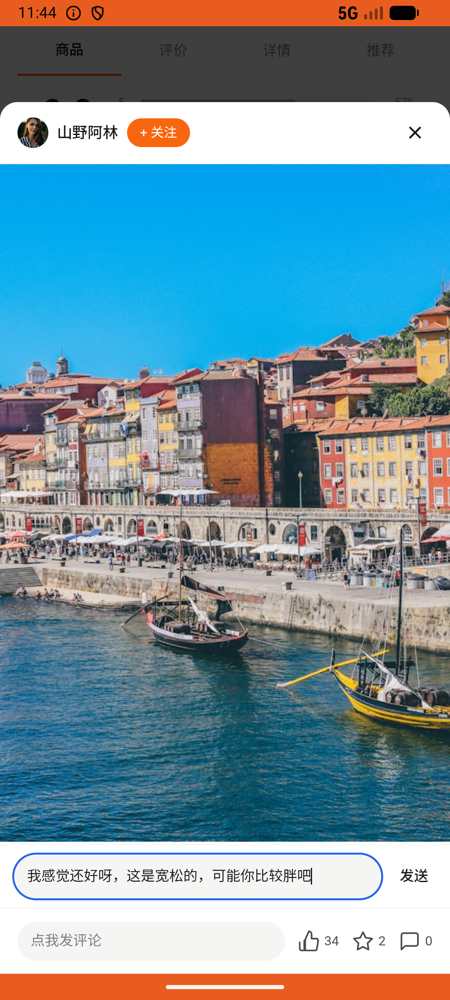

# review_v011_reply_lining_tee_shanye_review  ⚠️

- **Brand**: `duwu`
- **Class**: `DuwuReviewV011ReplyLiningTeeShanyeReviewTask`
- **Pass@3**: **1/3**  (score = 1.00)
- **Elapsed**: 345s (~5.8 min)
- **Model**: `doubao-seed-2-0-lite-260428`
- **Raw log**: [./raw_logs/DuwuReviewV011ReplyLiningTeeShanyeReviewTask.log](./raw_logs/DuwuReviewV011ReplyLiningTeeShanyeReviewTask.log)
- **Generated**: 2026-06-25T03:41:37+08:00

## Task Goal

> 「李宁 海岛冲浪印花 短袖 T 恤」那商品下面有人评价「袖口偏紧，胳膊粗的同学慎重，颜色比图上深一点点」，评论发送一句「我感觉还好呀，这是宽松的，可能你比较胖吧」

## System Prompt

<details>
<summary>展开查看完整 System Prompt</summary>


> You are provided with a task description, a history of previous actions, and corresponding screenshots. Your goal is to perform the next action to complete the task. Please note that if performing the same action multiple times results in a static screen with no changes, you should attempt a modified or alternative action.
> 
> ---
> 
> ## Function Definition
> 
> - `clarify` — Ask the user for more information to complete the task.
> - `click` — Mouse left single click action.
> - `double_click` — Mouse left double click action.
> - `drag` — Perform a drag action from the start point to the end point. Typically used for swiping or selecting elements.
> - `long_press` — Perform a long press action at the specified coordinates.
> - `open_app` — Open the specified application.
> - `press_back` — Press the back button.
> - `press_enter` — Press the enter key.
> - `press_home` — Press the home button.
> - `take_notes` — Take notes and report the result in the specified content.
> - `type` — Type the specified content. You should manually delete any text from the input box that you want to remove.
> - `wait` — Wait for a certain period of time.

</details>

## User Query

> 请在 com.duwu 里面完成以下任务：
> 「李宁 海岛冲浪印花 短袖 T 恤」那商品下面有人评价「袖口偏紧，胳膊粗的同学慎重，颜色比图上深一点点」，评论发送一句「我感觉还好呀，这是宽松的，可能你比较胖吧」

## Attempts

| # | Outcome | Steps | Terminated | Reason | Start → End |
|---|---------|-------|------------|--------|-------------|
| 1 | ❌ failed | 13 | answer | 已在该评价下发评论: 未找到 demo 用户对该评价的回复 | 2026-06-25 02:03:33 → 2026-06-25 02:05:13 |
| 2 | ❌ failed | 13 | answer | 已在该评价下发评论: 未找到 demo 用户对该评价的回复 | 2026-06-25 02:05:13 → 2026-06-25 02:07:03 |
| 3 | ✅ passed | 15 | answer | – | 2026-06-25 02:07:03 → 2026-06-25 02:09:17 |

## Failure Details

### Episode 1 — ❌ failed

- steps_used: `13`
- terminated_reason: `answer`
- reason:

  ```
  已在该评价下发评论: 未找到 demo 用户对该评价的回复
  ```
- death shot: 
  - state: [`./death_shots/DuwuReviewV011ReplyLiningTeeShanyeReviewTask/episode_001/step_013.json`](./death_shots/DuwuReviewV011ReplyLiningTeeShanyeReviewTask/episode_001/step_013.json)
  - digest: [`episode_digest.md`](./death_shots/DuwuReviewV011ReplyLiningTeeShanyeReviewTask/episode_001/episode_digest.md)

### Episode 2 — ❌ failed

- steps_used: `13`
- terminated_reason: `answer`
- reason:

  ```
  已在该评价下发评论: 未找到 demo 用户对该评价的回复
  ```
- death shot: 
  - state: [`./death_shots/DuwuReviewV011ReplyLiningTeeShanyeReviewTask/episode_002/step_013.json`](./death_shots/DuwuReviewV011ReplyLiningTeeShanyeReviewTask/episode_002/step_013.json)
  - digest: [`episode_digest.md`](./death_shots/DuwuReviewV011ReplyLiningTeeShanyeReviewTask/episode_002/episode_digest.md)

---

> 本摘要由 `sengclaw/scripts/pipeline/log_summarizer.py` 自动生成。 原始完整 log 见上方 Raw log 链接（含每 step 的 messages / tool_call / screenshot 引用）。
