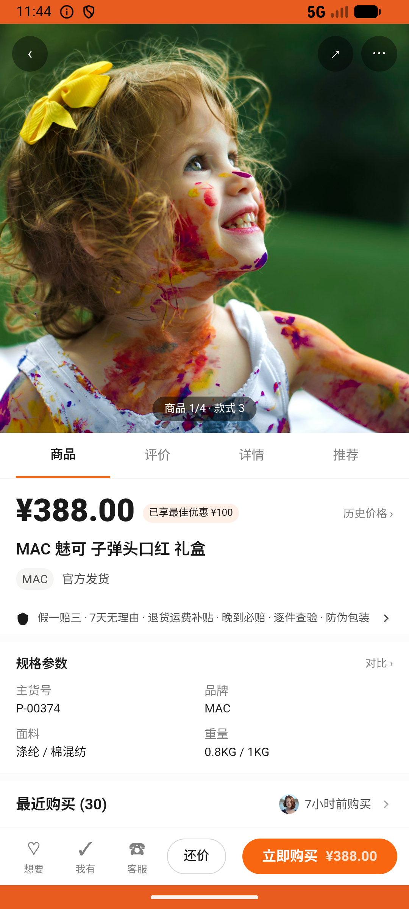
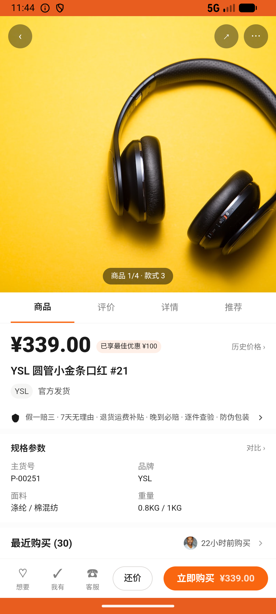

# sku_v008_buy_valentine_lipstick  ❌

- **Brand**: `duwu`
- **Class**: `DuwuSkuV008BuyValentineLipstickTask`
- **Pass@3**: **0/3**  (score = 0.00)
- **Elapsed**: 449s (~7.5 min)
- **Model**: `doubao-seed-2-0-lite-260428`
- **Raw log**: [./raw_logs/DuwuSkuV008BuyValentineLipstickTask.log](./raw_logs/DuwuSkuV008BuyValentineLipstickTask.log)
- **Generated**: 2026-06-25T03:41:38+08:00

## Task Goal

> 情人节快到了，想送女朋友一支口红，预算 300-400 元，帮我搜「口红」买一支贵点的口红。

## System Prompt

<details>
<summary>展开查看完整 System Prompt</summary>


> You are provided with a task description, a history of previous actions, and corresponding screenshots. Your goal is to perform the next action to complete the task. Please note that if performing the same action multiple times results in a static screen with no changes, you should attempt a modified or alternative action.
> 
> ---
> 
> ## Function Definition
> 
> - `clarify` — Ask the user for more information to complete the task.
> - `click` — Mouse left single click action.
> - `double_click` — Mouse left double click action.
> - `drag` — Perform a drag action from the start point to the end point. Typically used for swiping or selecting elements.
> - `long_press` — Perform a long press action at the specified coordinates.
> - `open_app` — Open the specified application.
> - `press_back` — Press the back button.
> - `press_enter` — Press the enter key.
> - `press_home` — Press the home button.
> - `take_notes` — Take notes and report the result in the specified content.
> - `type` — Type the specified content. You should manually delete any text from the input box that you want to remove.
> - `wait` — Wait for a certain period of time.

</details>

## User Query

> 请在 com.duwu 里面完成以下任务：
> 情人节快到了，想送女朋友一支口红，预算 300-400 元，帮我搜「口红」买一支贵点的口红。

## Attempts

| # | Outcome | Steps | Terminated | Reason | Start → End |
|---|---------|-------|------------|--------|-------------|
| 1 | ❌ failed | 15 | answer | 存在 MAC 魅可 子弹头口红 礼盒(¥388) 订单: 未找到 MAC 魅可 子弹头口红 礼盒(¥388) 订单。注意：题面预算 300-400 元、要「贵点的」，不能选 ¥339 的 YSL 圆管小金条（区间内更便宜），不能选 ¥429 的 Tom Ford（超预算），... | 2026-06-25 02:55:56 → 2026-06-25 02:57:54 |
| 2 | ❌ failed | 15 | answer | 存在 MAC 魅可 子弹头口红 礼盒(¥388) 订单: 未找到 MAC 魅可 子弹头口红 礼盒(¥388) 订单。注意：题面预算 300-400 元、要「贵点的」，不能选 ¥339 的 YSL 圆管小金条（区间内更便宜），不能选 ¥429 的 Tom Ford（超预算），... | 2026-06-25 02:57:54 → 2026-06-25 02:59:47 |
| 3 | ❌ failed | 15 | answer | 存在 MAC 魅可 子弹头口红 礼盒(¥388) 订单: 未找到 MAC 魅可 子弹头口红 礼盒(¥388) 订单。注意：题面预算 300-400 元、要「贵点的」，不能选 ¥339 的 YSL 圆管小金条（区间内更便宜），不能选 ¥429 的 Tom Ford（超预算），... | 2026-06-25 02:59:47 → 2026-06-25 03:03:24 |

## Failure Details

### Episode 1 — ❌ failed

- steps_used: `15`
- terminated_reason: `answer`
- reason:

  ```
  存在 MAC 魅可 子弹头口红 礼盒(¥388) 订单: 未找到 MAC 魅可 子弹头口红 礼盒(¥388) 订单。注意：题面预算 300-400 元、要「贵点的」，不能选 ¥339 的 YSL 圆管小金条（区间内更便宜），不能选 ¥429 的 Tom Ford（超预算），也不能选 ¥179 的 MAC 子弹头经典正红（虽是同品牌但低于预算）。
  ```
- death shot: 
  - state: [`./death_shots/DuwuSkuV008BuyValentineLipstickTask/episode_001/step_015.json`](./death_shots/DuwuSkuV008BuyValentineLipstickTask/episode_001/step_015.json)
  - digest: [`episode_digest.md`](./death_shots/DuwuSkuV008BuyValentineLipstickTask/episode_001/episode_digest.md)

### Episode 2 — ❌ failed

- steps_used: `15`
- terminated_reason: `answer`
- reason:

  ```
  存在 MAC 魅可 子弹头口红 礼盒(¥388) 订单: 未找到 MAC 魅可 子弹头口红 礼盒(¥388) 订单。注意：题面预算 300-400 元、要「贵点的」，不能选 ¥339 的 YSL 圆管小金条（区间内更便宜），不能选 ¥429 的 Tom Ford（超预算），也不能选 ¥179 的 MAC 子弹头经典正红（虽是同品牌但低于预算）。
  ```
- death shot: 
  - state: [`./death_shots/DuwuSkuV008BuyValentineLipstickTask/episode_002/step_015.json`](./death_shots/DuwuSkuV008BuyValentineLipstickTask/episode_002/step_015.json)
  - digest: [`episode_digest.md`](./death_shots/DuwuSkuV008BuyValentineLipstickTask/episode_002/episode_digest.md)

### Episode 3 — ❌ failed

- steps_used: `15`
- terminated_reason: `answer`
- reason:

  ```
  存在 MAC 魅可 子弹头口红 礼盒(¥388) 订单: 未找到 MAC 魅可 子弹头口红 礼盒(¥388) 订单。注意：题面预算 300-400 元、要「贵点的」，不能选 ¥339 的 YSL 圆管小金条（区间内更便宜），不能选 ¥429 的 Tom Ford（超预算），也不能选 ¥179 的 MAC 子弹头经典正红（虽是同品牌但低于预算）。
  ```
- death shot: 
  - state: [`./death_shots/DuwuSkuV008BuyValentineLipstickTask/episode_003/step_015.json`](./death_shots/DuwuSkuV008BuyValentineLipstickTask/episode_003/step_015.json)
  - digest: [`episode_digest.md`](./death_shots/DuwuSkuV008BuyValentineLipstickTask/episode_003/episode_digest.md)

---

> 本摘要由 `sengclaw/scripts/pipeline/log_summarizer.py` 自动生成。 原始完整 log 见上方 Raw log 链接（含每 step 的 messages / tool_call / screenshot 引用）。
