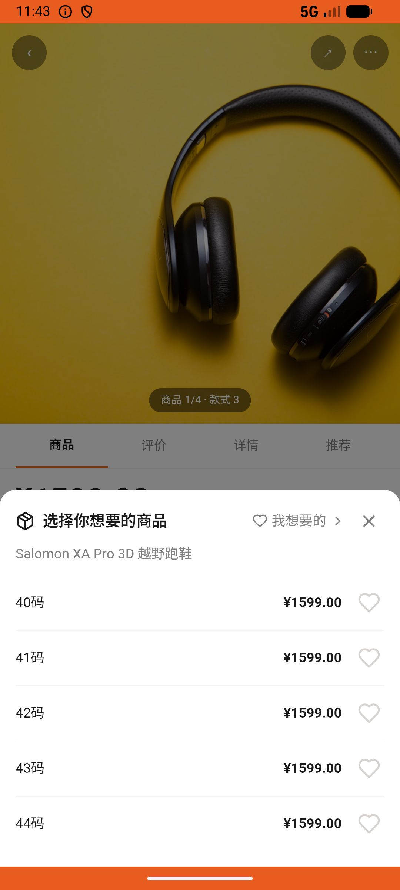
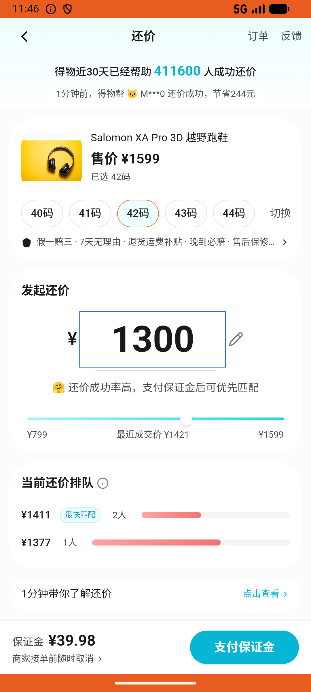

# search_v003_search_then_follow_author  ⚠️

- **Brand**: `duwu`
- **Class**: `DuwuSearchV003SearchThenFollowAuthorTask`
- **Pass@3**: **1/3**  (score = 1.00)
- **Elapsed**: 530s (~8.8 min)
- **Model**: `doubao-seed-2-0-lite-260428`
- **Raw log**: [./raw_logs/DuwuSearchV003SearchThenFollowAuthorTask.log](./raw_logs/DuwuSearchV003SearchThenFollowAuthorTask.log)
- **Generated**: 2026-06-26T14:04:13+08:00

## Task Goal

> 下个月要跑越野赛，想入双 Salomon XA Pro 3D，先加进想要，再设个降到 1300 就提醒我的

## System Prompt

<details>
<summary>展开查看完整 System Prompt</summary>


> You are provided with a task description, a history of previous actions, and corresponding screenshots. Your goal is to perform the next action to complete the task. Please note that if performing the same action multiple times results in a static screen with no changes, you should attempt a modified or alternative action.
> 
> ---
> 
> ## Function Definition
> 
> - `clarify` — Ask the user for more information to complete the task.
> - `click` — Mouse left single click action.
> - `double_click` — Mouse left double click action.
> - `drag` — Perform a drag action from the start point to the end point. Typically used for swiping or selecting elements.
> - `long_press` — Perform a long press action at the specified coordinates.
> - `open_app` — Open the specified application.
> - `press_back` — Press the back button.
> - `press_enter` — Press the enter key.
> - `press_home` — Press the home button.
> - `take_notes` — Take notes and report the result in the specified content.
> - `type` — Type the specified content. You should manually delete any text from the input box that you want to remove.
> - `wait` — Wait for a certain period of time.

</details>

## User Query

> 请在 com.duwu 里面完成以下任务：
> 下个月要跑越野赛，想入双 Salomon XA Pro 3D，先加进想要，再设个降到 1300 就提醒我的

## Attempts

| # | Outcome | Steps | Terminated | Reason | Start → End |
|---|---------|-------|------------|--------|-------------|
| 1 | ❌ failed | 9 | answer | 已把 Salomon XA Pro 3D 加入想要清单: 未找到 Salomon XA Pro 3D 越野跑鞋的想要记录; 已为 Salomon XA Pro 3D 设置降价提醒: 未找到 Salomon XA Pro 3D 的降价提醒; 降价提醒的目标价是 1300 元:... | 2026-06-26 12:51:51 → 2026-06-26 12:53:13 |
| 2 | ❌ failed | 28 | answer | 已为 Salomon XA Pro 3D 设置降价提醒: 未找到 Salomon XA Pro 3D 的降价提醒; 降价提醒的目标价是 1300 元: 未找到目标价 1300 元（130000 分）的降价提醒，实际：[] | 2026-06-26 12:53:13 → 2026-06-26 12:57:36 |
| 3 | ✅ passed | 22 | answer | – | 2026-06-26 12:57:36 → 2026-06-26 13:00:41 |

## Failure Details

### Episode 1 — ❌ failed

- steps_used: `9`
- terminated_reason: `answer`
- reason:

  ```
  已把 Salomon XA Pro 3D 加入想要清单: 未找到 Salomon XA Pro 3D 越野跑鞋的想要记录; 已为 Salomon XA Pro 3D 设置降价提醒: 未找到 Salomon XA Pro 3D 的降价提醒; 降价提醒的目标价是 1300 元: 未找到目标价 1300 元（130000 分）的降价提醒，实际：[]
  ```
- death shot: 
  - state: [`./death_shots/DuwuSearchV003SearchThenFollowAuthorTask/episode_001/step_009.json`](./death_shots/DuwuSearchV003SearchThenFollowAuthorTask/episode_001/step_009.json)
  - digest: [`episode_digest.md`](./death_shots/DuwuSearchV003SearchThenFollowAuthorTask/episode_001/episode_digest.md)

### Episode 2 — ❌ failed

- steps_used: `28`
- terminated_reason: `answer`
- reason:

  ```
  已为 Salomon XA Pro 3D 设置降价提醒: 未找到 Salomon XA Pro 3D 的降价提醒; 降价提醒的目标价是 1300 元: 未找到目标价 1300 元（130000 分）的降价提醒，实际：[]
  ```
- death shot: 
  - state: [`./death_shots/DuwuSearchV003SearchThenFollowAuthorTask/episode_002/step_028.json`](./death_shots/DuwuSearchV003SearchThenFollowAuthorTask/episode_002/step_028.json)
  - digest: [`episode_digest.md`](./death_shots/DuwuSearchV003SearchThenFollowAuthorTask/episode_002/episode_digest.md)

---

> 本摘要由 `sengclaw/scripts/pipeline/log_summarizer.py` 自动生成。 原始完整 log 见上方 Raw log 链接（含每 step 的 messages / tool_call / screenshot 引用）。
