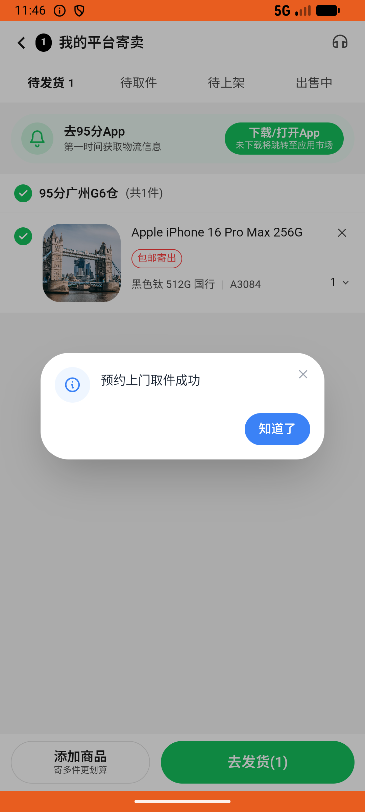

# sell_v013_view_recycle_orders  ⚠️

- **Brand**: `duwu`
- **Class**: `DuwuSellV013ViewRecycleOrdersTask`
- **Pass@3**: **2/3**  (score = 1.00)
- **Elapsed**: 1154s (~19.2 min)
- **Model**: `doubao-seed-2-0-lite-260428`
- **Raw log**: [./raw_logs/DuwuSellV013ViewRecycleOrdersTask.log](./raw_logs/DuwuSellV013ViewRecycleOrdersTask.log)
- **Generated**: 2026-06-29T08:55:47+08:00

## Task Goal

> 从「探索」→「买卖闲置」，在我的高价回收里，找到我那笔 iPhone 16 Pro Max 的回收单（容量填错了，填的 256G，应该是 512G），取消掉，取消原因选「商品信息描述有误」，然后重新提交一笔容量 512G 的回收单，直接完成不用确认

## System Prompt

<details>
<summary>展开查看完整 System Prompt</summary>


> You are provided with a task description, a history of previous actions, and corresponding screenshots. Your goal is to perform the next action to complete the task. Please note that if performing the same action multiple times results in a static screen with no changes, you should attempt a modified or alternative action.
> 
> ---
> 
> ## Function Definition
> 
> - `clarify` — Ask the user for more information to complete the task.
> - `click` — Mouse left single click action.
> - `double_click` — Mouse left double click action.
> - `drag` — Perform a drag action from the start point to the end point. Typically used for swiping or selecting elements.
> - `long_press` — Perform a long press action at the specified coordinates.
> - `open_app` — Open the specified application.
> - `press_back` — Press the back button.
> - `press_enter` — Press the enter key.
> - `press_home` — Press the home button.
> - `take_notes` — Take notes and report the result in the specified content.
> - `type` — Type the specified content. You should manually delete any text from the input box that you want to remove.
> - `wait` — Wait for a certain period of time.

</details>

## User Query

> 请在 com.duwu 里面完成以下任务：
> 从「探索」→「买卖闲置」，在我的高价回收里，找到我那笔 iPhone 16 Pro Max 的回收单（容量填错了，填的 256G，应该是 512G），取消掉，取消原因选「商品信息描述有误」，然后重新提交一笔容量 512G 的回收单，直接完成不用确认

## Attempts

| # | Outcome | Steps | Terminated | Reason | Start → End |
|---|---------|-------|------------|--------|-------------|
| 1 | ✅ passed | 43 | answer | – | 2026-06-29 08:29:49 → 2026-06-29 08:36:02 |
| 2 | ❌ failed | 25 | answer | 已有回收单及新回收单共两条记录: 预期至少 2 条回收记录，实际 1; 重新创建了回收单（待取件状态）: 预期至少 1 条待取件回收单，实际 0; 新回收单问卷容量为 512G: 问卷 capacity 预期 '512G'，实际 nil; 新回收单已有报价: 新回收单报价为 0 | 2026-06-29 08:36:02 → 2026-06-29 08:39:46 |
| 3 | ✅ passed | 58 | answer | – | 2026-06-29 08:39:46 → 2026-06-29 08:49:02 |

## Failure Details

### Episode 2 — ❌ failed

- steps_used: `25`
- terminated_reason: `answer`
- reason:

  ```
  已有回收单及新回收单共两条记录: 预期至少 2 条回收记录，实际 1; 重新创建了回收单（待取件状态）: 预期至少 1 条待取件回收单，实际 0; 新回收单问卷容量为 512G: 问卷 capacity 预期 '512G'，实际 nil; 新回收单已有报价: 新回收单报价为 0
  ```
- death shot: 
  - state: [`./death_shots/DuwuSellV013ViewRecycleOrdersTask/episode_002/step_025.json`](./death_shots/DuwuSellV013ViewRecycleOrdersTask/episode_002/step_025.json)
  - digest: [`episode_digest.md`](./death_shots/DuwuSellV013ViewRecycleOrdersTask/episode_002/episode_digest.md)

---

> 本摘要由 `sengclaw/scripts/pipeline/log_summarizer.py` 自动生成。 原始完整 log 见上方 Raw log 链接（含每 step 的 messages / tool_call / screenshot 引用）。
