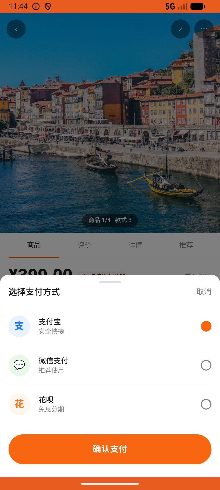

# sku_v005_buy_kt9_for_brother  ⚠️

- **Brand**: `duwu`
- **Class**: `DuwuSkuV005BuyKt9ForBrotherTask`
- **Pass@3**: **2/3**  (score = 1.00)
- **Elapsed**: 533s (~8.9 min)
- **Model**: `doubao-seed-2-0-lite-260428`
- **Raw log**: [./raw_logs/DuwuSkuV005BuyKt9ForBrotherTask.log](./raw_logs/DuwuSkuV005BuyKt9ForBrotherTask.log)
- **Generated**: 2026-06-30T04:30:42+08:00

## Task Goal

> 我想给弟弟买个礼物，先看看「安踏 KT 儿童款 篮球鞋」，发现相关推荐有「Anta KT9 青少年款」这双鞋子，想买「Anta KT9 青少年款」，给弟弟买 36 码，直接支付，无需向我确认。

## System Prompt

<details>
<summary>展开查看完整 System Prompt</summary>


> You are provided with a task description, a history of previous actions, and corresponding screenshots. Your goal is to perform the next action to complete the task. Please note that if performing the same action multiple times results in a static screen with no changes, you should attempt a modified or alternative action.
> 
> ---
> 
> ## Function Definition
> 
> - `clarify` — Ask the user for more information to complete the task.
> - `click` — Mouse left single click action.
> - `double_click` — Mouse left double click action.
> - `drag` — Perform a drag action from the start point to the end point. Typically used for swiping or selecting elements.
> - `long_press` — Perform a long press action at the specified coordinates.
> - `open_app` — Open the specified application.
> - `press_back` — Press the back button.
> - `press_enter` — Press the enter key.
> - `press_home` — Press the home button.
> - `take_notes` — Take notes and report the result in the specified content.
> - `type` — Type the specified content. You should manually delete any text from the input box that you want to remove.
> - `wait` — Wait for a certain period of time.

</details>

## User Query

> 请在 com.duwu 里面完成以下任务：
> 我想给弟弟买个礼物，先看看「安踏 KT 儿童款 篮球鞋」，发现相关推荐有「Anta KT9 青少年款」这双鞋子，想买「Anta KT9 青少年款」，给弟弟买 36 码，直接支付，无需向我确认。

## Attempts

| # | Outcome | Steps | Terminated | Reason | Start → End |
|---|---------|-------|------------|--------|-------------|
| 1 | ❌ failed | 13 | answer | 存在「Anta KT9 青少年款」订单: 未找到 Anta KT9 青少年款 的订单（注意：商品名是「Anta KT9 青少年款」，不是「安踏 KT9 男款篮球鞋」） | 2026-06-30 02:37:55 → 2026-06-30 02:39:49 |
| 2 | ✅ passed | 15 | answer | – | 2026-06-30 02:39:49 → 2026-06-30 02:42:21 |
| 3 | ✅ passed | 14 | answer | – | 2026-06-30 02:42:21 → 2026-06-30 02:46:47 |

## Failure Details

### Episode 1 — ❌ failed

- steps_used: `13`
- terminated_reason: `answer`
- reason:

  ```
  存在「Anta KT9 青少年款」订单: 未找到 Anta KT9 青少年款 的订单（注意：商品名是「Anta KT9 青少年款」，不是「安踏 KT9 男款篮球鞋」）
  ```
- death shot: 
  - state: [`./death_shots/DuwuSkuV005BuyKt9ForBrotherTask/episode_001/step_013.json`](./death_shots/DuwuSkuV005BuyKt9ForBrotherTask/episode_001/step_013.json)
  - digest: [`episode_digest.md`](./death_shots/DuwuSkuV005BuyKt9ForBrotherTask/episode_001/episode_digest.md)

---

> 本摘要由 `sengclaw/scripts/pipeline/log_summarizer.py` 自动生成。 原始完整 log 见上方 Raw log 链接（含每 step 的 messages / tool_call / screenshot 引用）。
