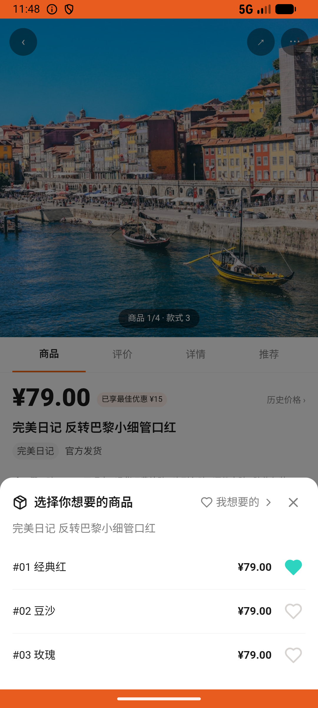
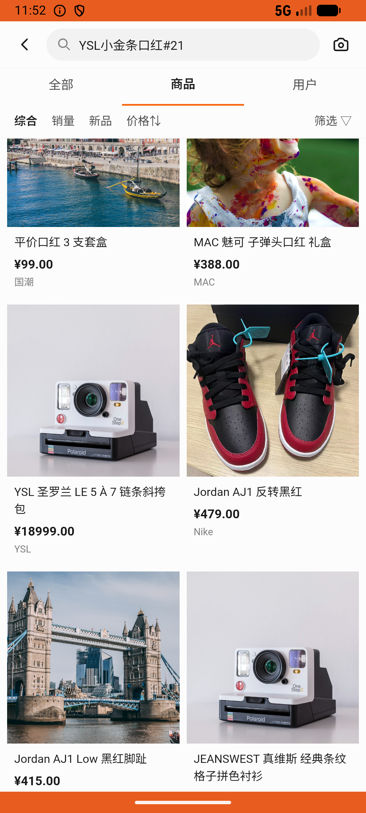

# sku_v009_compare_lipsticks_wish  ⚠️

- **Brand**: `duwu`
- **Class**: `DuwuSkuV009CompareLipsticksWishTask`
- **Pass@3**: **1/3**  (score = 1.00)
- **Elapsed**: 1366s (~22.8 min)
- **Model**: `doubao-seed-2-0-lite-260428`
- **Raw log**: [./raw_logs/DuwuSkuV009CompareLipsticksWishTask.log](./raw_logs/DuwuSkuV009CompareLipsticksWishTask.log)
- **Generated**: 2026-06-30T04:30:42+08:00

## Task Goal

> 帮我把这几款口红加到我的想要里：Tom Ford 黑管口红 #16、YSL 圆管小金条口红 #21、完美日记 反转巴黎小细管口红，后面我自己比一下。去购买页搜「口红」，依次找到这 3 款，进每款详情页选好规格后点心形图标加入想要，直接操作无需向我确认

## System Prompt

<details>
<summary>展开查看完整 System Prompt</summary>


> You are provided with a task description, a history of previous actions, and corresponding screenshots. Your goal is to perform the next action to complete the task. Please note that if performing the same action multiple times results in a static screen with no changes, you should attempt a modified or alternative action.
> 
> ---
> 
> ## Function Definition
> 
> - `clarify` — Ask the user for more information to complete the task.
> - `click` — Mouse left single click action.
> - `double_click` — Mouse left double click action.
> - `drag` — Perform a drag action from the start point to the end point. Typically used for swiping or selecting elements.
> - `long_press` — Perform a long press action at the specified coordinates.
> - `open_app` — Open the specified application.
> - `press_back` — Press the back button.
> - `press_enter` — Press the enter key.
> - `press_home` — Press the home button.
> - `take_notes` — Take notes and report the result in the specified content.
> - `type` — Type the specified content. You should manually delete any text from the input box that you want to remove.
> - `wait` — Wait for a certain period of time.

</details>

## User Query

> 请在 com.duwu 里面完成以下任务：
> 帮我把这几款口红加到我的想要里：Tom Ford 黑管口红 #16、YSL 圆管小金条口红 #21、完美日记 反转巴黎小细管口红，后面我自己比一下。去购买页搜「口红」，依次找到这 3 款，进每款详情页选好规格后点心形图标加入想要，直接操作无需向我确认

## Attempts

| # | Outcome | Steps | Terminated | Reason | Start → End |
|---|---------|-------|------------|--------|-------------|
| 1 | ❌ failed | 43 | answer | YSL 圆管小金条口红 #21 已加入想要: 未找到 YSL 圆管小金条口红 #21 的想要记录 Diff: @@ -1 +1 @@ -true +false | 2026-06-30 03:14:18 → 2026-06-30 03:20:46 |
| 2 | ❌ failed | 60 | answer | YSL 圆管小金条口红 #21 已加入想要: 未找到 YSL 圆管小金条口红 #21 的想要记录 Diff: @@ -1 +1 @@ -true +false | 2026-06-30 03:20:46 → 2026-06-30 03:30:37 |
| 3 | ✅ passed | 42 | answer | – | 2026-06-30 03:30:37 → 2026-06-30 03:37:04 |

## Failure Details

### Episode 1 — ❌ failed

- steps_used: `43`
- terminated_reason: `answer`
- reason:

  ```
  YSL 圆管小金条口红 #21 已加入想要: 未找到 YSL 圆管小金条口红 #21 的想要记录
  Diff:
  @@ -1 +1 @@
  -true
  +false
  ```
- death shot: 
  - state: [`./death_shots/DuwuSkuV009CompareLipsticksWishTask/episode_001/step_043.json`](./death_shots/DuwuSkuV009CompareLipsticksWishTask/episode_001/step_043.json)
  - digest: [`episode_digest.md`](./death_shots/DuwuSkuV009CompareLipsticksWishTask/episode_001/episode_digest.md)

### Episode 2 — ❌ failed

- steps_used: `60`
- terminated_reason: `answer`
- reason:

  ```
  YSL 圆管小金条口红 #21 已加入想要: 未找到 YSL 圆管小金条口红 #21 的想要记录
  Diff:
  @@ -1 +1 @@
  -true
  +false
  ```
- death shot: 
  - state: [`./death_shots/DuwuSkuV009CompareLipsticksWishTask/episode_002/step_060.json`](./death_shots/DuwuSkuV009CompareLipsticksWishTask/episode_002/step_060.json)
  - digest: [`episode_digest.md`](./death_shots/DuwuSkuV009CompareLipsticksWishTask/episode_002/episode_digest.md)

---

> 本摘要由 `sengclaw/scripts/pipeline/log_summarizer.py` 自动生成。 原始完整 log 见上方 Raw log 链接（含每 step 的 messages / tool_call / screenshot 引用）。
