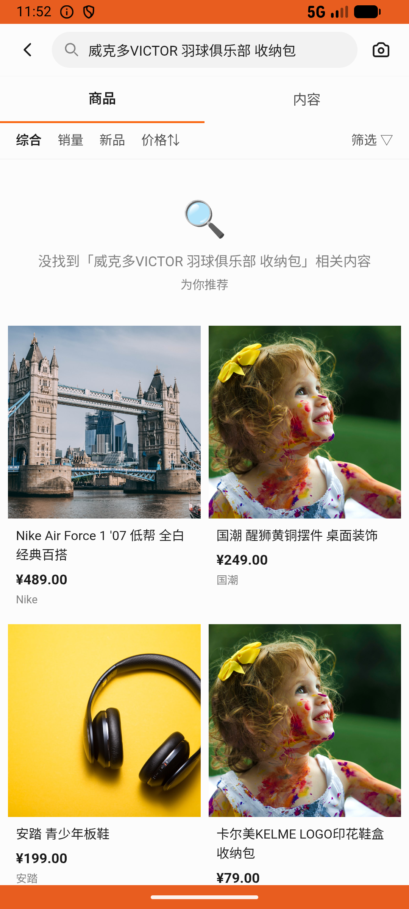
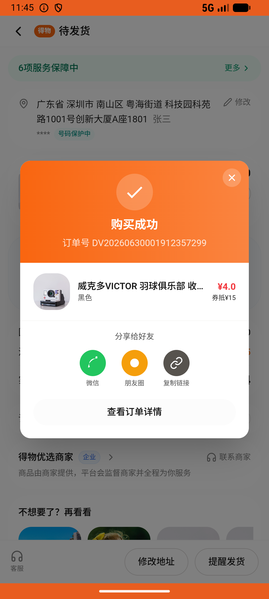

# order_v012_buy_first_flash_sale_item  ⚠️

- **Brand**: `duwu`
- **Class**: `DuwuOrderV012BuyFirstFlashSaleItemTask`
- **Pass@3**: **1/3**  (score = 1.00)
- **Elapsed**: 801s (~13.3 min)
- **Model**: `doubao-seed-2-0-lite-260428`
- **Raw log**: [./raw_logs/DuwuOrderV012BuyFirstFlashSaleItemTask.log](./raw_logs/DuwuOrderV012BuyFirstFlashSaleItemTask.log)
- **Generated**: 2026-06-30T09:34:11+08:00

## Task Goal

> 在购买页的「9 元秒杀」专区里，帮我抢第一个商品「威克多VICTOR 羽球俱乐部 收纳包」，选支付宝直接点「确认支付」完成下单，无需向我确认

## System Prompt

<details>
<summary>展开查看完整 System Prompt</summary>


> You are provided with a task description, a history of previous actions, and corresponding screenshots. Your goal is to perform the next action to complete the task. Please note that if performing the same action multiple times results in a static screen with no changes, you should attempt a modified or alternative action.
> 
> ---
> 
> ## Function Definition
> 
> - `clarify` — Ask the user for more information to complete the task.
> - `click` — Mouse left single click action.
> - `double_click` — Mouse left double click action.
> - `drag` — Perform a drag action from the start point to the end point. Typically used for swiping or selecting elements.
> - `long_press` — Perform a long press action at the specified coordinates.
> - `open_app` — Open the specified application.
> - `press_back` — Press the back button.
> - `press_enter` — Press the enter key.
> - `press_home` — Press the home button.
> - `take_notes` — Take notes and report the result in the specified content.
> - `type` — Type the specified content. You should manually delete any text from the input box that you want to remove.
> - `wait` — Wait for a certain period of time.

</details>

## User Query

> 请在 com.duwu 里面完成以下任务：
> 在购买页的「9 元秒杀」专区里，帮我抢第一个商品「威克多VICTOR 羽球俱乐部 收纳包」，选支付宝直接点「确认支付」完成下单，无需向我确认

## Attempts

| # | Outcome | Steps | Terminated | Reason | Start → End |
|---|---------|-------|------------|--------|-------------|
| 1 | ❌ failed | 54 | answer | 存在「威克多收纳包」的订单: 未找到「威克多VICTOR 羽球俱乐部 收纳包」的订单 | 2026-06-30 08:07:11 → 2026-06-30 08:16:46 |
| 2 | ❌ failed | 17 | answer | 走的是 9 元秒杀通道（成交价 ¥9，非标价 ¥19）: 成交价预期 900 分（¥9），实际 1900 分。若实际为 1900 表示 Agent 直接从商品页/搜索进入下单，未走「9 元秒杀」专区入口。 | 2026-06-30 08:16:46 → 2026-06-30 08:19:24 |
| 3 | ✅ passed | 8 | answer | – | 2026-06-30 08:19:24 → 2026-06-30 08:20:32 |

## Failure Details

### Episode 1 — ❌ failed

- steps_used: `54`
- terminated_reason: `answer`
- reason:

  ```
  存在「威克多收纳包」的订单: 未找到「威克多VICTOR 羽球俱乐部 收纳包」的订单
  ```
- death shot: 
  - state: [`./death_shots/DuwuOrderV012BuyFirstFlashSaleItemTask/episode_001/step_054.json`](./death_shots/DuwuOrderV012BuyFirstFlashSaleItemTask/episode_001/step_054.json)
  - digest: [`episode_digest.md`](./death_shots/DuwuOrderV012BuyFirstFlashSaleItemTask/episode_001/episode_digest.md)

### Episode 2 — ❌ failed

- steps_used: `17`
- terminated_reason: `answer`
- reason:

  ```
  走的是 9 元秒杀通道（成交价 ¥9，非标价 ¥19）: 成交价预期 900 分（¥9），实际 1900 分。若实际为 1900 表示 Agent 直接从商品页/搜索进入下单，未走「9 元秒杀」专区入口。
  ```
- death shot: 
  - state: [`./death_shots/DuwuOrderV012BuyFirstFlashSaleItemTask/episode_002/step_017.json`](./death_shots/DuwuOrderV012BuyFirstFlashSaleItemTask/episode_002/step_017.json)
  - digest: [`episode_digest.md`](./death_shots/DuwuOrderV012BuyFirstFlashSaleItemTask/episode_002/episode_digest.md)

---

> 本摘要由 `sengclaw/scripts/pipeline/log_summarizer.py` 自动生成。 原始完整 log 见上方 Raw log 链接（含每 step 的 messages / tool_call / screenshot 引用）。
