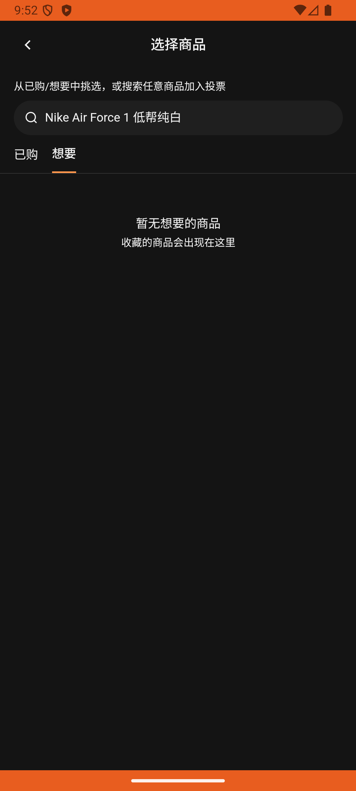

# post_v012_create_post_with_product_poll  ❌

- **Brand**: `duwu`
- **Class**: `DuwuPostV012CreatePostWithProductPollTask`
- **Pass@3**: **0/3**  (score = 0.00)
- **Elapsed**: 473s (~7.9 min)
- **Model**: `doubao-seed-2-0-lite-260428`
- **Raw log**: [./raw_logs/DuwuPostV012CreatePostWithProductPollTask.log](./raw_logs/DuwuPostV012CreatePostWithProductPollTask.log)
- **Generated**: 2026-07-01T01:19:57+08:00

## Task Goal

> 帮我发条带「好物投票」的帖子：标题「球鞋 PK」，正文「选哪双」，配两张准备好的鞋图；工具栏点投票按钮切到「好物」Tab，投票描述「白鞋之王是谁」，两个选项在选品页搜索框搜商品名按回车来找到「Nike Air Force 1 低帮纯白」和「adidas Stan Smith 史密斯 绿尾 板鞋」，完成后无需确认直接点「发布」把帖子发出去

## System Prompt

<details>
<summary>展开查看完整 System Prompt</summary>


> You are provided with a task description, a history of previous actions, and corresponding screenshots. Your goal is to perform the next action to complete the task. Please note that if performing the same action multiple times results in a static screen with no changes, you should attempt a modified or alternative action.
> 
> ---
> 
> ## Function Definition
> 
> - `clarify` — Ask the user for more information to complete the task.
> - `click` — Mouse left single click action.
> - `double_click` — Mouse left double click action.
> - `drag` — Perform a drag action from the start point to the end point. Typically used for swiping or selecting elements.
> - `long_press` — Perform a long press action at the specified coordinates.
> - `open_app` — Open the specified application.
> - `press_back` — Press the back button.
> - `press_enter` — Press the enter key.
> - `press_home` — Press the home button.
> - `take_notes` — Take notes and report the result in the specified content.
> - `type` — Type the specified content. You should manually delete any text from the input box that you want to remove.
> - `wait` — Wait for a certain period of time.

</details>

## User Query

> 请在 com.duwu 里面完成以下任务：
> 帮我发条带「好物投票」的帖子：标题「球鞋 PK」，正文「选哪双」，配两张准备好的鞋图；工具栏点投票按钮切到「好物」Tab，投票描述「白鞋之王是谁」，两个选项在选品页搜索框搜商品名按回车来找到「Nike Air Force 1 低帮纯白」和「adidas Stan Smith 史密斯 绿尾 板鞋」，完成后无需确认直接点「发布」把帖子发出去

## Attempts

| # | Outcome | Steps | Terminated | Reason | Start → End |
|---|---------|-------|------------|--------|-------------|
| 1 | ❌ failed | 25 | answer | 发布了标题为「球鞋 PK」的帖子: expected: not nil      got: nil | 2026-06-30 21:47:39 → 2026-06-30 21:52:18 |
| 2 | 💥 error | 0 | exception | exception: 500 Internal Server Error for url: http://localhost:6800/task/init \\| detail: init_task('DuwuPostV012CreatePostWithProductPol... | 2026-06-30 21:52:18 → 2026-06-30 21:53:55 |
| 3 | 💥 error | 0 | exception | exception: 500 Internal Server Error for url: http://localhost:6800/task/init \\| detail: init_task('DuwuPostV012CreatePostWithProductPol... | 2026-06-30 21:53:55 → 2026-06-30 21:55:32 |

## Failure Details

### Episode 1 — ❌ failed

- steps_used: `25`
- terminated_reason: `answer`
- reason:

  ```
  发布了标题为「球鞋 PK」的帖子: expected: not nil
       got: nil
  ```
- death shot: 
  - state: [`./death_shots/DuwuPostV012CreatePostWithProductPollTask/episode_001/step_025.json`](./death_shots/DuwuPostV012CreatePostWithProductPollTask/episode_001/step_025.json)
  - digest: [`episode_digest.md`](./death_shots/DuwuPostV012CreatePostWithProductPollTask/episode_001/episode_digest.md)

### Episode 2 — 💥 error

- steps_used: `0`
- terminated_reason: `exception`
- reason:

  ```
  exception: 500 Internal Server Error for url: http://localhost:6800/task/init | detail: init_task('DuwuPostV012CreatePostWithProductPollTask') failed: Task 'DuwuPostV012CreatePostWithProductPollTask' failed during initialize_task()
  ```

### Episode 3 — 💥 error

- steps_used: `0`
- terminated_reason: `exception`
- reason:

  ```
  exception: 500 Internal Server Error for url: http://localhost:6800/task/init | detail: init_task('DuwuPostV012CreatePostWithProductPollTask') failed: Task 'DuwuPostV012CreatePostWithProductPollTask' failed during initialize_task()
  ```

---

> 本摘要由 `sengclaw/scripts/pipeline/log_summarizer.py` 自动生成。 原始完整 log 见上方 Raw log 链接（含每 step 的 messages / tool_call / screenshot 引用）。
