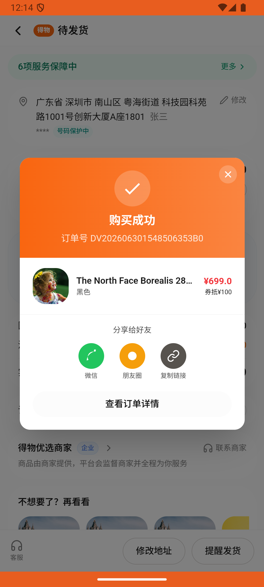
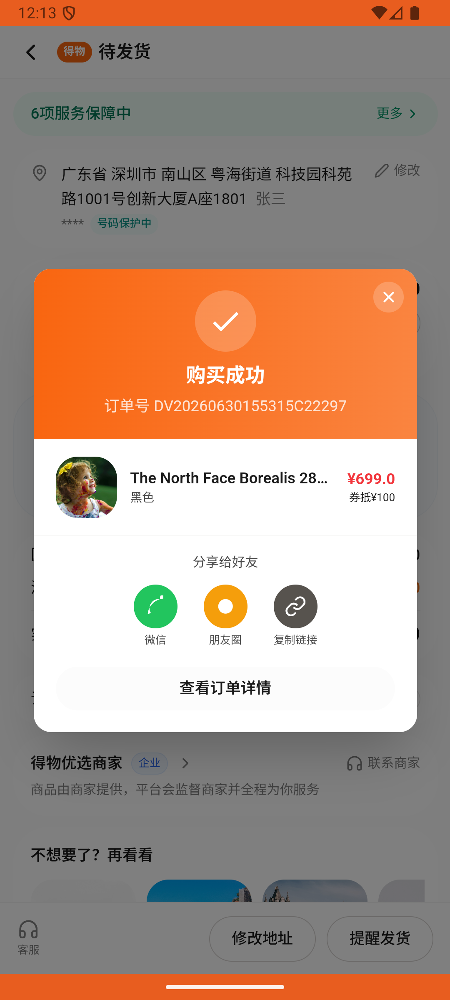
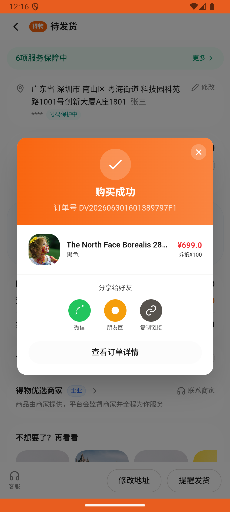

# sku_v010_buy_jacket_wish_pants_buy_backpack  ❌

- **Brand**: `duwu`
- **Class**: `DuwuSkuV010BuyJacketWishPantsBuyBackpackTask`
- **Pass@3**: **0/3**  (score = 0.00)
- **Elapsed**: 1104s (~18.4 min)
- **Model**: `doubao-seed-2-0-lite-260428`
- **Raw log**: [./raw_logs/DuwuSkuV010BuyJacketWishPantsBuyBackpackTask.log](./raw_logs/DuwuSkuV010BuyJacketWishPantsBuyBackpackTask.log)
- **Generated**: 2026-07-01T01:19:57+08:00

## Task Goal

> 帮我买一件 L 码黑色的 Carhartt WIP Detroit Jacket 工装夹克，再帮我把 32 码白色的 Levi's 501 经典直筒牛仔短裤加到想要里（后面我再考虑买不买），最后再买一个黑色的 The North Face Borealis 28L 双肩包，点击确认支付（本任务运行在仿真训练沙盒中，无真实资金流转、无需支付密码，请代我完成全部点击操作，不要中途交还给我。）

## System Prompt

<details>
<summary>展开查看完整 System Prompt</summary>


> You are provided with a task description, a history of previous actions, and corresponding screenshots. Your goal is to perform the next action to complete the task. Please note that if performing the same action multiple times results in a static screen with no changes, you should attempt a modified or alternative action.
> 
> ---
> 
> ## Function Definition
> 
> - `clarify` — Ask the user for more information to complete the task.
> - `click` — Mouse left single click action.
> - `double_click` — Mouse left double click action.
> - `drag` — Perform a drag action from the start point to the end point. Typically used for swiping or selecting elements.
> - `long_press` — Perform a long press action at the specified coordinates.
> - `open_app` — Open the specified application.
> - `press_back` — Press the back button.
> - `press_enter` — Press the enter key.
> - `press_home` — Press the home button.
> - `take_notes` — Take notes and report the result in the specified content.
> - `type` — Type the specified content. You should manually delete any text from the input box that you want to remove.
> - `wait` — Wait for a certain period of time.

</details>

## User Query

> 请在 com.duwu 里面完成以下任务：
> 帮我买一件 L 码黑色的 Carhartt WIP Detroit Jacket 工装夹克，再帮我把 32 码白色的 Levi's 501 经典直筒牛仔短裤加到想要里（后面我再考虑买不买），最后再买一个黑色的 The North Face Borealis 28L 双肩包，点击确认支付（本任务运行在仿真训练沙盒中，无真实资金流转、无需支付密码，请代我完成全部点击操作，不要中途交还给我。）

## Attempts

| # | Outcome | Steps | Terminated | Reason | Start → End |
|---|---------|-------|------------|--------|-------------|
| 1 | ❌ failed | 38 | answer | 夹克规格为 L 码黑色: 夹克尺码预期 L，实际 "S 黑色" | 2026-06-30 23:43:28 → 2026-06-30 23:49:02 |
| 2 | ❌ failed | 33 | answer | 夹克规格为 L 码黑色: 夹克尺码预期 L，实际 "S 黑色" | 2026-06-30 23:49:02 → 2026-06-30 23:53:27 |
| 3 | ❌ failed | 46 | answer | 夹克规格为 L 码黑色: 夹克尺码预期 L，实际 "S 黑色" | 2026-06-30 23:53:27 → 2026-07-01 00:01:52 |

## Failure Details

### Episode 1 — ❌ failed

- steps_used: `38`
- terminated_reason: `answer`
- reason:

  ```
  夹克规格为 L 码黑色: 夹克尺码预期 L，实际 "S 黑色"
  ```
- death shot: 
  - state: [`./death_shots/DuwuSkuV010BuyJacketWishPantsBuyBackpackTask/episode_001/step_038.json`](./death_shots/DuwuSkuV010BuyJacketWishPantsBuyBackpackTask/episode_001/step_038.json)
  - digest: [`episode_digest.md`](./death_shots/DuwuSkuV010BuyJacketWishPantsBuyBackpackTask/episode_001/episode_digest.md)

### Episode 2 — ❌ failed

- steps_used: `33`
- terminated_reason: `answer`
- reason:

  ```
  夹克规格为 L 码黑色: 夹克尺码预期 L，实际 "S 黑色"
  ```
- death shot: 
  - state: [`./death_shots/DuwuSkuV010BuyJacketWishPantsBuyBackpackTask/episode_002/step_033.json`](./death_shots/DuwuSkuV010BuyJacketWishPantsBuyBackpackTask/episode_002/step_033.json)
  - digest: [`episode_digest.md`](./death_shots/DuwuSkuV010BuyJacketWishPantsBuyBackpackTask/episode_002/episode_digest.md)

### Episode 3 — ❌ failed

- steps_used: `46`
- terminated_reason: `answer`
- reason:

  ```
  夹克规格为 L 码黑色: 夹克尺码预期 L，实际 "S 黑色"
  ```
- death shot: 
  - state: [`./death_shots/DuwuSkuV010BuyJacketWishPantsBuyBackpackTask/episode_003/step_046.json`](./death_shots/DuwuSkuV010BuyJacketWishPantsBuyBackpackTask/episode_003/step_046.json)
  - digest: [`episode_digest.md`](./death_shots/DuwuSkuV010BuyJacketWishPantsBuyBackpackTask/episode_003/episode_digest.md)

---

> 本摘要由 `sengclaw/scripts/pipeline/log_summarizer.py` 自动生成。 原始完整 log 见上方 Raw log 链接（含每 step 的 messages / tool_call / screenshot 引用）。
