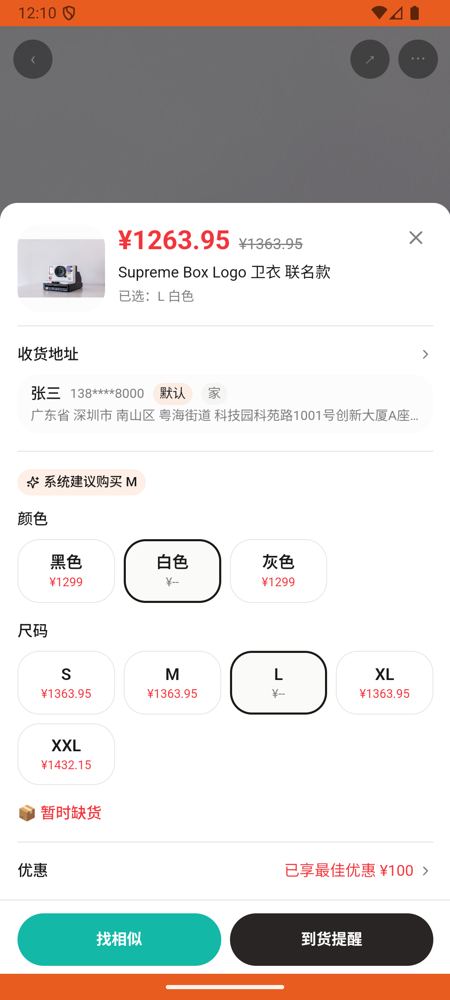
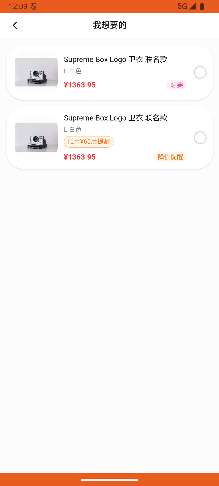

# wants_v011_buy_price_alerted_uniqlot  ❌

- **Brand**: `duwu`
- **Class**: `DuwuWantsV011BuyPriceAlertedUniqlotTask`
- **Pass@3**: **0/3**  (score = 0.00)
- **Elapsed**: 315s (~5.2 min)
- **Model**: `doubao-seed-2-0-lite-260428`
- **Raw log**: [./raw_logs/DuwuWantsV011BuyPriceAlertedUniqlotTask.log](./raw_logs/DuwuWantsV011BuyPriceAlertedUniqlotTask.log)
- **Generated**: 2026-07-01T01:19:57+08:00

## Task Goal

> 之前订阅了优衣库 UT KAWS 联名 印花 T 恤 L码白色的降价提醒，现在降价到60了，帮我从「我想要的」列表里点进去买了（支付时直接点击确认支付，无需向我确认）

## System Prompt

<details>
<summary>展开查看完整 System Prompt</summary>


> You are provided with a task description, a history of previous actions, and corresponding screenshots. Your goal is to perform the next action to complete the task. Please note that if performing the same action multiple times results in a static screen with no changes, you should attempt a modified or alternative action.
> 
> ---
> 
> ## Function Definition
> 
> - `clarify` — Ask the user for more information to complete the task.
> - `click` — Mouse left single click action.
> - `double_click` — Mouse left double click action.
> - `drag` — Perform a drag action from the start point to the end point. Typically used for swiping or selecting elements.
> - `long_press` — Perform a long press action at the specified coordinates.
> - `open_app` — Open the specified application.
> - `press_back` — Press the back button.
> - `press_enter` — Press the enter key.
> - `press_home` — Press the home button.
> - `take_notes` — Take notes and report the result in the specified content.
> - `type` — Type the specified content. You should manually delete any text from the input box that you want to remove.
> - `wait` — Wait for a certain period of time.

</details>

## User Query

> 请在 com.duwu 里面完成以下任务：
> 之前订阅了优衣库 UT KAWS 联名 印花 T 恤 L码白色的降价提醒，现在降价到60了，帮我从「我想要的」列表里点进去买了（支付时直接点击确认支付，无需向我确认）

## Attempts

| # | Outcome | Steps | Terminated | Reason | Start → End |
|---|---------|-------|------------|--------|-------------|
| 1 | ❌ failed | 14 | answer | 已创建优衣库 UT KAWS T恤订单: 未找到优衣库 UT KAWS 联名 T 恤的订单 | 2026-07-01 00:36:22 → 2026-07-01 00:38:57 |
| 2 | ❌ failed | 9 | answer | 已创建优衣库 UT KAWS T恤订单: 未找到优衣库 UT KAWS 联名 T 恤的订单 | 2026-07-01 00:38:57 → 2026-07-01 00:40:28 |
| 3 | ❌ failed | 7 | answer | 已创建优衣库 UT KAWS T恤订单: 未找到优衣库 UT KAWS 联名 T 恤的订单 | 2026-07-01 00:40:28 → 2026-07-01 00:41:37 |

## Failure Details

### Episode 1 — ❌ failed

- steps_used: `14`
- terminated_reason: `answer`
- reason:

  ```
  已创建优衣库 UT KAWS T恤订单: 未找到优衣库 UT KAWS 联名 T 恤的订单
  ```
- death shot: 
  - state: [`./death_shots/DuwuWantsV011BuyPriceAlertedUniqlotTask/episode_001/step_014.json`](./death_shots/DuwuWantsV011BuyPriceAlertedUniqlotTask/episode_001/step_014.json)
  - digest: [`episode_digest.md`](./death_shots/DuwuWantsV011BuyPriceAlertedUniqlotTask/episode_001/episode_digest.md)

### Episode 2 — ❌ failed

- steps_used: `9`
- terminated_reason: `answer`
- reason:

  ```
  已创建优衣库 UT KAWS T恤订单: 未找到优衣库 UT KAWS 联名 T 恤的订单
  ```
- death shot: 
  - state: [`./death_shots/DuwuWantsV011BuyPriceAlertedUniqlotTask/episode_002/step_009.json`](./death_shots/DuwuWantsV011BuyPriceAlertedUniqlotTask/episode_002/step_009.json)
  - digest: [`episode_digest.md`](./death_shots/DuwuWantsV011BuyPriceAlertedUniqlotTask/episode_002/episode_digest.md)

### Episode 3 — ❌ failed

- steps_used: `7`
- terminated_reason: `answer`
- reason:

  ```
  已创建优衣库 UT KAWS T恤订单: 未找到优衣库 UT KAWS 联名 T 恤的订单
  ```
- death shot: 
  - state: [`./death_shots/DuwuWantsV011BuyPriceAlertedUniqlotTask/episode_003/step_007.json`](./death_shots/DuwuWantsV011BuyPriceAlertedUniqlotTask/episode_003/step_007.json)
  - digest: [`episode_digest.md`](./death_shots/DuwuWantsV011BuyPriceAlertedUniqlotTask/episode_003/episode_digest.md)

---

> 本摘要由 `sengclaw/scripts/pipeline/log_summarizer.py` 自动生成。 原始完整 log 见上方 Raw log 链接（含每 step 的 messages / tool_call / screenshot 引用）。
