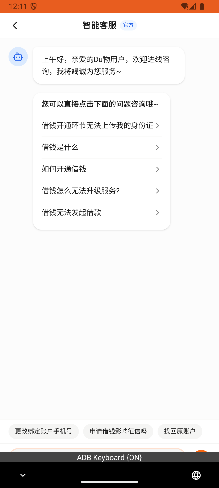
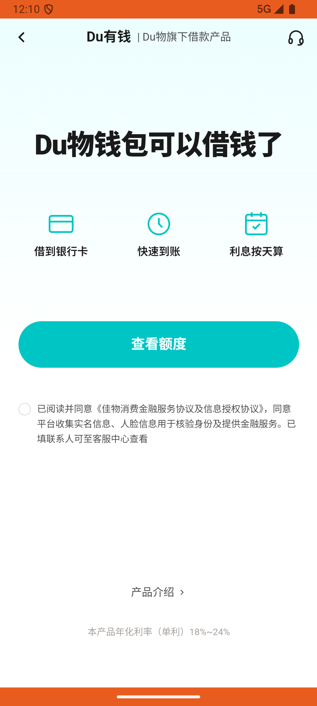

# wallet_v008_bind_bank_card  ⚠️

- **Brand**: `duwu`
- **Class**: `DuwuWalletV008BindBankCardTask`
- **Pass@3**: **1/3**  (score = 1.00)
- **Elapsed**: 687s (~11.4 min)
- **Model**: `doubao-seed-evolving`
- **Raw log**: [./raw_logs/DuwuWalletV008BindBankCardTask.log](./raw_logs/DuwuWalletV008BindBankCardTask.log)
- **Generated**: 2026-07-14T13:40:25+08:00

## Task Goal

> 去「借钱」模块，在 Du有钱 里的「我的银行卡」里绑定一张中国农业银行卡，卡号 6225880137290827

## System Prompt

<details>
<summary>展开查看完整 System Prompt</summary>


> You are provided with a task description, a history of previous actions, and corresponding screenshots. Your goal is to perform the next action to complete the task. Please note that if performing the same action multiple times results in a static screen with no changes, you should attempt a modified or alternative action.
> 
> ---
> 
> ## Function Definition
> 
> - `clarify` — Ask the user for more information to complete the task.
> - `click` — Mouse left single click action.
> - `double_click` — Mouse left double click action.
> - `drag` — Perform a drag action from the start point to the end point. Typically used for swiping or selecting elements.
> - `long_press` — Perform a long press action at the specified coordinates.
> - `open_app` — Open the specified application.
> - `press_back` — Press the back button.
> - `press_enter` — Press the enter key.
> - `press_home` — Press the home button.
> - `take_notes` — Take notes and report the result in the specified content.
> - `type` — Type the specified content. You should manually delete any text from the input box that you want to remove.
> - `wait` — Wait for a certain period of time.

</details>

## User Query

> 请在 com.duwu 里面完成以下任务：
> 去「借钱」模块，在 Du有钱 里的「我的银行卡」里绑定一张中国农业银行卡，卡号 6225880137290827

## Attempts

| # | Outcome | Steps | Terminated | Reason | Start → End |
|---|---------|-------|------------|--------|-------------|
| 1 | ❌ failed | 23 | answer | 新增中国农业银行卡（尾号0827）: 预期 1 张中国农业银行 0827 卡，实际 0 | 2026-07-14 13:28:57 → 2026-07-14 13:32:07 |
| 2 | ❌ failed | 14 | answer | 新增中国农业银行卡（尾号0827）: 预期 1 张中国农业银行 0827 卡，实际 0 | 2026-07-14 13:32:07 → 2026-07-14 13:34:20 |
| 3 | ✅ passed | 37 | answer | – | 2026-07-14 13:34:20 → 2026-07-14 13:40:24 |

## Failure Details

### Episode 1 — ❌ failed

- steps_used: `23`
- terminated_reason: `answer`
- reason:

  ```
  新增中国农业银行卡（尾号0827）: 预期 1 张中国农业银行 0827 卡，实际 0
  ```
- death shot: 
  - state: [`./screenshots/DuwuWalletV008BindBankCardTask/episode_001/step_023.json`](./screenshots/DuwuWalletV008BindBankCardTask/episode_001/step_023.json)
  - digest: [`episode_digest.md`](./digests/DuwuWalletV008BindBankCardTask/episode_001/episode_digest.md)

### Episode 2 — ❌ failed

- steps_used: `14`
- terminated_reason: `answer`
- reason:

  ```
  新增中国农业银行卡（尾号0827）: 预期 1 张中国农业银行 0827 卡，实际 0
  ```
- death shot: 
  - state: [`./screenshots/DuwuWalletV008BindBankCardTask/episode_002/step_014.json`](./screenshots/DuwuWalletV008BindBankCardTask/episode_002/step_014.json)
  - digest: [`episode_digest.md`](./digests/DuwuWalletV008BindBankCardTask/episode_002/episode_digest.md)

---

> 本摘要由 `sengclaw/scripts/pipeline/log_summarizer.py` 自动生成。 原始完整 log 见上方 Raw log 链接（含每 step 的 messages / tool_call / screenshot 引用）。
