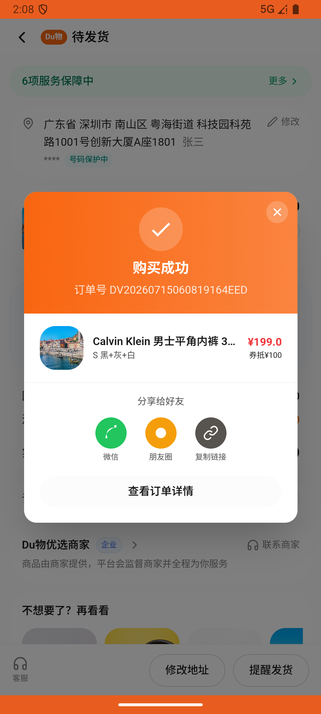

# sku_v007_buy_most_expensive_underwear  ⚠️

- **Brand**: `duwu`
- **Class**: `DuwuSkuV007BuyMostExpensiveUnderwearTask`
- **Pass@3**: **1/3**  (score = 1.00)
- **Elapsed**: 363s (~6.0 min)
- **Model**: `doubao-seed-evolving`
- **Raw log**: [./raw_logs/DuwuSkuV007BuyMostExpensiveUnderwearTask.log](./raw_logs/DuwuSkuV007BuyMostExpensiveUnderwearTask.log)
- **Generated**: 2026-07-15T15:31:03+08:00

## Task Goal

> 最近想换内裤了，去我的想要列表看看，里面有几款内裤，帮我买最贵的那款，选 L 码，支付宝确认支付，沙箱不扣款直接下单就好

## System Prompt

<details>
<summary>展开查看完整 System Prompt</summary>


> You are provided with a task description, a history of previous actions, and corresponding screenshots. Your goal is to perform the next action to complete the task. Please note that if performing the same action multiple times results in a static screen with no changes, you should attempt a modified or alternative action.
> 
> ---
> 
> ## Function Definition
> 
> - `clarify` — Ask the user for more information to complete the task.
> - `click` — Mouse left single click action.
> - `double_click` — Mouse left double click action.
> - `drag` — Perform a drag action from the start point to the end point. Typically used for swiping or selecting elements.
> - `long_press` — Perform a long press action at the specified coordinates.
> - `open_app` — Open the specified application.
> - `press_back` — Press the back button.
> - `press_enter` — Press the enter key.
> - `press_home` — Press the home button.
> - `take_notes` — Take notes and report the result in the specified content.
> - `type` — Type the specified content. You should manually delete any text from the input box that you want to remove.
> - `wait` — Wait for a certain period of time.

</details>

## User Query

> 请在 com.duwu 里面完成以下任务：
> 最近想换内裤了，去我的想要列表看看，里面有几款内裤，帮我买最贵的那款，选 L 码，支付宝确认支付，沙箱不扣款直接下单就好

## Attempts

| # | Outcome | Steps | Terminated | Reason | Start → End |
|---|---------|-------|------------|--------|-------------|
| 1 | ✅ passed | 10 | answer | – | 2026-07-15 14:04:04 → 2026-07-15 14:06:15 |
| 2 | ❌ failed | 10 | answer | 规格为 L 码: 规格名称预期包含「L」码（且不是 XL），实际："S 黑+灰+白" Diff: @@ -1 +1 @@ -/(?:^\\|[^X])L(?:$\\|[^a-zA-Z])/ +"S 黑+灰+白" | 2026-07-15 14:06:15 → 2026-07-15 14:08:28 |
| 3 | 💥 error | 0 | exception | exception: 500 Internal Server Error for url: http://localhost:6800/task/init \\| detail: init_task('DuwuSkuV007BuyMostExpensiveUnderwear... | 2026-07-15 14:08:28 → 2026-07-15 14:10:06 |

## Failure Details

### Episode 2 — ❌ failed

- steps_used: `10`
- terminated_reason: `answer`
- reason:

  ```
  规格为 L 码: 规格名称预期包含「L」码（且不是 XL），实际："S 黑+灰+白"
  Diff:
  @@ -1 +1 @@
  -/(?:^|[^X])L(?:$|[^a-zA-Z])/
  +"S 黑+灰+白"
  ```
- death shot: 
  - state: [`./screenshots/DuwuSkuV007BuyMostExpensiveUnderwearTask/episode_002/step_010.json`](./screenshots/DuwuSkuV007BuyMostExpensiveUnderwearTask/episode_002/step_010.json)
  - digest: [`episode_digest.md`](./digests/DuwuSkuV007BuyMostExpensiveUnderwearTask/episode_002/episode_digest.md)

### Episode 3 — 💥 error

- steps_used: `0`
- terminated_reason: `exception`
- reason:

  ```
  exception: 500 Internal Server Error for url: http://localhost:6800/task/init | detail: init_task('DuwuSkuV007BuyMostExpensiveUnderwearTask') failed: Task 'DuwuSkuV007BuyMostExpensiveUnderwearTask' failed during initialize_task()
  ```
  - digest: [`episode_digest.md`](./digests/DuwuSkuV007BuyMostExpensiveUnderwearTask/episode_003/episode_digest.md)

---

> 本摘要由 `sengclaw/scripts/pipeline/log_summarizer.py` 自动生成。 原始完整 log 见上方 Raw log 链接（含每 step 的 messages / tool_call / screenshot 引用）。
