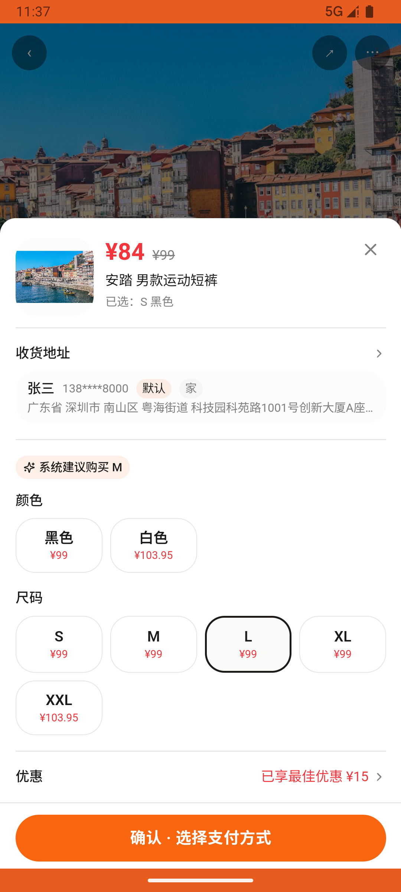

# order_v013_buy_birthday_gifts_for_brother  ⚠️

- **Brand**: `duwu`
- **Class**: `DuwuOrderV013BuyBirthdayGiftsForBrotherTask`
- **Pass@3**: **1/3**  (score = 1.00)
- **Elapsed**: 1018s (~17.0 min)
- **Model**: `doubao-seed-2-0-pro-260215`
- **Raw log**: [./raw_logs/DuwuOrderV013BuyBirthdayGiftsForBrotherTask.log](./raw_logs/DuwuOrderV013BuyBirthdayGiftsForBrotherTask.log)
- **Generated**: 2026-07-18T01:45:23+08:00

## Task Goal

> 弟弟生日到了，帮我买三件礼物：①李宁[海岛冲浪印花 短袖T恤]选L码；②安踏[男款运动短裤]选黑色L码；③[AJ1 反转黑红]选42码，每件都选支付宝直接点「确认支付」完成下单，无需向我确认

## System Prompt

<details>
<summary>展开查看完整 System Prompt</summary>


> You are provided with a task description, a history of previous actions, and corresponding screenshots. Your goal is to perform the next action to complete the task. Please note that if performing the same action multiple times results in a static screen with no changes, you should attempt a modified or alternative action.
> 
> ---
> 
> ## Function Definition
> 
> - `clarify` — Ask the user for more information to complete the task.
> - `click` — Mouse left single click action.
> - `double_click` — Mouse left double click action.
> - `drag` — Perform a drag action from the start point to the end point. Typically used for swiping or selecting elements.
> - `long_press` — Perform a long press action at the specified coordinates.
> - `open_app` — Open the specified application.
> - `press_back` — Press the back button.
> - `press_enter` — Press the enter key.
> - `press_home` — Press the home button.
> - `take_notes` — Take notes and report the result in the specified content.
> - `type` — Type the specified content. You should manually delete any text from the input box that you want to remove.
> - `wait` — Wait for a certain period of time.

</details>

## User Query

> 请在 com.duwu 里面完成以下任务：
> 弟弟生日到了，帮我买三件礼物：①李宁[海岛冲浪印花 短袖T恤]选L码；②安踏[男款运动短裤]选黑色L码；③[AJ1 反转黑红]选42码，每件都选支付宝直接点「确认支付」完成下单，无需向我确认

## Attempts

| # | Outcome | Steps | Terminated | Reason | Start → End |
|---|---------|-------|------------|--------|-------------|
| 1 | ⏰ timeout | 50 | max_steps | 已下单并支付「Jordan AJ1 反转黑红」: 未找到「Jordan AJ1 反转黑红」(id=1) 的订单——注意区分同系列的 AJ1 Mid 中帮 / AJ1 Low 烟灰 Diff: @@ -1 +1 @@ -true +false | 2026-07-17 23:26:35 → 2026-07-17 23:37:07 |
| 2 | ✅ passed | 38 | answer | – | 2026-07-17 23:37:07 → 2026-07-17 23:43:33 |

## Failure Details

### Episode 1 — ⏰ timeout

- steps_used: `50`
- terminated_reason: `max_steps`
- reason:

  ```
  已下单并支付「Jordan AJ1 反转黑红」: 未找到「Jordan AJ1 反转黑红」(id=1) 的订单——注意区分同系列的 AJ1 Mid 中帮 / AJ1 Low 烟灰
  Diff:
  @@ -1 +1 @@
  -true
  +false
  ```
- death shot:
  
- state: [`./death_shots/DuwuOrderV013BuyBirthdayGiftsForBrotherTask/episode_001/step_050.json`](./death_shots/DuwuOrderV013BuyBirthdayGiftsForBrotherTask/episode_001/step_050.json)
- digest: [`episode_digest.md`](./episode_digests/DuwuOrderV013BuyBirthdayGiftsForBrotherTask/episode_001/episode_digest.md)

---

> 本摘要由 `sengclaw/scripts/pipeline/log_summarizer.py` 自动生成。 原始完整 log 见上方 Raw log 链接（含每 step 的 messages / tool_call / screenshot 引用）。
