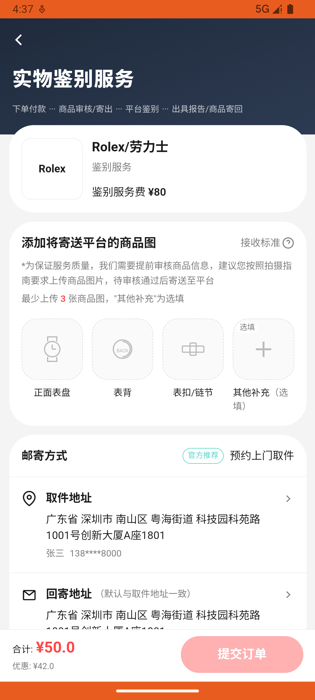

# identify_v002_create_watch_order  ❌

- **Brand**: `duwu`
- **Class**: `DuwuIdentifyV002CreateWatchOrderTask`
- **Pass@3**: **0/3**  (score = 0.00)
- **Elapsed**: 785s (~13.1 min)
- **Model**: `doubao-seed-2-0-pro-260215`
- **Raw log**: [./raw_logs/DuwuIdentifyV002CreateWatchOrderTask.log](./raw_logs/DuwuIdentifyV002CreateWatchOrderTask.log)
- **Generated**: 2026-07-20T18:00:22+08:00

## Task Goal

> 我有块 Rolex 手表想验真假，帮我约个手表鉴别，点击「确认支付」完成下单。

> 🔴 **基建重试记录**：本 task 发生 1 次基建重试（原因：ep2:404 Not Found, ep3:404 Not Found），重试后仍全部失败，**建议排查 infra 而非 Agent 能力**。

## Attempts

| # | Outcome | Steps | Terminated | Reason | Start → End |
|---|---------|-------|------------|--------|-------------|
| 1 | 💥 error | 0 | exception | exception: 500 Internal Server Error for url: http://localhost:6800/task/init \\| detail: init_task('DuwuIdentifyV002CreateWatchOrderTask... | 2026-07-20 16:30:05 → 2026-07-20 16:32:04 |
| 2 | ❌ failed | 22 | answer | 已创建手表实物鉴别订单: 未找到 Rolex 手表实物鉴别订单 | 2026-07-20 16:32:04 → 2026-07-20 16:32:04 |
| 3 | ❌ failed | 28 | answer | 已创建手表实物鉴别订单: 未找到 Rolex 手表实物鉴别订单 | 2026-07-20 16:32:04 → 2026-07-20 16:32:04 |

## Failure Details

### Episode 1 — 💥 error

- steps_used: `0`
- terminated_reason: `exception`
- reason:

  ```
  exception: 500 Internal Server Error for url: http://localhost:6800/task/init | detail: init_task('DuwuIdentifyV002CreateWatchOrderTask') failed: Task 'DuwuIdentifyV002CreateWatchOrderTask' failed during initialize_task()
  ```
- digest: [`episode_digest.md`](./episode_digests/DuwuIdentifyV002CreateWatchOrderTask/episode_001/episode_digest.md)

### Episode 2 — ❌ failed

- steps_used: `22`
- terminated_reason: `answer`
- reason:

  ```
  已创建手表实物鉴别订单: 未找到 Rolex 手表实物鉴别订单
  ```
- death shot:
  
- state: [`./death_shots/DuwuIdentifyV002CreateWatchOrderTask/episode_002/step_022.json`](./death_shots/DuwuIdentifyV002CreateWatchOrderTask/episode_002/step_022.json)
- digest: [`episode_digest.md`](./episode_digests/DuwuIdentifyV002CreateWatchOrderTask/episode_002/episode_digest.md)

### Episode 3 — ❌ failed

- steps_used: `28`
- terminated_reason: `answer`
- reason:

  ```
  已创建手表实物鉴别订单: 未找到 Rolex 手表实物鉴别订单
  ```
- death shot:
  
- state: [`./death_shots/DuwuIdentifyV002CreateWatchOrderTask/episode_003/step_028.json`](./death_shots/DuwuIdentifyV002CreateWatchOrderTask/episode_003/step_028.json)
- digest: [`episode_digest.md`](./episode_digests/DuwuIdentifyV002CreateWatchOrderTask/episode_003/episode_digest.md)

---

> 本摘要由 `sengclaw/scripts/pipeline/log_summarizer.py` 自动生成。 原始完整 log 见上方 Raw log 链接（含每 step 的 messages / tool_call / screenshot 引用）。
