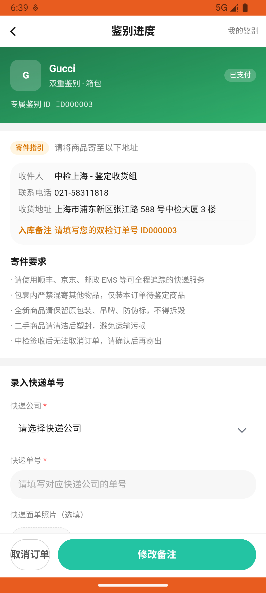

# identify_v001_create_luxury_bag_order  ❌

- **Brand**: `duwu`
- **Class**: `DuwuIdentifyV001CreateLuxuryBagOrderTask`
- **Pass@3**: **0/3**  (score = 0.00)
- **Elapsed**: 1137s (~18.9 min)
- **Model**: `doubao-seed-2-0-pro-260215`
- **Raw log**: [./raw_logs/DuwuIdentifyV001CreateLuxuryBagOrderTask.log](./raw_logs/DuwuIdentifyV001CreateLuxuryBagOrderTask.log)
- **Generated**: 2026-07-20T18:52:53+08:00

## Task Goal

> 我有个 Gucci 包想验真假，帮我约个奢包双重鉴别，从「探索」→「鉴别服务」→「去寄送」→「双重鉴别」→「箱包」，选择Gucci这个品牌，上传准备好的图片，其他信息用默认的，然后提交订单并立即支付（使用微信支付）

## System Prompt

<details>
<summary>展开查看完整 System Prompt</summary>


> You are provided with a task description, a history of previous actions, and corresponding screenshots. Your goal is to perform the next action to complete the task. Please note that if performing the same action multiple times results in a static screen with no changes, you should attempt a modified or alternative action.
> 
> ---
> 
> ## Function Definition
> 
> - `clarify` — Ask the user for more information to complete the task.
> - `click` — Mouse left single click action.
> - `double_click` — Mouse left double click action.
> - `drag` — Perform a drag action from the start point to the end point. Typically used for swiping or selecting elements.
> - `long_press` — Perform a long press action at the specified coordinates.
> - `open_app` — Open the specified application.
> - `press_back` — Press the back button.
> - `press_enter` — Press the enter key.
> - `press_home` — Press the home button.
> - `take_notes` — Take notes and report the result in the specified content.
> - `type` — Type the specified content. You should manually delete any text from the input box that you want to remove.
> - `wait` — Wait for a certain period of time.

</details>

## User Query

> 请在 com.duwu 里面完成以下任务：
> 我有个 Gucci 包想验真假，帮我约个奢包双重鉴别，从「探索」→「鉴别服务」→「去寄送」→「双重鉴别」→「箱包」，选择Gucci这个品牌，上传准备好的图片，其他信息用默认的，然后提交订单并立即支付（使用微信支付）

## Attempts

| # | Outcome | Steps | Terminated | Reason | Start → End |
|---|---------|-------|------------|--------|-------------|
| 1 | ❌ failed | 31 | answer | 已创建奢包双重鉴别订单: 未找到 Gucci 奢包双重鉴别订单 | 2026-07-20 18:21:04 → 2026-07-20 18:26:42 |
| 2 | ❌ failed | 32 | answer | 已创建奢包双重鉴别订单: 未找到 Gucci 奢包双重鉴别订单 | 2026-07-20 18:26:42 → 2026-07-20 18:33:15 |
| 3 | ❌ failed | 35 | answer | 已创建奢包双重鉴别订单: 未找到 Gucci 奢包双重鉴别订单 | 2026-07-20 18:33:15 → 2026-07-20 18:40:00 |

## Failure Details

### Episode 1 — ❌ failed

- steps_used: `31`
- terminated_reason: `answer`
- reason:

  ```
  已创建奢包双重鉴别订单: 未找到 Gucci 奢包双重鉴别订单
  ```
- death shot:
  
- state: [`./death_shots/DuwuIdentifyV001CreateLuxuryBagOrderTask/episode_001/step_031.json`](./death_shots/DuwuIdentifyV001CreateLuxuryBagOrderTask/episode_001/step_031.json)
- digest: [`episode_digest.md`](./episode_digests/DuwuIdentifyV001CreateLuxuryBagOrderTask/episode_001/episode_digest.md)

### Episode 2 — ❌ failed

- steps_used: `32`
- terminated_reason: `answer`
- reason:

  ```
  已创建奢包双重鉴别订单: 未找到 Gucci 奢包双重鉴别订单
  ```
- death shot:
  
- state: [`./death_shots/DuwuIdentifyV001CreateLuxuryBagOrderTask/episode_002/step_032.json`](./death_shots/DuwuIdentifyV001CreateLuxuryBagOrderTask/episode_002/step_032.json)
- digest: [`episode_digest.md`](./episode_digests/DuwuIdentifyV001CreateLuxuryBagOrderTask/episode_002/episode_digest.md)

### Episode 3 — ❌ failed

- steps_used: `35`
- terminated_reason: `answer`
- reason:

  ```
  已创建奢包双重鉴别订单: 未找到 Gucci 奢包双重鉴别订单
  ```
- death shot:
  
- state: [`./death_shots/DuwuIdentifyV001CreateLuxuryBagOrderTask/episode_003/step_035.json`](./death_shots/DuwuIdentifyV001CreateLuxuryBagOrderTask/episode_003/step_035.json)
- digest: [`episode_digest.md`](./episode_digests/DuwuIdentifyV001CreateLuxuryBagOrderTask/episode_003/episode_digest.md)

---

> 本摘要由 `sengclaw/scripts/pipeline/log_summarizer.py` 自动生成。 原始完整 log 见上方 Raw log 链接（含每 step 的 messages / tool_call / screenshot 引用）。
