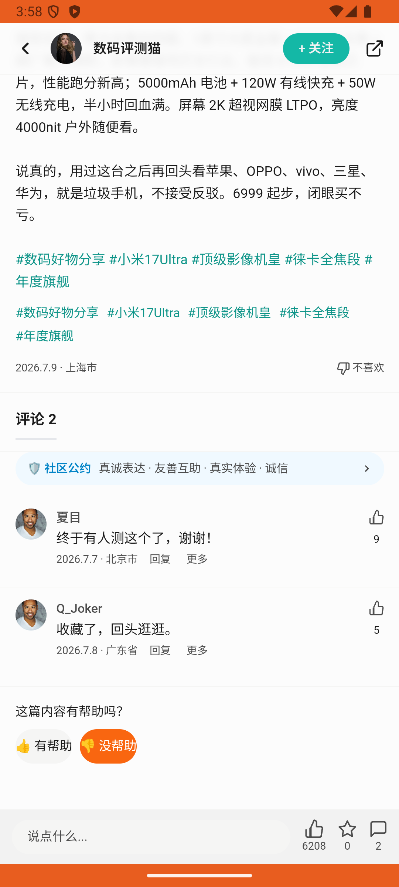

# feed_negative_feedback_v004_dislike_xiaomi_and_unhelpful  ❌

- **Brand**: `duwu`
- **Class**: `DuwuFeedNegativeFeedbackV004DislikeXiaomiAndUnhelpfulTask`
- **Pass@3**: **0/3**  (score = 0.00)
- **Elapsed**: 342s (~5.7 min)
- **Model**: `doubao-seed-evolving`
- **Raw log**: [./raw_logs/DuwuFeedNegativeFeedbackV004DislikeXiaomiAndUnhelpfulTask.log](./raw_logs/DuwuFeedNegativeFeedbackV004DislikeXiaomiAndUnhelpfulTask.log)
- **Generated**: 2026-07-14T09:39:36+08:00
- **Note**: backfilled from /tmp/pass_at_3_full_<ts>/ on 2026-05-02

## Task Goal

> 浏览「小米 17 Ultra 上手｜全世界最好的手机」这篇帖子时，感觉是小米广告，负面太多了，帮我点击不喜欢该内容，并在（这篇内容有帮助吗？）点击没帮助

## System Prompt

<details>
<summary>展开查看完整 System Prompt</summary>


> You are provided with a task description, a history of previous actions, and corresponding screenshots. Your goal is to perform the next action to complete the task. Please note that if performing the same action multiple times results in a static screen with no changes, you should attempt a modified or alternative action.
> 
> ---
> 
> ## Function Definition
> 
> - `clarify` — Ask the user for more information to complete the task.
> - `click` — Mouse left single click action.
> - `double_click` — Mouse left double click action.
> - `drag` — Perform a drag action from the start point to the end point. Typically used for swiping or selecting elements.
> - `long_press` — Perform a long press action at the specified coordinates.
> - `open_app` — Open the specified application.
> - `press_back` — Press the back button.
> - `press_enter` — Press the enter key.
> - `press_home` — Press the home button.
> - `take_notes` — Take notes and report the result in the specified content.
> - `type` — Type the specified content. You should manually delete any text from the input box that you want to remove.
> - `wait` — Wait for a certain period of time.

</details>

## User Query

> 请在 com.duwu 里面完成以下任务：
> 浏览「小米 17 Ultra 上手｜全世界最好的手机」这篇帖子时，感觉是小米广告，负面太多了，帮我点击不喜欢该内容，并在（这篇内容有帮助吗？）点击没帮助

## Attempts

| # | Outcome | Steps | Terminated | Reason | Start → End |
|---|---------|-------|------------|--------|-------------|
| 1 | ❌ failed | 14 | answer | 对目标帖子提交了「不喜欢该内容」反馈: 未找到「不喜欢该内容」记录，请确认点击的是「小米 17 Ultra 上手｜全世界最好的手机」帖子并选择「不喜欢该内容」; 在「这篇内容有帮助吗？」点击了「没帮助」: 未找到帮助投票记录，请确认在帖子底部「这篇内容有帮助吗？」处投了票 | 2026-07-14 03:55:36 → 2026-07-14 03:58:03 |
| 2 | 💥 error | 0 | exception | exception: 500 Internal Server Error for url: http://localhost:6800/task/init \\| detail: init_task('DuwuFeedNegativeFeedbackV004DislikeX... | 2026-07-14 03:58:03 → 2026-07-14 03:59:40 |
| 3 | 💥 error | 0 | exception | exception: 500 Internal Server Error for url: http://localhost:6800/task/init \\| detail: init_task('DuwuFeedNegativeFeedbackV004DislikeX... | 2026-07-14 03:59:40 → 2026-07-14 04:01:18 |

## Failure Details

### Episode 1 — ❌ failed

- steps_used: `14`
- terminated_reason: `answer`
- reason:

  ```
  对目标帖子提交了「不喜欢该内容」反馈: 未找到「不喜欢该内容」记录，请确认点击的是「小米 17 Ultra 上手｜全世界最好的手机」帖子并选择「不喜欢该内容」; 在「这篇内容有帮助吗？」点击了「没帮助」: 未找到帮助投票记录，请确认在帖子底部「这篇内容有帮助吗？」处投了票
  ```
- death shot: 
  - state: [`./death_shots/DuwuFeedNegativeFeedbackV004DislikeXiaomiAndUnhelpfulTask/episode_001/step_014.json`](./death_shots/DuwuFeedNegativeFeedbackV004DislikeXiaomiAndUnhelpfulTask/episode_001/step_014.json)
  - digest: [`episode_digest.md`](./death_shots/DuwuFeedNegativeFeedbackV004DislikeXiaomiAndUnhelpfulTask/episode_001/episode_digest.md)

### Episode 2 — 💥 error

- steps_used: `0`
- terminated_reason: `exception`
- reason:

  ```
  exception: 500 Internal Server Error for url: http://localhost:6800/task/init | detail: init_task('DuwuFeedNegativeFeedbackV004DislikeXiaomiAndUnhelpfulTask') failed: Task 'DuwuFeedNegativeFeedbackV004DislikeXiaomiAndUnhelpfulTask' failed during initialize_task()
  ```

### Episode 3 — 💥 error

- steps_used: `0`
- terminated_reason: `exception`
- reason:

  ```
  exception: 500 Internal Server Error for url: http://localhost:6800/task/init | detail: init_task('DuwuFeedNegativeFeedbackV004DislikeXiaomiAndUnhelpfulTask') failed: Task 'DuwuFeedNegativeFeedbackV004DislikeXiaomiAndUnhelpfulTask' failed during initialize_task()
  ```

---

> 本摘要由 `sengclaw/scripts/pipeline/log_summarizer.py` 自动生成。 原始完整 log 见上方 Raw log 链接（含每 step 的 messages / tool_call / screenshot 引用）。
