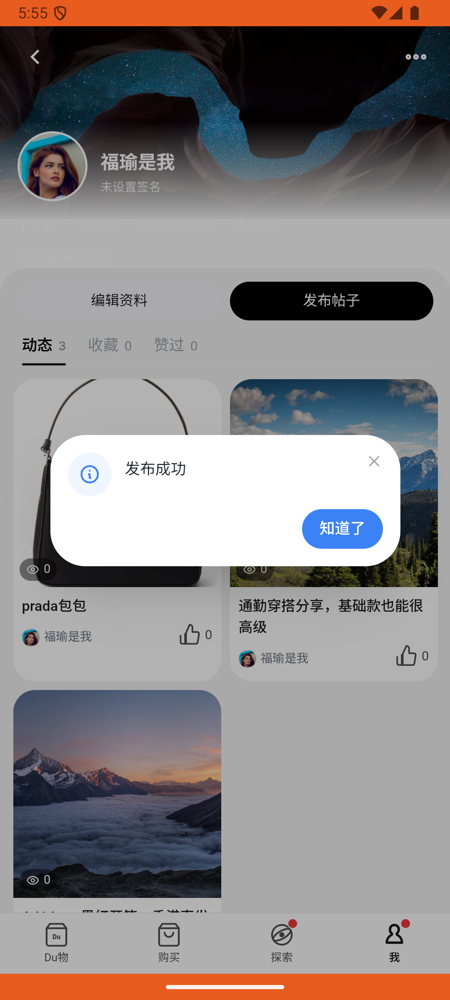

# post_v017_create_post_with_topic_and_product  ❌

- **Brand**: `duwu`
- **Class**: `DuwuPostV017CreatePostWithTopicAndProductTask`
- **Pass@3**: **0/3**  (score = 0.00)
- **Elapsed**: 552s (~9.2 min)
- **Model**: `doubao-seed-evolving`
- **Raw log**: [./raw_logs/DuwuPostV017CreatePostWithTopicAndProductTask.log](./raw_logs/DuwuPostV017CreatePostWithTopicAndProductTask.log)
- **Generated**: 2026-07-14T09:39:36+08:00
- **Note**: backfilled from /tmp/pass_at_3_full_<ts>/ on 2026-05-02

## Task Goal

> 在灵感模块，找到「韩娱爱豆联名款」话题卡片，帮我发条帖子，标题写"prada包包"，正文「我也买到柳智敏同款包包啦」，在关联好物搜索框里搜索「PRADA」并找到"PRADA普拉达 Carry 压花字母徽标 牛皮革 斜挎手提包 "然后挂上，把准备好的 3 张图片都上传，然后发布。

## System Prompt

<details>
<summary>展开查看完整 System Prompt</summary>


> You are provided with a task description, a history of previous actions, and corresponding screenshots. Your goal is to perform the next action to complete the task. Please note that if performing the same action multiple times results in a static screen with no changes, you should attempt a modified or alternative action.
> 
> ---
> 
> ## Function Definition
> 
> - `clarify` — Ask the user for more information to complete the task.
> - `click` — Mouse left single click action.
> - `double_click` — Mouse left double click action.
> - `drag` — Perform a drag action from the start point to the end point. Typically used for swiping or selecting elements.
> - `long_press` — Perform a long press action at the specified coordinates.
> - `open_app` — Open the specified application.
> - `press_back` — Press the back button.
> - `press_enter` — Press the enter key.
> - `press_home` — Press the home button.
> - `take_notes` — Take notes and report the result in the specified content.
> - `type` — Type the specified content. You should manually delete any text from the input box that you want to remove.
> - `wait` — Wait for a certain period of time.

</details>

## User Query

> 请在 com.duwu 里面完成以下任务：
> 在灵感模块，找到「韩娱爱豆联名款」话题卡片，帮我发条帖子，标题写"prada包包"，正文「我也买到柳智敏同款包包啦」，在关联好物搜索框里搜索「PRADA」并找到"PRADA普拉达 Carry 压花字母徽标 牛皮革 斜挎手提包 "然后挂上，把准备好的 3 张图片都上传，然后发布。

## Attempts

| # | Outcome | Steps | Terminated | Reason | Start → End |
|---|---------|-------|------------|--------|-------------|
| 1 | ❌ failed | 40 | answer | 挂载了 PRADA Carry 商品: 未挂载 PRADA Carry（id=133），实际挂载=[] | 2026-07-14 05:49:52 → 2026-07-14 05:55:49 |
| 2 | 💥 error | 0 | exception | exception: 500 Internal Server Error for url: http://localhost:6800/task/init \\| detail: init_task('DuwuPostV017CreatePostWithTopicAndPr... | 2026-07-14 05:55:50 → 2026-07-14 05:57:27 |
| 3 | 💥 error | 0 | exception | exception: 500 Internal Server Error for url: http://localhost:6800/task/init \\| detail: init_task('DuwuPostV017CreatePostWithTopicAndPr... | 2026-07-14 05:57:27 → 2026-07-14 05:59:04 |

## Failure Details

### Episode 1 — ❌ failed

- steps_used: `40`
- terminated_reason: `answer`
- reason:

  ```
  挂载了 PRADA Carry 商品: 未挂载 PRADA Carry（id=133），实际挂载=[]
  ```
- death shot: 
  - state: [`./death_shots/DuwuPostV017CreatePostWithTopicAndProductTask/episode_001/step_040.json`](./death_shots/DuwuPostV017CreatePostWithTopicAndProductTask/episode_001/step_040.json)
  - digest: [`episode_digest.md`](./death_shots/DuwuPostV017CreatePostWithTopicAndProductTask/episode_001/episode_digest.md)

### Episode 2 — 💥 error

- steps_used: `0`
- terminated_reason: `exception`
- reason:

  ```
  exception: 500 Internal Server Error for url: http://localhost:6800/task/init | detail: init_task('DuwuPostV017CreatePostWithTopicAndProductTask') failed: Task 'DuwuPostV017CreatePostWithTopicAndProductTask' failed during initialize_task()
  ```

### Episode 3 — 💥 error

- steps_used: `0`
- terminated_reason: `exception`
- reason:

  ```
  exception: 500 Internal Server Error for url: http://localhost:6800/task/init | detail: init_task('DuwuPostV017CreatePostWithTopicAndProductTask') failed: Task 'DuwuPostV017CreatePostWithTopicAndProductTask' failed during initialize_task()
  ```

---

> 本摘要由 `sengclaw/scripts/pipeline/log_summarizer.py` 自动生成。 原始完整 log 见上方 Raw log 链接（含每 step 的 messages / tool_call / screenshot 引用）。
