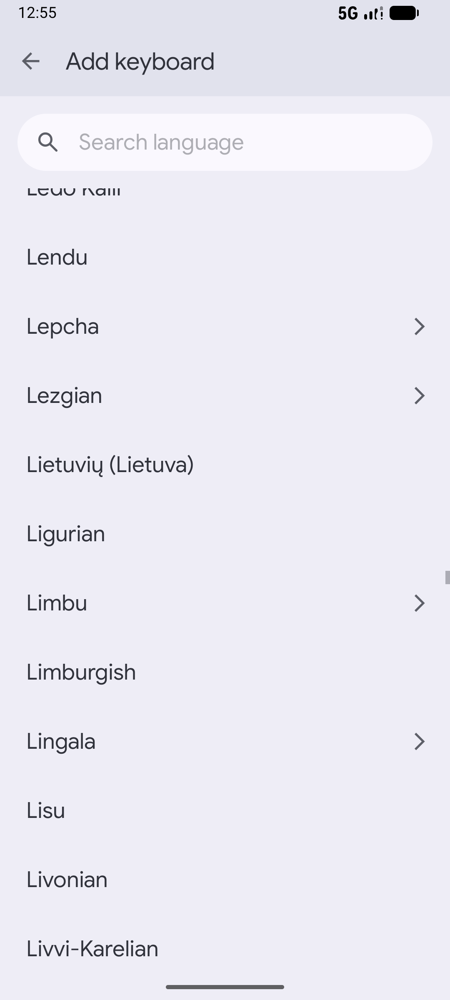
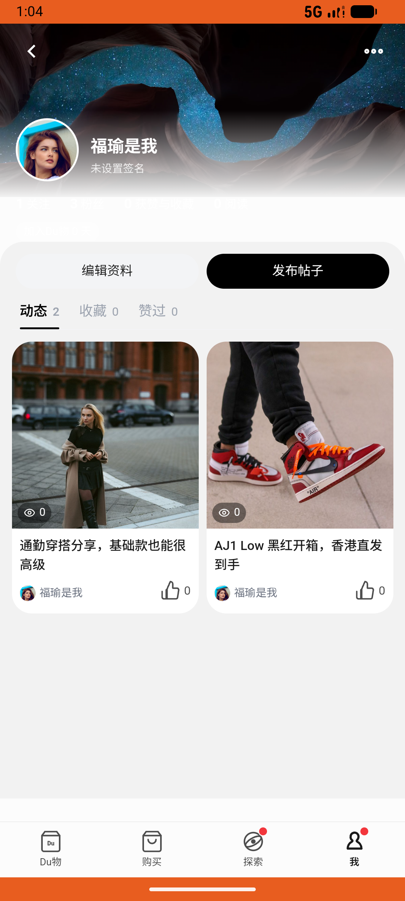
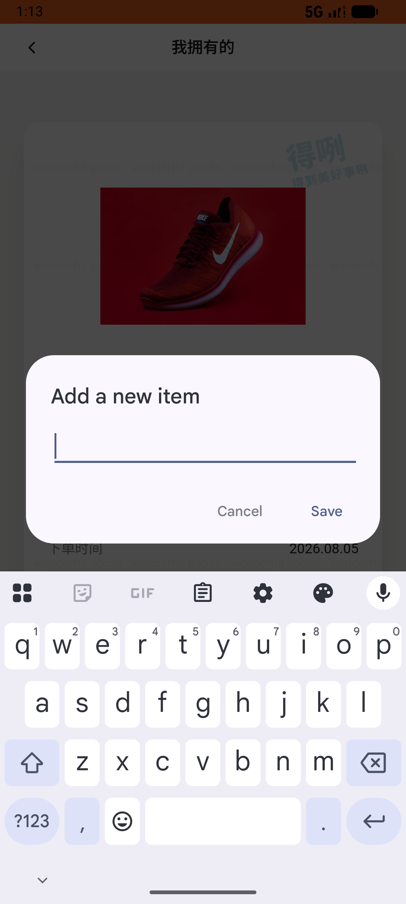

# ownership_v002_purchase_auto_ownership  ❌

- **Brand**: `duwu`
- **Class**: `DuwuOwnershipV002PurchaseAutoOwnershipTask`
- **Pass@3**: **0/3**  (score = 0.00)
- **Elapsed**: 1638s (~27.3 min)
- **Model**: `doubao-seed-evolving`
- **Raw log**: [./raw_logs/DuwuOwnershipV002PurchaseAutoOwnershipTask.log](./raw_logs/DuwuOwnershipV002PurchaseAutoOwnershipTask.log)
- **Generated**: 2026-08-05T14:35:57+08:00
- **Note**: backfilled from /tmp/pass_at_3_full_<ts>/ on 2026-05-02

## Task Goal

> 帮我买双 Converse Chuck 70 高帮帆布鞋 41 码，完成支付，然后再去「我拥有的」列表里找到该商品卡片，帮我记录心情"美滋滋"。（不需要向我确认，沙箱不扣款）

## System Prompt

<details>
<summary>展开查看完整 System Prompt</summary>


> You are provided with a task description, a history of previous actions, and corresponding screenshots. Your goal is to perform the next action to complete the task. Please note that if performing the same action multiple times results in a static screen with no changes, you should attempt a modified or alternative action.
> 
> ---
> 
> ## Function Definition
> 
> - `clarify` — Ask the user for more information to complete the task.
> - `click` — Mouse left single click action.
> - `double_click` — Mouse left double click action.
> - `drag` — Perform a drag action from the start point to the end point. Typically used for swiping or selecting elements.
> - `long_press` — Perform a long press action at the specified coordinates.
> - `open_app` — Open the specified application.
> - `press_back` — Press the back button.
> - `press_enter` — Press the enter key.
> - `press_home` — Press the home button.
> - `take_notes` — Take notes and report the result in the specified content.
> - `type` — Type the specified content. You should manually delete any text from the input box that you want to remove.
> - `wait` — Wait for a certain period of time.

</details>

## User Query

> 请在 com.duwu 里面完成以下任务：
> 帮我买双 Converse Chuck 70 高帮帆布鞋 41 码，完成支付，然后再去「我拥有的」列表里找到该商品卡片，帮我记录心情"美滋滋"。（不需要向我确认，沙箱不扣款）

## Attempts

| # | Outcome | Steps | Terminated | Reason | Start → End |
|---|---------|-------|------------|--------|-------------|
| 1 | ⏰ timeout | 80 | max_steps | 支付后商品出现在「我拥有的」列表: 未找到购买来源的 Converse Chuck 70 拥有记录 | 2026-08-05 12:46:03 → 2026-08-05 12:55:05 |
| 2 | ❌ failed | 80 | answer | 心情备注已记录为"美滋滋": 未找到心情备注为「美滋滋」的拥有记录（实际备注：[""]） | 2026-08-05 12:55:05 → 2026-08-05 13:04:09 |
| 3 | ⏰ timeout | 80 | max_steps | 心情备注已记录为"美滋滋": 未找到心情备注为「美滋滋」的拥有记录（实际备注：[nil]） | 2026-08-05 13:04:09 → 2026-08-05 13:13:21 |

## Failure Details

### Episode 1 — ⏰ timeout

- steps_used: `80`
- terminated_reason: `max_steps`
- reason:

  ```
  支付后商品出现在「我拥有的」列表: 未找到购买来源的 Converse Chuck 70 拥有记录
  ```
- death shot: 
  - state: [`./death_shots/DuwuOwnershipV002PurchaseAutoOwnershipTask/episode_001/step_080.json`](./death_shots/DuwuOwnershipV002PurchaseAutoOwnershipTask/episode_001/step_080.json)
  - digest: [`episode_digest.md`](./death_shots/DuwuOwnershipV002PurchaseAutoOwnershipTask/episode_001/episode_digest.md)

### Episode 2 — ❌ failed

- steps_used: `80`
- terminated_reason: `answer`
- reason:

  ```
  心情备注已记录为"美滋滋": 未找到心情备注为「美滋滋」的拥有记录（实际备注：[""]）
  ```
- death shot: 
  - state: [`./death_shots/DuwuOwnershipV002PurchaseAutoOwnershipTask/episode_002/step_080.json`](./death_shots/DuwuOwnershipV002PurchaseAutoOwnershipTask/episode_002/step_080.json)
  - digest: [`episode_digest.md`](./death_shots/DuwuOwnershipV002PurchaseAutoOwnershipTask/episode_002/episode_digest.md)

### Episode 3 — ⏰ timeout

- steps_used: `80`
- terminated_reason: `max_steps`
- reason:

  ```
  心情备注已记录为"美滋滋": 未找到心情备注为「美滋滋」的拥有记录（实际备注：[nil]）
  ```
- death shot: 
  - state: [`./death_shots/DuwuOwnershipV002PurchaseAutoOwnershipTask/episode_003/step_080.json`](./death_shots/DuwuOwnershipV002PurchaseAutoOwnershipTask/episode_003/step_080.json)
  - digest: [`episode_digest.md`](./death_shots/DuwuOwnershipV002PurchaseAutoOwnershipTask/episode_003/episode_digest.md)

---

> 本摘要由 `sengclaw/scripts/pipeline/log_summarizer.py` 自动生成。 原始完整 log 见上方 Raw log 链接（含每 step 的 messages / tool_call / screenshot 引用）。
