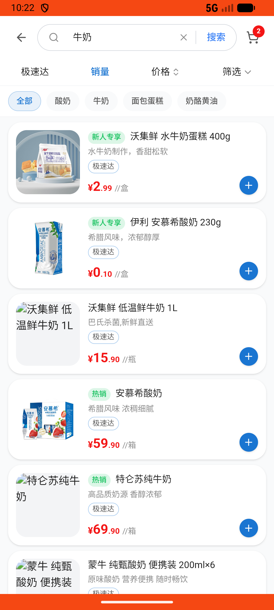

# search_v002_search_milk_sort_by_sales  ❌

- **Brand**: `wogoumarket`
- **Class**: `WogoumarketSearchV002SearchMilkSortBySalesTask`
- **Pass@3**: **0/3**  (score = 0.00)
- **Elapsed**: 970s (~16.2 min)
- **Model**: `doubao-seed-2-0-pro-260215`
- **Raw log**: [./raw_logs/WogoumarketSearchV002SearchMilkSortBySalesTask.log](./raw_logs/WogoumarketSearchV002SearchMilkSortBySalesTask.log)
- **Generated**: 2026-05-19T02:09:17+08:00

## Task Goal

> 【当前账户档案】账号：demo@rlbox.ai；昵称：张三；支付密码：123456；默认收货地址（JSON）：{"recipient": "科憨憨", "phone": "13100002345", "address": "腾讯滨海大厦 广东省 深圳市 南山区 1楼东门外卖柜"}。请基于以上档案完成下列任务：搜索"牛奶"，按"销量"排序，把排第一的那款加购 2 件

## Attempts

| # | Outcome | Steps | Terminated | Reason | Start → End |
|---|---------|-------|------------|--------|-------------|
| 1 | ❌ failed | 8 | answer | – | – |
| 2 | ❌ failed | 8 | answer | – | – |
| 3 | ❌ failed | 8 | answer | – | – |
| 4 | ❌ failed | 1 | unknown | – | – |
| 5 | ❌ failed | 1 | unknown | – | – |
| 6 | ❌ failed | 1 | unknown | – | – |

## Failure Details

### Episode 1 — ❌ failed

- steps_used: `8`
- terminated_reason: `answer`
- death shot: 
  - state: [`./death_shots/WogoumarketSearchV002SearchMilkSortBySalesTask/episode_001/step_008.json`](./death_shots/WogoumarketSearchV002SearchMilkSortBySalesTask/episode_001/step_008.json)

### Episode 2 — ❌ failed

- steps_used: `8`
- terminated_reason: `answer`
- death shot: 
  - state: [`./death_shots/WogoumarketSearchV002SearchMilkSortBySalesTask/episode_002/step_008.json`](./death_shots/WogoumarketSearchV002SearchMilkSortBySalesTask/episode_002/step_008.json)

### Episode 3 — ❌ failed

- steps_used: `8`
- terminated_reason: `answer`
- death shot: 
  - state: [`./death_shots/WogoumarketSearchV002SearchMilkSortBySalesTask/episode_003/step_008.json`](./death_shots/WogoumarketSearchV002SearchMilkSortBySalesTask/episode_003/step_008.json)

### Episode 4 — ❌ failed

- steps_used: `1`
- terminated_reason: `unknown`
- death shot: 
  - state: [`./death_shots/WogoumarketSearchV002SearchMilkSortBySalesTask/episode_004/step_000_init.json`](./death_shots/WogoumarketSearchV002SearchMilkSortBySalesTask/episode_004/step_000_init.json)

### Episode 5 — ❌ failed

- steps_used: `1`
- terminated_reason: `unknown`
- death shot: 
  - state: [`./death_shots/WogoumarketSearchV002SearchMilkSortBySalesTask/episode_005/step_000_init.json`](./death_shots/WogoumarketSearchV002SearchMilkSortBySalesTask/episode_005/step_000_init.json)

### Episode 6 — ❌ failed

- steps_used: `1`
- terminated_reason: `unknown`
- death shot: 
  - state: [`./death_shots/WogoumarketSearchV002SearchMilkSortBySalesTask/episode_006/step_000_init.json`](./death_shots/WogoumarketSearchV002SearchMilkSortBySalesTask/episode_006/step_000_init.json)

---

> 本摘要由 `sengclaw/scripts/pipeline/log_summarizer.py` 自动生成。 原始完整 log 见上方 Raw log 链接（含每 step 的 messages / tool_call / screenshot 引用）。
