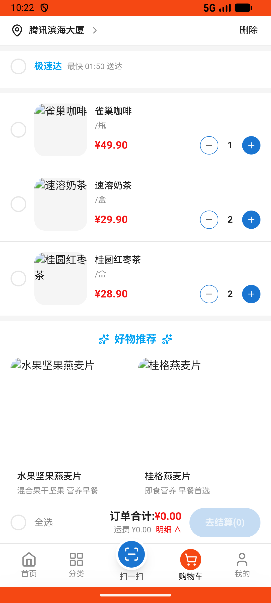

# common_v004_cross_category_add_and_abandon_payment  ❌

- **Brand**: `wogoumarket`
- **Class**: `WogoumarketCommonV004CrossCategoryAddAndAbandonPaymentTask`
- **Pass@3**: **0/3**  (score = 0.00)
- **Elapsed**: 352s (~5.9 min)
- **Model**: `doubao-seed-2-0-pro-260215`
- **Raw log**: [./raw_logs/WogoumarketCommonV004CrossCategoryAddAndAbandonPaymentTask.log](./raw_logs/WogoumarketCommonV004CrossCategoryAddAndAbandonPaymentTask.log)
- **Generated**: 2026-05-20T01:28:29+08:00

## Task Goal

> 【当前账户档案】账号：demo@rlbox.ai；昵称：张三；支付密码：123456；默认收货地址（JSON）：{"recipient": "科憨憨", "phone": "13100002345", "address": "腾讯滨海大厦 广东省 深圳市 南山区 1楼东门外卖柜"}。请基于以上档案完成下列任务：在「速食冲调_咖啡」加购1份雀巢咖啡，切换到「奶茶冲调」加购2份速溶奶茶和2份桂圆红枣茶，进入购物车结算时放弃支付

## Attempts

| # | Outcome | Steps | Terminated | Reason | Start → End |
|---|---------|-------|------------|--------|-------------|
| 1 | ❌ failed | 13 | answer | – | – |
| 2 | ❌ failed | 13 | answer | – | – |
| 3 | ❌ failed | 13 | answer | – | – |

## Failure Details

### Episode 1 — ❌ failed

- steps_used: `13`
- terminated_reason: `answer`
- death shot: 
  - state: [`./death_shots/WogoumarketCommonV004CrossCategoryAddAndAbandonPaymentTask/episode_001/step_013.json`](./death_shots/WogoumarketCommonV004CrossCategoryAddAndAbandonPaymentTask/episode_001/step_013.json)

### Episode 2 — ❌ failed

- steps_used: `13`
- terminated_reason: `answer`
- death shot: 
  - state: [`./death_shots/WogoumarketCommonV004CrossCategoryAddAndAbandonPaymentTask/episode_002/step_013.json`](./death_shots/WogoumarketCommonV004CrossCategoryAddAndAbandonPaymentTask/episode_002/step_013.json)

### Episode 3 — ❌ failed

- steps_used: `13`
- terminated_reason: `answer`
- death shot: 
  - state: [`./death_shots/WogoumarketCommonV004CrossCategoryAddAndAbandonPaymentTask/episode_003/step_013.json`](./death_shots/WogoumarketCommonV004CrossCategoryAddAndAbandonPaymentTask/episode_003/step_013.json)

---

> 本摘要由 `sengclaw/scripts/pipeline/log_summarizer.py` 自动生成。 原始完整 log 见上方 Raw log 链接（含每 step 的 messages / tool_call / screenshot 引用）。
