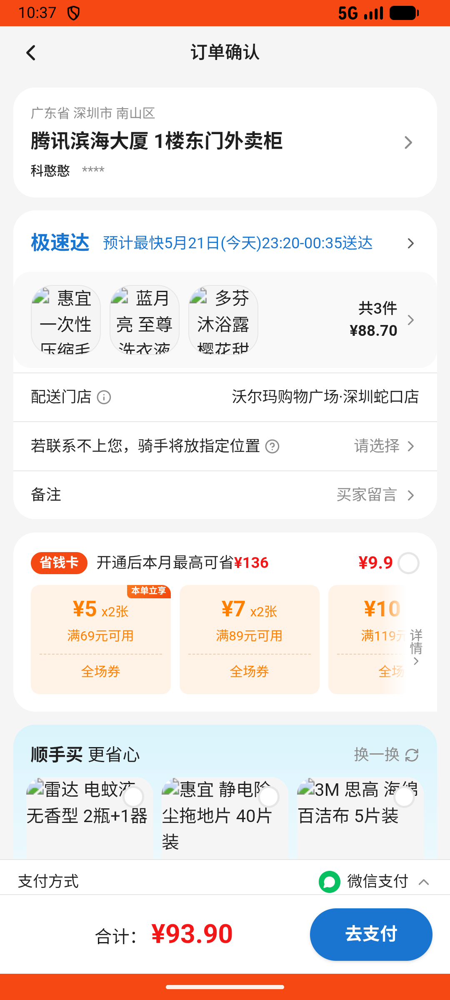

# checkout_v016_paper_cleaning_multi_tab_cart_edit_checkout  ❌

- **Brand**: `wogoumarket`
- **Class**: `WogoumarketCheckoutV016PaperCleaningMultiTabCartEditCheckoutTask`
- **Pass@3**: **0/3**  (score = 0.00)
- **Elapsed**: 495s (~8.2 min)
- **Model**: `doubao-seed-2-0-lite-260428`
- **Raw log**: [./raw_logs/WogoumarketCheckoutV016PaperCleaningMultiTabCartEditCheckoutTask.log](./raw_logs/WogoumarketCheckoutV016PaperCleaningMultiTabCartEditCheckoutTask.log)
- **Generated**: 2026-05-21T22:57:22+08:00

## Task Goal

> 当前App：【我购Market】。

## Attempts

| # | Outcome | Steps | Terminated | Reason | Start → End |
|---|---------|-------|------------|--------|-------------|
| 1 | ❌ failed | 5 | answer | – | 2026-05-21 22:49:07 → 2026-05-21 22:50:11 |
| 2 | ❌ failed | 7 | answer | – | 2026-05-21 22:50:11 → 2026-05-21 22:51:36 |
| 3 | ❌ failed | 27 | answer | – | 2026-05-21 22:51:36 → 2026-05-21 22:57:22 |

## Failure Details

### Episode 1 — ❌ failed

- steps_used: `5`
- terminated_reason: `answer`
- death shot: 
  - state: [`./death_shots/WogoumarketCheckoutV016PaperCleaningMultiTabCartEditCheckoutTask/episode_001/step_005.json`](./death_shots/WogoumarketCheckoutV016PaperCleaningMultiTabCartEditCheckoutTask/episode_001/step_005.json)

### Episode 2 — ❌ failed

- steps_used: `7`
- terminated_reason: `answer`
- death shot: 
  - state: [`./death_shots/WogoumarketCheckoutV016PaperCleaningMultiTabCartEditCheckoutTask/episode_002/step_007.json`](./death_shots/WogoumarketCheckoutV016PaperCleaningMultiTabCartEditCheckoutTask/episode_002/step_007.json)

### Episode 3 — ❌ failed

- steps_used: `27`
- terminated_reason: `answer`
- death shot: 
  - state: [`./death_shots/WogoumarketCheckoutV016PaperCleaningMultiTabCartEditCheckoutTask/episode_003/step_027.json`](./death_shots/WogoumarketCheckoutV016PaperCleaningMultiTabCartEditCheckoutTask/episode_003/step_027.json)

---

> 本摘要由 `sengclaw/scripts/pipeline/log_summarizer.py` 自动生成。 原始完整 log 见上方 Raw log 链接（含每 step 的 messages / tool_call / screenshot 引用）。
