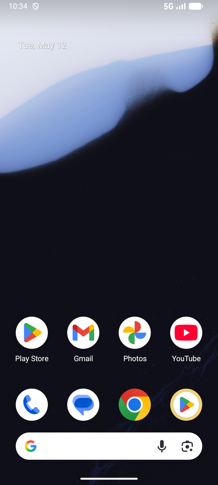

# checkout_v017_baby_formula_sort_view_add_abandon_cancel  ❌

- **Brand**: `wogoumarket`
- **Class**: `WogoumarketCheckoutV017BabyFormulaSortViewAddAbandonCancelTask`
- **Pass@3**: **0/3**  (score = 0.00)
- **Elapsed**: 329s (~5.5 min)
- **Model**: `doubao-seed-2-0-lite-260428`
- **Raw log**: [./raw_logs/WogoumarketCheckoutV017BabyFormulaSortViewAddAbandonCancelTask.log](./raw_logs/WogoumarketCheckoutV017BabyFormulaSortViewAddAbandonCancelTask.log)
- **Generated**: 2026-05-21T23:04:56+08:00

## Task Goal

> 当前App：【我购Market】。

## Attempts

| # | Outcome | Steps | Terminated | Reason | Start → End |
|---|---------|-------|------------|--------|-------------|
| 1 | ❌ failed | 12 | answer | – | 2026-05-21 22:59:27 → 2026-05-21 23:02:13 |
| 2 | ❌ failed | 6 | answer | – | 2026-05-21 23:02:13 → 2026-05-21 23:03:29 |
| 3 | ❌ failed | 7 | answer | – | 2026-05-21 23:03:29 → 2026-05-21 23:04:55 |

## Failure Details

### Episode 1 — ❌ failed

- steps_used: `12`
- terminated_reason: `answer`
- death shot: 
  - state: [`./death_shots/WogoumarketCheckoutV017BabyFormulaSortViewAddAbandonCancelTask/episode_001/step_012.json`](./death_shots/WogoumarketCheckoutV017BabyFormulaSortViewAddAbandonCancelTask/episode_001/step_012.json)

### Episode 2 — ❌ failed

- steps_used: `6`
- terminated_reason: `answer`
- death shot: 
  - state: [`./death_shots/WogoumarketCheckoutV017BabyFormulaSortViewAddAbandonCancelTask/episode_002/step_006.json`](./death_shots/WogoumarketCheckoutV017BabyFormulaSortViewAddAbandonCancelTask/episode_002/step_006.json)

### Episode 3 — ❌ failed

- steps_used: `7`
- terminated_reason: `answer`
- death shot: 
  - state: [`./death_shots/WogoumarketCheckoutV017BabyFormulaSortViewAddAbandonCancelTask/episode_003/step_007.json`](./death_shots/WogoumarketCheckoutV017BabyFormulaSortViewAddAbandonCancelTask/episode_003/step_007.json)

---

> 本摘要由 `sengclaw/scripts/pipeline/log_summarizer.py` 自动生成。 原始完整 log 见上方 Raw log 链接（含每 step 的 messages / tool_call / screenshot 引用）。
