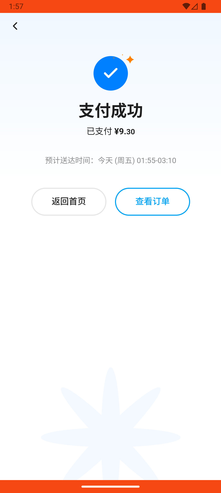

# checkout_v011_search_location_then_select_saved_address  ❌

- **Brand**: `wogoumarket`
- **Class**: `WogoumarketCheckoutV011SearchLocationThenSelectSavedAddressTask`
- **Pass@3**: **0/3**  (score = 0.00)
- **Elapsed**: 832s (~13.9 min)
- **Model**: `doubao-seed-2-0-pro-260215`
- **Raw log**: [./raw_logs/WogoumarketCheckoutV011SearchLocationThenSelectSavedAddressTask.log](./raw_logs/WogoumarketCheckoutV011SearchLocationThenSelectSavedAddressTask.log)
- **Generated**: 2026-05-23T01:41:56+08:00

## Task Goal

> 【当前账户档案】账号：demo@rlbox.ai；昵称：张三；支付密码：123456；默认收货地址（JSON）：{"recipient": "科憨憨", "phone": "13100002345", "address": "腾讯滨海大厦 广东省 深圳市 南山区 1楼东门外卖柜"}。请基于以上档案完成下列任务：在首页地址栏搜索"京基"选择"京基100大厦"，然后在购物车点去结算，弹出提示时点选择地址，选"腾讯滨海大厦"后完成下单

## Attempts

| # | Outcome | Steps | Terminated | Reason | Start → End |
|---|---------|-------|------------|--------|-------------|
| 1 | ❌ failed | 24 | answer | – | 2026-05-23 01:28:03 → 2026-05-23 01:32:48 |
| 2 | ❌ failed | 23 | answer | – | 2026-05-23 01:33:19 → 2026-05-23 01:37:25 |
| 3 | ❌ failed | 23 | answer | – | 2026-05-23 01:37:56 → 2026-05-23 01:41:56 |

## Failure Details

### Episode 1 — ❌ failed

- steps_used: `24`
- terminated_reason: `answer`
- death shot: 
  - state: [`./death_shots/WogoumarketCheckoutV011SearchLocationThenSelectSavedAddressTask/episode_001/step_024.json`](./death_shots/WogoumarketCheckoutV011SearchLocationThenSelectSavedAddressTask/episode_001/step_024.json)
  - digest: [`episode_digest.md`](./death_shots/WogoumarketCheckoutV011SearchLocationThenSelectSavedAddressTask/episode_001/episode_digest.md)

### Episode 2 — ❌ failed

- steps_used: `23`
- terminated_reason: `answer`
- death shot: 
  - state: [`./death_shots/WogoumarketCheckoutV011SearchLocationThenSelectSavedAddressTask/episode_002/step_023.json`](./death_shots/WogoumarketCheckoutV011SearchLocationThenSelectSavedAddressTask/episode_002/step_023.json)
  - digest: [`episode_digest.md`](./death_shots/WogoumarketCheckoutV011SearchLocationThenSelectSavedAddressTask/episode_002/episode_digest.md)

### Episode 3 — ❌ failed

- steps_used: `23`
- terminated_reason: `answer`
- death shot: 
  - state: [`./death_shots/WogoumarketCheckoutV011SearchLocationThenSelectSavedAddressTask/episode_003/step_023.json`](./death_shots/WogoumarketCheckoutV011SearchLocationThenSelectSavedAddressTask/episode_003/step_023.json)
  - digest: [`episode_digest.md`](./death_shots/WogoumarketCheckoutV011SearchLocationThenSelectSavedAddressTask/episode_003/episode_digest.md)

---

> 本摘要由 `sengclaw/scripts/pipeline/log_summarizer.py` 自动生成。 原始完整 log 见上方 Raw log 链接（含每 step 的 messages / tool_call / screenshot 引用）。
