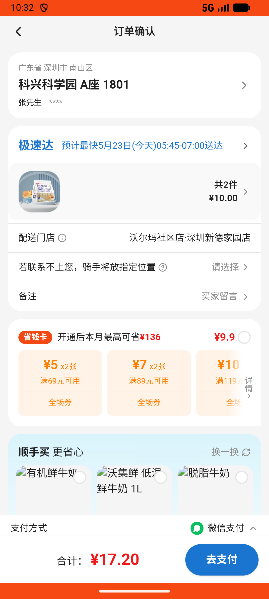
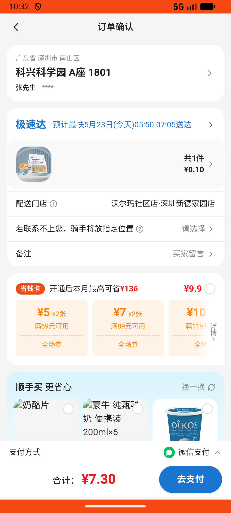

# checkout_v003_non_default_address  ❌

- **Brand**: `wogoumarket`
- **Class**: `WogoumarketCheckoutV003NonDefaultAddressTask`
- **Pass@3**: **0/3**  (score = 0.00)
- **Elapsed**: 183s (~3.0 min)
- **Model**: `doubao-seed-2-0-lite-260428`
- **Raw log**: [./raw_logs/WogoumarketCheckoutV003NonDefaultAddressTask.log](./raw_logs/WogoumarketCheckoutV003NonDefaultAddressTask.log)
- **Generated**: 2026-05-23T05:26:13+08:00

## Task Goal

> 【当前账户档案】账号：demo@rlbox.ai；昵称：张三；支付密码：123456；默认收货地址（JSON）：{"recipient": "科憨憨", "phone": "13100002345", "address": "腾讯滨海大厦 广东省 深圳市 南山区 1楼东门外卖柜"}。请基于以上档案完成下列任务：结算时选其他地址进行下单，而不是默认的地址

## Attempts

| # | Outcome | Steps | Terminated | Reason | Start → End |
|---|---------|-------|------------|--------|-------------|
| 1 | ❌ failed | 8 | answer | – | 2026-05-23 05:23:10 → 2026-05-23 05:24:17 |
| 2 | ❌ failed | 8 | answer | – | 2026-05-23 05:24:17 → 2026-05-23 05:25:17 |
| 3 | ❌ failed | 7 | answer | – | 2026-05-23 05:25:17 → 2026-05-23 05:26:13 |

## Failure Details

### Episode 1 — ❌ failed

- steps_used: `8`
- terminated_reason: `answer`
- death shot: 
  - state: [`./death_shots/WogoumarketCheckoutV003NonDefaultAddressTask/episode_001/step_008.json`](./death_shots/WogoumarketCheckoutV003NonDefaultAddressTask/episode_001/step_008.json)
  - digest: [`episode_digest.md`](./death_shots/WogoumarketCheckoutV003NonDefaultAddressTask/episode_001/episode_digest.md)

### Episode 2 — ❌ failed

- steps_used: `8`
- terminated_reason: `answer`
- death shot: 
  - state: [`./death_shots/WogoumarketCheckoutV003NonDefaultAddressTask/episode_002/step_008.json`](./death_shots/WogoumarketCheckoutV003NonDefaultAddressTask/episode_002/step_008.json)
  - digest: [`episode_digest.md`](./death_shots/WogoumarketCheckoutV003NonDefaultAddressTask/episode_002/episode_digest.md)

### Episode 3 — ❌ failed

- steps_used: `7`
- terminated_reason: `answer`
- death shot: 
  - state: [`./death_shots/WogoumarketCheckoutV003NonDefaultAddressTask/episode_003/step_007.json`](./death_shots/WogoumarketCheckoutV003NonDefaultAddressTask/episode_003/step_007.json)
  - digest: [`episode_digest.md`](./death_shots/WogoumarketCheckoutV003NonDefaultAddressTask/episode_003/episode_digest.md)

---

> 本摘要由 `sengclaw/scripts/pipeline/log_summarizer.py` 自动生成。 原始完整 log 见上方 Raw log 链接（含每 step 的 messages / tool_call / screenshot 引用）。
