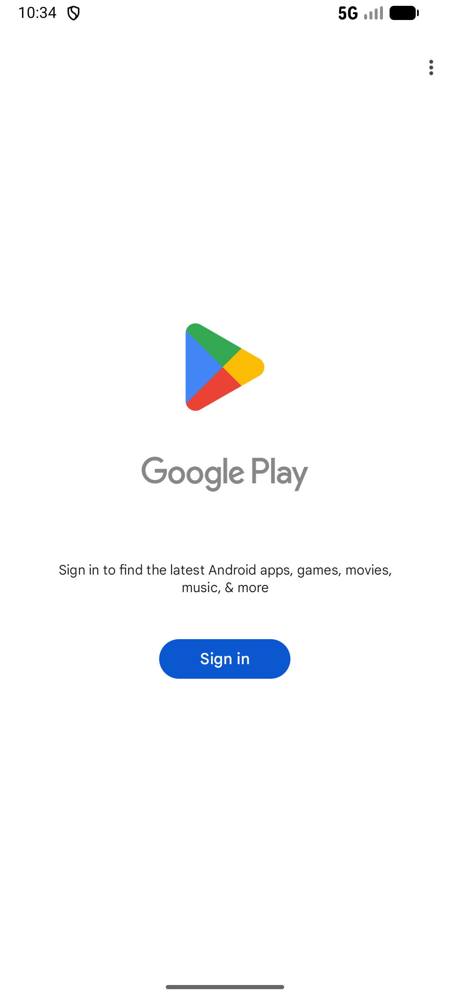

# cart_v001_add_bottled_water_3  ⚠️

- **Brand**: `wogoumarket`
- **Class**: `WogoumarketCartV001AddBottledWater3Task`
- **Pass@3**: **2/3**  (score = 1.00)
- **Elapsed**: 386s (~6.4 min)
- **Model**: `doubao-seed-2-0-lite-260428`
- **Raw log**: [./raw_logs/WogoumarketCartV001AddBottledWater3Task.log](./raw_logs/WogoumarketCartV001AddBottledWater3Task.log)
- **Generated**: 2026-05-25T03:10:08+08:00

## Task Goal

> 【当前账户档案】账号：demo@rlbox.ai；昵称：张三；支付密码：123456；默认收货地址（JSON）：{"recipient": "科憨憨", "phone": "13100002345", "address": "腾讯滨海大厦 广东省 深圳市 南山区 1楼东门外卖柜"}。请基于以上档案使用我购Market（com.wogoumarket）应用完成以下任务：将3 瓶"农夫山泉 饮用天然水 550ml 单瓶"加入购物车中

## Attempts

| # | Outcome | Steps | Terminated | Reason | Start → End |
|---|---------|-------|------------|--------|-------------|
| 1 | ✅ passed | 12 | answer | – | 2026-05-25 03:03:43 → 2026-05-25 03:05:11 |
| 2 | ❌ failed | 19 | answer | – | 2026-05-25 03:05:42 → 2026-05-25 03:08:14 |
| 3 | ✅ passed | 12 | answer | – | 2026-05-25 03:08:45 → 2026-05-25 03:10:08 |

## Failure Details

### Episode 2 — ❌ failed

- steps_used: `19`
- terminated_reason: `answer`
- death shot: 
  - state: [`./death_shots/WogoumarketCartV001AddBottledWater3Task/episode_002/step_019.json`](./death_shots/WogoumarketCartV001AddBottledWater3Task/episode_002/step_019.json)
  - digest: [`episode_digest.md`](./death_shots/WogoumarketCartV001AddBottledWater3Task/episode_002/episode_digest.md)

---

> 本摘要由 `sengclaw/scripts/pipeline/log_summarizer.py` 自动生成。 原始完整 log 见上方 Raw log 链接（含每 step 的 messages / tool_call / screenshot 引用）。
