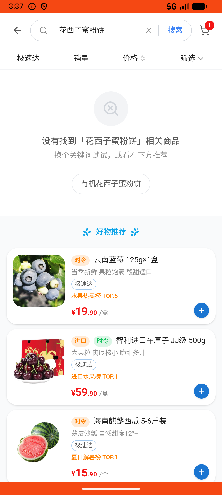

# cart_v008_beauty_add_and_remove  ⚠️

- **Brand**: `wogoumarket`
- **Class**: `WogoumarketCartV008BeautyAddAndRemoveTask`
- **Pass@3**: **2/3**  (score = 1.00)
- **Elapsed**: 564s (~9.4 min)
- **Model**: `doubao-seed-2-0-lite-260428`
- **Raw log**: [./raw_logs/WogoumarketCartV008BeautyAddAndRemoveTask.log](./raw_logs/WogoumarketCartV008BeautyAddAndRemoveTask.log)
- **Generated**: 2026-05-26T15:37:20+08:00

## Task Goal

> 【当前账户档案】账号：demo@rlbox.ai；昵称：张三；支付密码：123456；默认收货地址（JSON）：{"recipient": "科憨憨", "phone": "13100002345", "address": "腾讯滨海大厦 广东省 深圳市 南山区 1楼东门外卖柜"}。请基于以上档案打开 com.wogoumarket 并完成以下任务：在「个护美妆」分类下加购理肤泉B5修复面霜、惠宜旅行装洗护套装、碧柔防晒霜各1件及花西子蜜粉饼2件，进入购物车将花西子蜜粉饼删除

## Attempts

| # | Outcome | Steps | Terminated | Reason | Start → End |
|---|---------|-------|------------|--------|-------------|
| 1 | ✅ passed | 18 | answer | – | 2026-05-26 15:27:55 → 2026-05-26 15:30:51 |
| 2 | ✅ passed | 22 | answer | – | 2026-05-26 15:30:51 → 2026-05-26 15:34:34 |
| 3 | ❌ failed | 19 | answer | – | 2026-05-26 15:34:34 → 2026-05-26 15:37:19 |

## Failure Details

### Episode 3 — ❌ failed

- steps_used: `19`
- terminated_reason: `answer`
- death shot: 
  - state: [`./death_shots/WogoumarketCartV008BeautyAddAndRemoveTask/episode_003/step_019.json`](./death_shots/WogoumarketCartV008BeautyAddAndRemoveTask/episode_003/step_019.json)
  - digest: [`episode_digest.md`](./death_shots/WogoumarketCartV008BeautyAddAndRemoveTask/episode_003/episode_digest.md)

---

> 本摘要由 `sengclaw/scripts/pipeline/log_summarizer.py` 自动生成。 原始完整 log 见上方 Raw log 链接（含每 step 的 messages / tool_call / screenshot 引用）。
