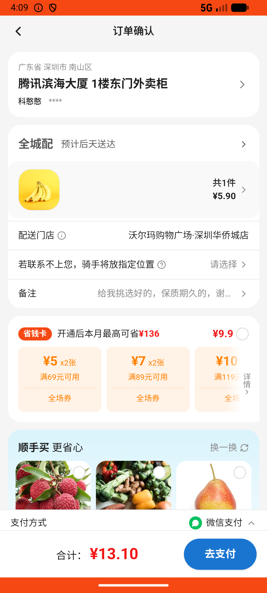
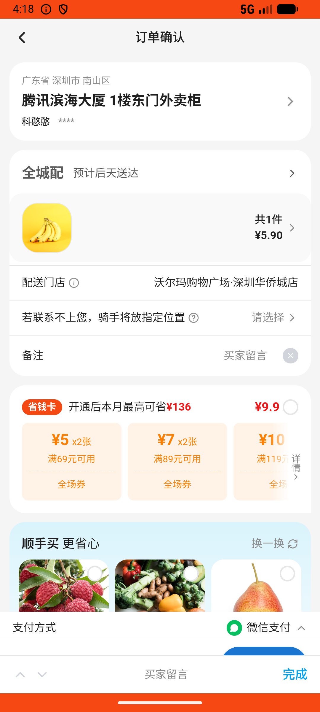

# checkout_v006_remark_pick_fresh  ⚠️

- **Brand**: `wogoumarket`
- **Class**: `WogoumarketCheckoutV006RemarkPickFreshTask`
- **Pass@3**: **1/3**  (score = 1.00)
- **Elapsed**: 1289s (~21.5 min)
- **Model**: `doubao-seed-2-0-lite-260428`
- **Raw log**: [./raw_logs/WogoumarketCheckoutV006RemarkPickFreshTask.log](./raw_logs/WogoumarketCheckoutV006RemarkPickFreshTask.log)
- **Generated**: 2026-05-26T16:18:18+08:00

## Task Goal

> 【当前账户档案】账号：demo@rlbox.ai；昵称：张三；支付密码：123456；默认收货地址（JSON）：{"recipient": "科憨憨", "phone": "13100002345", "address": "腾讯滨海大厦 广东省 深圳市 南山区 1楼东门外卖柜"}。请基于以上档案打开 com.wogoumarket 并完成以下任务：结算购物车时备注"给我挑选好的，保质期久的，谢谢你"并完成支付

## Attempts

| # | Outcome | Steps | Terminated | Reason | Start → End |
|---|---------|-------|------------|--------|-------------|
| 1 | ✅ passed | 25 | answer | – | 2026-05-26 15:56:49 → 2026-05-26 16:00:56 |
| 2 | ⏰ timeout | 50 | max_steps | – | 2026-05-26 16:00:56 → 2026-05-26 16:09:49 |
| 3 | ⏰ timeout | 50 | max_steps | – | 2026-05-26 16:09:49 → 2026-05-26 16:18:18 |

## Failure Details

### Episode 2 — ⏰ timeout

- steps_used: `50`
- terminated_reason: `max_steps`
- death shot: 
  - state: [`./death_shots/WogoumarketCheckoutV006RemarkPickFreshTask/episode_002/step_050.json`](./death_shots/WogoumarketCheckoutV006RemarkPickFreshTask/episode_002/step_050.json)
  - digest: [`episode_digest.md`](./death_shots/WogoumarketCheckoutV006RemarkPickFreshTask/episode_002/episode_digest.md)

### Episode 3 — ⏰ timeout

- steps_used: `50`
- terminated_reason: `max_steps`
- death shot: 
  - state: [`./death_shots/WogoumarketCheckoutV006RemarkPickFreshTask/episode_003/step_050.json`](./death_shots/WogoumarketCheckoutV006RemarkPickFreshTask/episode_003/step_050.json)
  - digest: [`episode_digest.md`](./death_shots/WogoumarketCheckoutV006RemarkPickFreshTask/episode_003/episode_digest.md)

---

> 本摘要由 `sengclaw/scripts/pipeline/log_summarizer.py` 自动生成。 原始完整 log 见上方 Raw log 链接（含每 step 的 messages / tool_call / screenshot 引用）。
