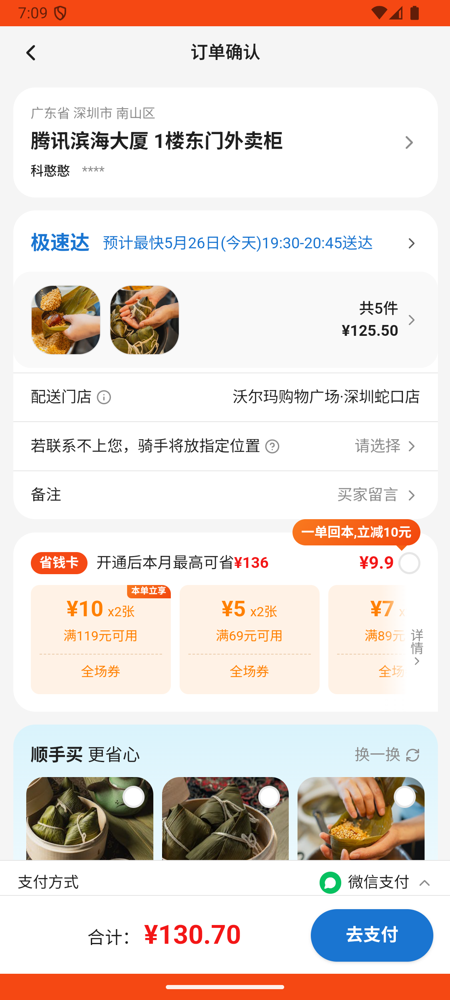

# common_v005_zongqing_add_modify_checkout  ⚠️

- **Brand**: `wogoumarket`
- **Class**: `WogoumarketCommonV005ZongqingAddModifyCheckoutTask`
- **Pass@3**: **2/3**  (score = 1.00)
- **Elapsed**: 739s (~12.3 min)
- **Model**: `doubao-seed-2-0-lite-260428`
- **Raw log**: [./raw_logs/WogoumarketCommonV005ZongqingAddModifyCheckoutTask.log](./raw_logs/WogoumarketCommonV005ZongqingAddModifyCheckoutTask.log)
- **Generated**: 2026-05-26T19:09:17+08:00

## Task Goal

> 【当前账户档案】账号：demo@rlbox.ai；昵称：张三；支付密码：123456；默认收货地址（JSON）：{"recipient": "科憨憨", "phone": "13100002345", "address": "腾讯滨海大厦 广东省 深圳市 南山区 1楼东门外卖柜"}。请基于以上档案打开 com.wogoumarket 并完成以下任务：在「粽情端午_精选推荐」分类下找到五芳斋蛋黄鲜肉粽浏览详情后加购3份，切换到「鲜肉粽」加购5份沃集鲜香菇鸡肉粽，进入购物车将香菇鸡肉粽改为2份后结算支付

## Attempts

| # | Outcome | Steps | Terminated | Reason | Start → End |
|---|---------|-------|------------|--------|-------------|
| 1 | ✅ passed | 29 | answer | – | 2026-05-26 18:56:58 → 2026-05-26 19:01:07 |
| 2 | ✅ passed | 28 | answer | – | 2026-05-26 19:01:07 → 2026-05-26 19:05:09 |
| 3 | ❌ failed | 27 | answer | – | 2026-05-26 19:05:09 → 2026-05-26 19:09:17 |

## Failure Details

### Episode 3 — ❌ failed

- steps_used: `27`
- terminated_reason: `answer`
- death shot: 
  - state: [`./death_shots/WogoumarketCommonV005ZongqingAddModifyCheckoutTask/episode_003/step_027.json`](./death_shots/WogoumarketCommonV005ZongqingAddModifyCheckoutTask/episode_003/step_027.json)
  - digest: [`episode_digest.md`](./death_shots/WogoumarketCommonV005ZongqingAddModifyCheckoutTask/episode_003/episode_digest.md)

---

> 本摘要由 `sengclaw/scripts/pipeline/log_summarizer.py` 自动生成。 原始完整 log 见上方 Raw log 链接（含每 step 的 messages / tool_call / screenshot 引用）。
