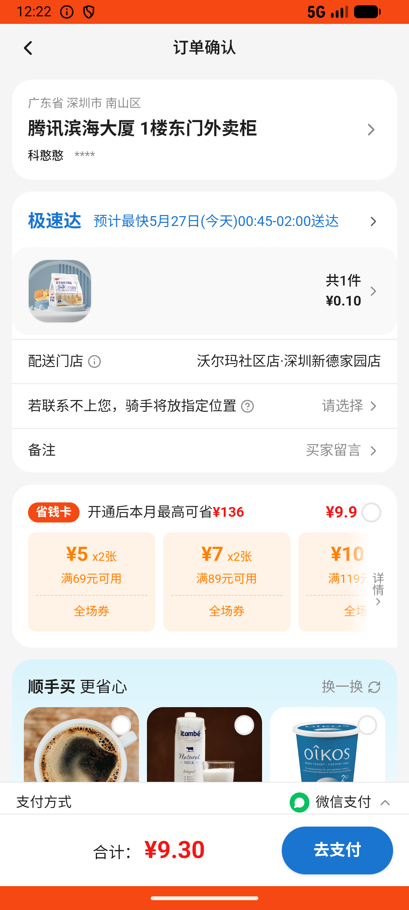
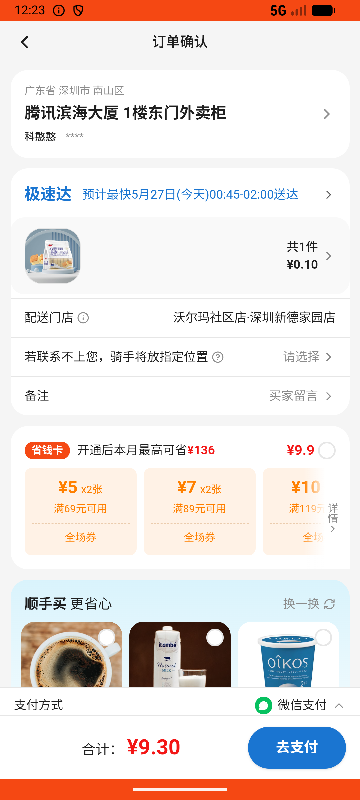

# checkout_v011_search_location_then_select_saved_address  ❌

- **Brand**: `wogoumarket`
- **Class**: `WogoumarketCheckoutV011SearchLocationThenSelectSavedAddressTask`
- **Pass@3**: **0/3**  (score = 0.00)
- **Elapsed**: 308s (~5.1 min)
- **Model**: `doubao-seed-2-0-lite-260428`
- **Raw log**: [./raw_logs/WogoumarketCheckoutV011SearchLocationThenSelectSavedAddressTask.log](./raw_logs/WogoumarketCheckoutV011SearchLocationThenSelectSavedAddressTask.log)
- **Generated**: 2026-05-27T01:37:42+08:00

## Task Goal

> 【当前账户档案】账号：demo@rlbox.ai；昵称：张三；支付密码：123456；默认收货地址（JSON）：{"recipient": "科憨憨", "phone": "13100002345", "address": "腾讯滨海大厦 广东省 深圳市 南山区 1楼东门外卖柜"}。请基于以上档案打开 com.wogoumarket 并完成以下任务：在首页地址栏搜索"京基"选择"京基100大厦"，然后在购物车点去结算，弹出提示时点选择地址，选"腾讯滨海大厦"后完成下单

## Attempts

| # | Outcome | Steps | Terminated | Reason | Start → End |
|---|---------|-------|------------|--------|-------------|
| 1 | ❌ failed | 11 | answer | – | 2026-05-27 00:18:47 → 2026-05-27 00:20:14 |
| 2 | ❌ failed | 14 | answer | – | 2026-05-27 00:20:14 → 2026-05-27 00:22:04 |
| 3 | ❌ failed | 14 | answer | – | 2026-05-27 00:22:04 → 2026-05-27 00:23:54 |

## Failure Details

### Episode 1 — ❌ failed

- steps_used: `11`
- terminated_reason: `answer`
- death shot: 
  - state: [`./death_shots/WogoumarketCheckoutV011SearchLocationThenSelectSavedAddressTask/episode_001/step_011.json`](./death_shots/WogoumarketCheckoutV011SearchLocationThenSelectSavedAddressTask/episode_001/step_011.json)
  - digest: [`episode_digest.md`](./death_shots/WogoumarketCheckoutV011SearchLocationThenSelectSavedAddressTask/episode_001/episode_digest.md)

### Episode 2 — ❌ failed

- steps_used: `14`
- terminated_reason: `answer`
- death shot: 
  - state: [`./death_shots/WogoumarketCheckoutV011SearchLocationThenSelectSavedAddressTask/episode_002/step_014.json`](./death_shots/WogoumarketCheckoutV011SearchLocationThenSelectSavedAddressTask/episode_002/step_014.json)
  - digest: [`episode_digest.md`](./death_shots/WogoumarketCheckoutV011SearchLocationThenSelectSavedAddressTask/episode_002/episode_digest.md)

### Episode 3 — ❌ failed

- steps_used: `14`
- terminated_reason: `answer`
- death shot: 
  - state: [`./death_shots/WogoumarketCheckoutV011SearchLocationThenSelectSavedAddressTask/episode_003/step_014.json`](./death_shots/WogoumarketCheckoutV011SearchLocationThenSelectSavedAddressTask/episode_003/step_014.json)
  - digest: [`episode_digest.md`](./death_shots/WogoumarketCheckoutV011SearchLocationThenSelectSavedAddressTask/episode_003/episode_digest.md)

---

> 本摘要由 `sengclaw/scripts/pipeline/log_summarizer.py` 自动生成。 原始完整 log 见上方 Raw log 链接（含每 step 的 messages / tool_call / screenshot 引用）。
